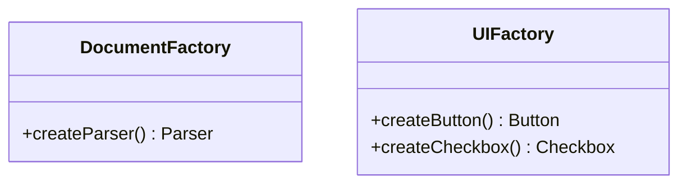
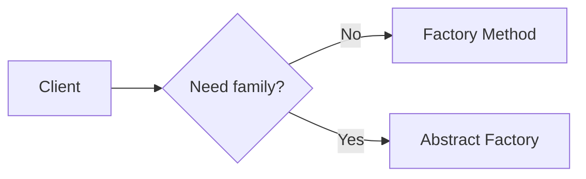

### Problem & Intent

**Factory Method** creates **one product type** with polymorphic implementations. **Abstract Factory** creates **families of related products** that must stay consistent (UI theme, cloud provider bundle). Use Factory Method twice before reaching for Abstract Factory.

---

### Pattern Comparison at a Glance

| Dimension | Factory Method | Abstract Factory |
| :--- | :--- | :--- |
| **Products per factory** | One | Multiple related |
| **Consistency constraint** | None | Cross-product (theme) |
| **Variation axis** | Which impl of one type | Which platform bundle |
| **Typical smell** | Scattered `new` | Mismatched Mac button + Win scrollbar |

---

### When to Use / When NOT to Use

| Situation | Factory Method | Abstract Factory |
| :--- | :---: | :---: |
| Single `Connection` type | Yes | — |
| `Button` + `Checkbox` same OS theme | — | Yes |
| AWS S3 + SQS + Secrets as bundle | — | Yes |
| Two unrelated products | Two factory methods | No |

---

### Structure (Class Diagram)

---

### Interaction Flow

---

### Implementation

See [Factory Method](/design-patterns/02-creational-patterns/factory-method-pattern/) and [Abstract Factory](/design-patterns/02-creational-patterns/abstract-factory-pattern/).

---

### Trade-offs & Operational Realities

| Tradeoff | Factory Method | Abstract Factory |
| :--- | :--- | :--- |
| **Adding product** | New subclass | New method on factory + all impls |
| **Test doubles** | One mock product | Mock entire family |

---

### Junior Mistakes

- Abstract Factory for one product type.
- Factory Method when cross-product consistency is required.

---

### Senior Questions

1. How does Abstract Factory relate to plugin architectures?
2. When does DI container replace hand-rolled abstract factories?

---

### Revision Cheat Sheet

- **One type** → Factory Method.
- **Consistent family** → Abstract Factory.

---

### See Also

- [Factory vs Builder](/design-patterns/05-pattern-comparisons/factory-vs-builder/)
- [Creational 3-way guide](/design-patterns/05-pattern-comparisons/factory-method-vs-abstract-factory-vs-builder/)
