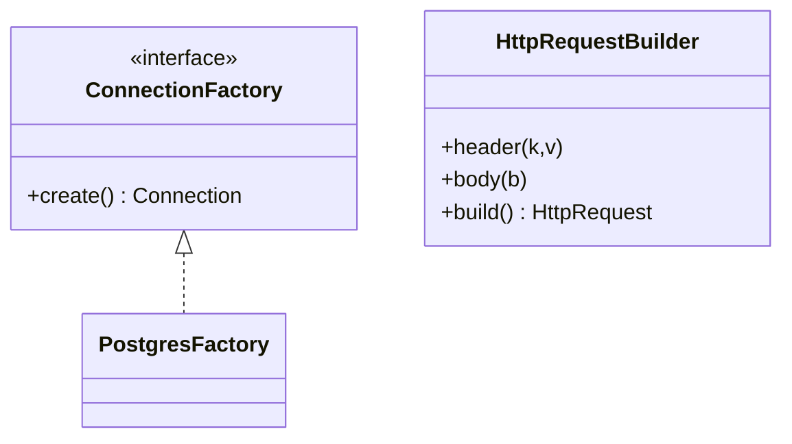
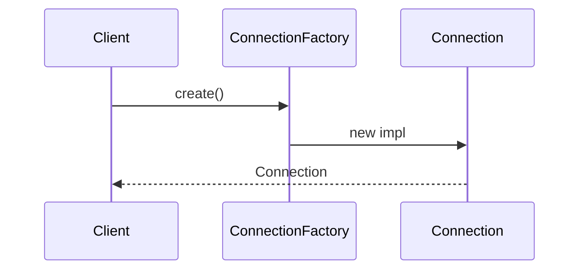

### Problem & Intent

**Factory Method** and **Builder** both hide construction — but Factory Method picks **which implementation** of one product type, while Builder assembles **one complex object** step-by-step. Confusing them yields a Builder for two fields or a Factory with twelve constructor parameters.

---

### Pattern Comparison at a Glance

| Dimension | Factory Method | Builder |
| :--- | :--- | :--- |
| **Intent** | Defer concrete product to subclass/provider | Separate construction from representation |
| **Products** | One interface, multiple impls | One aggregate, optional parts |
| **Client call** | `factory.create()` | `builder.setA().setB().build()` |
| **Validation** | At creation time | Often at `build()` |
| **Smell** | `switch` on type | Telescoping constructor |

---

### When to Use / When NOT to Use

| Situation | Factory Method | Builder |
| :--- | :---: | :---: |
| Postgres vs MySQL connection from config | Yes | — |
| HTTP request with 10 optional headers | — | Yes |
| Spring `@Bean` returns interface impl | Yes | — |
| Immutable object, 3 required fields | Maybe | Maybe — record may suffice |

---

### Structure (Class Diagram)

---

### Interaction Flow

---

### Implementation

See canonical pages: [Factory Method](/design-patterns/02-creational-patterns/factory-method-pattern/) and [Builder](/design-patterns/02-creational-patterns/builder-pattern/).

---

### Trade-offs & Operational Realities

| Tradeoff | Factory Method | Builder |
| :--- | :--- | :--- |
| **Complexity** | Low per product | Higher fluent API surface |
| **Testability** | Mock factory | Mock builder or director |
| **Framework fit** | DI `@Bean` | Step DSLs, test fixtures |

---

### Junior Mistakes

- Using Builder when a constructor or factory function suffices.
- Using Factory Method when families of related products need [Abstract Factory](/design-patterns/05-pattern-comparisons/factory-vs-abstract-factory/).

---

### Senior Questions

1. Where would validation live in each pattern?
2. How does Go `functional options` relate to Builder?

---

### Revision Cheat Sheet

- **Factory Method** → which single product implementation.
- **Builder** → many optional fields, one `build()` validation.

---

### See Also

- [Factory vs Abstract Factory](/design-patterns/05-pattern-comparisons/factory-vs-abstract-factory/)
- [Creational 3-way guide](/design-patterns/05-pattern-comparisons/factory-method-vs-abstract-factory-vs-builder/)
- [Pattern decision tree](/design-patterns/09-pattern-selection-guide/pattern-decision-tree/)
