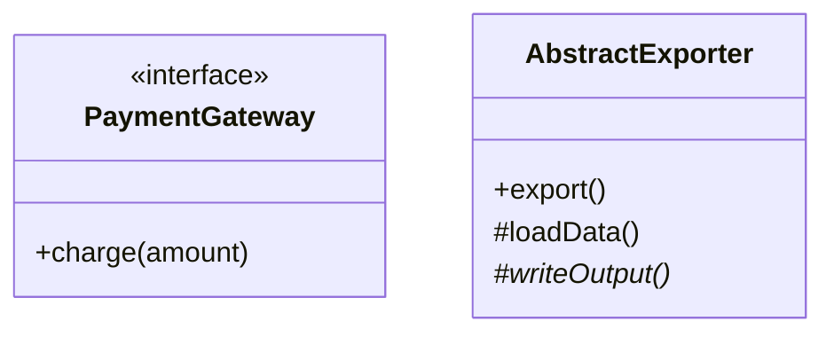
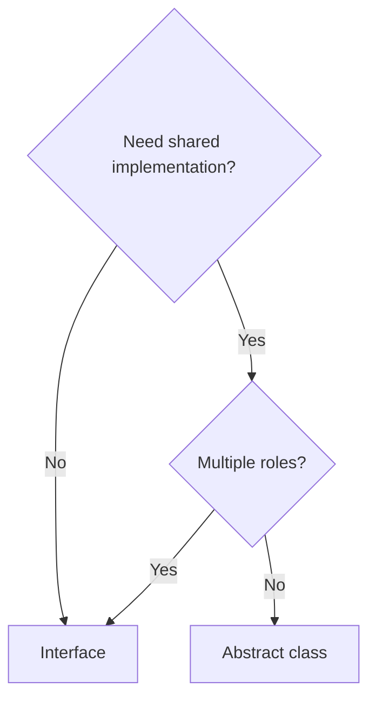

### Problem & Intent

**Interfaces** define contracts without shared state. **Abstract classes** share implementation and optional hooks. Language features (Java default methods, Go implicit interfaces) change the calculus — but the design force is the same: **how much shared code vs pure abstraction**.

---

### Pattern Comparison at a Glance

| Dimension | Interface | Abstract Class |
| :--- | :--- | :--- |
| **Multiple inheritance** | Yes (Java) | Single |
| **Shared state** | No | Yes |
| **Default behavior** | Default methods (Java 8+) | Concrete + abstract methods |
| **Go** | Implicit interfaces | No abstract classes — use embedding |

---

### When to Use / When NOT to Use

| Situation | Interface | Abstract Class |
| :--- | :---: | :---: |
| PaymentGateway contract | Yes | — |
| Template Method with shared steps | — | Yes |
| Cross-cutting capability (Serializable) | Yes | — |
| Need ctor enforcement + shared fields | — | Yes |

---

### Structure (Class Diagram)

---

### Interaction Flow

---

### Implementation

See [ISP](/design-patterns/01-solid-principles/interface-segregation-principle/) and [Template Method](/design-patterns/04-behavioral-patterns/template-method-pattern/).

---

### Trade-offs & Operational Realities

| Tradeoff | Interface | Abstract Class |
| :--- | :--- | :--- |
| **Evolution** | Adding methods breaks impls | Can add concrete methods |
| **Testing** | Trivial fakes | Subclass or spy |

---

### Junior Mistakes

- Fat interface violating ISP.
- Abstract class as dumping ground for unrelated helpers.

---

### Senior Questions

1. How do sealed classes change extension in Java 17+?
2. How do Go interfaces stay small?

---

### Revision Cheat Sheet

- **Contract only** → interface.
- **Shared skeleton** → abstract class (Java); composition in Go.

---

### See Also

- [Composition vs Inheritance](/design-patterns/05-pattern-comparisons/composition-vs-inheritance/)
- [DIP](/design-patterns/01-solid-principles/dependency-inversion-principle/)
