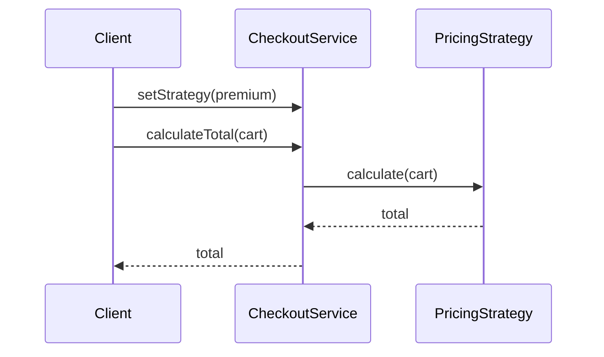
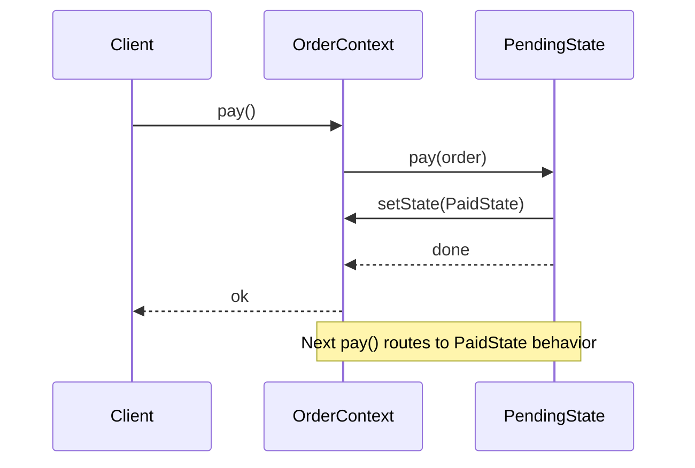
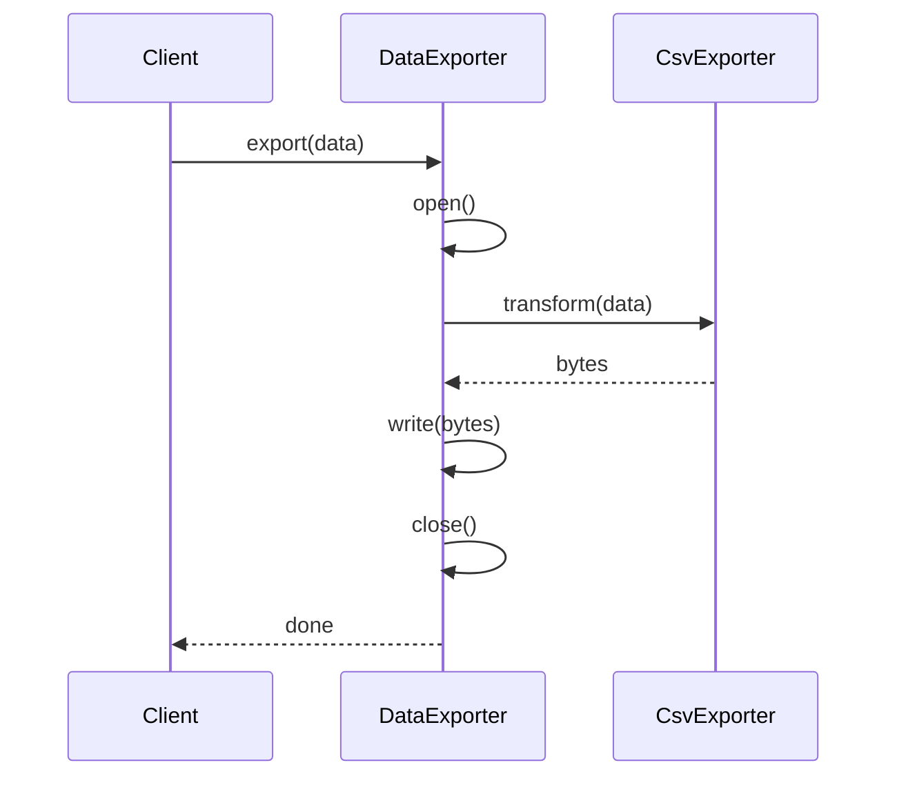

### Problem & Intent

**Strategy**, **State**, and **Template Method** all eliminate branching logic — but they answer different questions. Strategy asks *which algorithm should run right now?* State asks *what behavior is valid given this object's lifecycle?* Template Method asks *what steps are fixed vs customizable in a workflow?* Juniors often pick Strategy when State is correct (or vice versa) because all three use delegation. This guide disambiguates by **who changes behavior**, **when it changes**, and **what stays invariant**.

---

### Pattern Comparison at a Glance

| Dimension | Strategy | State | Template Method |
| :--- | :--- | :--- | :--- |
| **Primary intent** | Swap interchangeable algorithms | Change behavior as internal state changes | Fix algorithm skeleton; vary steps |
| **Who selects behavior** | Client or context (external) | Context itself (internal transition) | Base class defines flow; subclasses override hooks |
| **Relationship to context** | Strategy is injected / set | State object replaces another state | Subclass **is-a** context |
| **State transitions** | None — strategies don't know each other | Core feature — states drive transitions | N/A — no state machine |
| **Inheritance** | Composition over inheritance | Composition (state objects) | Inheritance (hook methods) |
| **Typical smell** | Growing `switch` on mode/tier/type | Growing `if (status == …)` in one class | Duplicated workflow with small step differences |
| **Open-Closed axis** | New strategy class | New state class | New subclass with overridden hooks |

---

### When to Use / When NOT to Use

| Situation | Strategy | State | Template Method | Why |
| :--- | :---: | :---: | :---: | :--- |
| Payment method chosen per checkout session | Yes | — | — | External selection; no lifecycle coupling |
| TCP connection: Closed → Established → Closing | — | Yes | — | Behavior and valid ops depend on connection phase |
| Data export pipeline: open → transform → write → close (fixed order) | — | — | Yes | Steps fixed; only transform/write vary by format |
| User role changes behavior but not object lifecycle | Yes | — | — | Role is configuration, not owned state machine |
| Order: Pending → Paid → Shipped → Cancelled | — | Yes | — | Transitions are domain rules; each phase has different allowed actions |
| Two subclasses differ only in one step of a 5-step batch job | — | — | Yes | Hook method beats duplicating the other four steps |
| Single algorithm, never varies | No | No | No | Plain method or function (YAGNI) |
| Behavior varies by internal state **and** client picks algorithm | — | — | — | Split concerns: State for lifecycle, Strategy inside a state if needed |
| Need runtime stacking of behaviors | No | No | No | Prefer [Decorator](/design-patterns/03-structural-patterns/decorator-pattern/) |
| Framework forbids deep inheritance hierarchies | Yes | Yes | No | Template Method leans on subclassing; prefer Strategy/State in Go |

---

### Structure (Class Diagram)

```mermaid
classDiagram
    direction TB

    namespace Strategy {
        class CheckoutService {
            -PricingStrategy strategy
            +calculateTotal(cart)
            +setStrategy(strategy)
        }
        class PricingStrategy {
            <<interface>>
            +calculate(cart)
        }
        class StandardPricing
        class PremiumPricing
        CheckoutService --> PricingStrategy
        PricingStrategy <|.. StandardPricing
        PricingStrategy <|.. PremiumPricing
    }

    namespace State {
        class OrderContext {
            -OrderState state
            +pay()
            +ship()
            +cancel()
            +setState(state)
        }
        class OrderState {
            <<interface>>
            +pay(ctx)
            +ship(ctx)
            +cancel(ctx)
        }
        class PendingState
        class PaidState
        class ShippedState
        OrderContext --> OrderState
        OrderState <|.. PendingState
        OrderState <|.. PaidState
        OrderState <|.. ShippedState
        PendingState --> PaidState : transition on pay
        PaidState --> ShippedState : transition on ship
    }

    namespace TemplateMethod {
        class DataExporter {
            +export(data)*
            #open()
            #transform(data)*
            #write(bytes)
            #close()
        }
        class CsvExporter {
            #transform(data)
        }
        class JsonExporter {
            #transform(data)
        }
        DataExporter <|-- CsvExporter
        DataExporter <|-- JsonExporter
    }
```

---

### Interaction Flow

**Strategy — client or wiring selects algorithm; context delegates once:**



**State — context delegates; state object may transition context:**



**Template Method — base class owns call order; subclass hook runs mid-flow:**



---

### Implementation




**Strategy — shipping cost by carrier (external swap):**

```java
public interface ShippingStrategy {
    BigDecimal cost(Cart cart);
}

public final class StandardShipping implements ShippingStrategy {
    @Override
    public BigDecimal cost(Cart cart) {
        return new BigDecimal("5.99");
    }
}

public final class ExpressShipping implements ShippingStrategy {
    @Override
    public BigDecimal cost(Cart cart) {
        return new BigDecimal("14.99");
    }
}

public final class CheckoutService {
    private ShippingStrategy shippingStrategy;

    public void setShippingStrategy(ShippingStrategy strategy) {
        this.shippingStrategy = strategy;
    }

    public BigDecimal shippingCost(Cart cart) {
        return shippingStrategy.cost(cart);
    }
}
```

**State — order lifecycle (internal transition on pay):**

```java
public interface OrderState {
    void pay(OrderContext ctx);
    void ship(OrderContext ctx);
}

public final class PendingState implements OrderState {
    @Override
    public void pay(OrderContext ctx) {
        ctx.setState(new PaidState());
    }

    @Override
    public void ship(OrderContext ctx) {
        throw new IllegalStateException("cannot ship unpaid order");
    }
}

public final class PaidState implements OrderState {
    @Override
    public void pay(OrderContext ctx) {
        throw new IllegalStateException("already paid");
    }

    @Override
    public void ship(OrderContext ctx) {
        ctx.setState(new ShippedState());
    }
}

public final class OrderContext {
    private OrderState state = new PendingState();

    public void setState(OrderState state) {
        this.state = state;
    }

    public void pay() { state.pay(this); }
    public void ship() { state.ship(this); }
}
```

**Template Method — export skeleton with format-specific transform:**

```java
public abstract class DataExporter {
    public final void export(List<Row> data) {
        open();
        try {
            byte[] bytes = transform(data);
            write(bytes);
        } finally {
            close();
        }
    }

    protected void open() { /* shared */ }
    protected abstract byte[] transform(List<Row> data);
    protected void write(byte[] bytes) { /* shared */ }
    protected void close() { /* shared */ }
}

public final class CsvExporter extends DataExporter {
    @Override
    protected byte[] transform(List<Row> data) {
        return CsvEncoder.encode(data);
    }
}
```




**Strategy — function type or small interface; selection at construction:**

```go
type Cart struct{ WeightKg float64 }

type ShippingStrategy interface {
    Cost(c Cart) float64
}

type StandardShipping struct{}
func (StandardShipping) Cost(c Cart) float64 { return 5.99 }

type ExpressShipping struct{}
func (ExpressShipping) Cost(c Cart) float64 { return 14.99 }

type CheckoutService struct {
    shipping ShippingStrategy
}

func (s *CheckoutService) ShippingCost(c Cart) float64 {
    return s.shipping.Cost(c)
}

// Stateless strategies: type ShippingFunc func(Cart) float64 works too.
```

**State — context holds state interface; states mutate context:**

```go
type OrderContext struct {
    state OrderState
}

func (o *OrderContext) SetState(s OrderState) { o.state = s }

func (o *OrderContext) Pay()  { o.state.Pay(o) }
func (o *OrderContext) Ship() { o.state.Ship(o) }

type OrderState interface {
    Pay(ctx *OrderContext)
    Ship(ctx *OrderContext)
}

type PendingState struct{}

func (PendingState) Pay(ctx *OrderContext) {
    ctx.SetState(PaidState{})
}

func (PendingState) Ship(ctx *OrderContext) {
    panic("cannot ship unpaid order")
}

type PaidState struct{}

func (PaidState) Pay(ctx *OrderContext)  { panic("already paid") }
func (PaidState) Ship(ctx *OrderContext) { ctx.SetState(ShippedState{}) }

type ShippedState struct{}
```

**Template Method — embed base struct; override hook (composition idiom in Go):**

```go
type Row struct{ Values []string }

type Exporter struct {
    Transform func([]Row) []byte
    Open      func()
    Write     func([]byte)
    Close     func()
}

func (e *Exporter) Export(data []Row) {
    if e.Open != nil {
        e.Open()
    }
    defer func() {
        if e.Close != nil {
            e.Close()
        }
    }()
    bytes := e.Transform(data)
    if e.Write != nil {
        e.Write(bytes)
    }
}

// CsvExporter wiring
csv := Exporter{
    Transform: func(rows []Row) []byte { return encodeCSV(rows) },
    Open:      openFile,
    Write:     writeFile,
    Close:     closeFile,
}
csv.Export(rows)
```

Go rarely uses inheritance; **embed a struct with function hooks** instead of abstract classes.




---

### Trade-offs & Operational Realities

| Concern | Strategy | State | Template Method |
| :--- | :--- | :--- | :--- |
| **Testability** | Mock strategy; test each algorithm alone | Test each state + transition table | Test base flow once; subclass tests only hooks |
| **Complexity** | Low per strategy; grows with count of algorithms | Medium — must model valid transitions explicitly | Low if 1–2 hooks; inheritance coupling rises with depth |
| **Framework fit** | Spring: strategy beans + `@Qualifier`; Go: func types / registry | Same DI story; document transition matrix in tests | Java: abstract base common; Go: prefer composition + hooks |
| **Runtime cost** | One indirection per call | One indirection; transition may allocate new state object | Virtual dispatch on hooks only |
| **Debugging** | Easy — "which strategy is wired?" | Harder — "which state and who transitioned?" | Medium — stack shows template + hook |
| **Team onboarding** | Intuitive for "pluggable rules" | Requires state diagram buy-in | Familiar to OOP devs; alien in Go codebases |

---

### Junior Mistakes

- Using Strategy for a **state machine** — client keeps passing the "right" strategy instead of letting the object own transitions
- Using State when behavior is **configuration** (tenant tier, feature flag) — no transitions, just swap a Strategy
- Using Template Method when **only the order of steps** varies — that's Strategy or pipeline composition, not hooks
- Putting transition logic in the **context** while also using State objects (half-refactor, double maintenance)
- Creating `AbstractPricingStrategy` with one subclass "for extensibility"
- In Go, copying Java's deep inheritance tree instead of **function hooks** or small interfaces

---

### Senior Questions

1. A vending machine accepts coins until price is met, then dispenses — Strategy, State, or Template Method? Draw the transition table.
2. How do you add a new shipping carrier without editing `CheckoutService`? How is that different from adding a new order status?
3. **Shipping + tax + discount** in one checkout call — one pattern or three? Where does [Chain of Responsibility](/design-patterns/04-behavioral-patterns/chain-of-responsibility-pattern/) fit?
4. Can a State object hold a Strategy? Give a production example where both appear in one aggregate.
5. Template Method in a library you don't own — when do you switch to **composition** (Strategy) instead of subclassing?
6. How do you test that `PendingState → PaidState` is the only valid path from `pay()`? Property-based vs table-driven?
7. Per-request strategy in multi-tenant API — request scope bean vs thread-local vs explicit parameter?

---

### Revision Cheat Sheet

- **Strategy:** "Pick algorithm from outside." Smell: `switch (mode)` on same operation. Pairs with [Factory Method](/design-patterns/02-creational-patterns/factory-method-pattern/), [Open-Closed](/design-patterns/01-solid-principles/open-closed-principle/).
- **State:** "Object behaves differently by lifecycle phase." Smell: `if (status == …)` scattered across methods. Pairs with [State Pattern](/design-patterns/04-behavioral-patterns/state-pattern/) deep dive.
- **Template Method:** "Same recipe, different ingredients." Smell: copy-pasted workflow differing in one step. Pairs with [Template Method](/design-patterns/04-behavioral-patterns/template-method-pattern/).
- **Avoid Strategy when:** behavior is tied to internal phase transitions.
- **Avoid State when:** no transitions — just runtime configuration.
- **Avoid Template Method when:** language/framework discourages inheritance (prefer hooks struct in Go).
- **Interview one-liner:** Strategy = **who** picks; State = **when** phase changes; Template = **which step** varies in a fixed pipeline.

---

### See Also

- [Strategy Pattern](/design-patterns/04-behavioral-patterns/strategy-pattern/)
- [State Pattern](/design-patterns/04-behavioral-patterns/state-pattern/)
- [Template Method Pattern](/design-patterns/04-behavioral-patterns/template-method-pattern/)
- [Open-Closed Principle](/design-patterns/01-solid-principles/open-closed-principle/)
- [Chain of Responsibility Pattern](/design-patterns/04-behavioral-patterns/chain-of-responsibility-pattern/)
- [Elevator Control System LLD](/design-patterns/08-lld-case-studies/elevator-control-system/) — State in practice
- [Parking Lot System LLD](/design-patterns/08-lld-case-studies/parking-lot/) — Strategy for pricing
