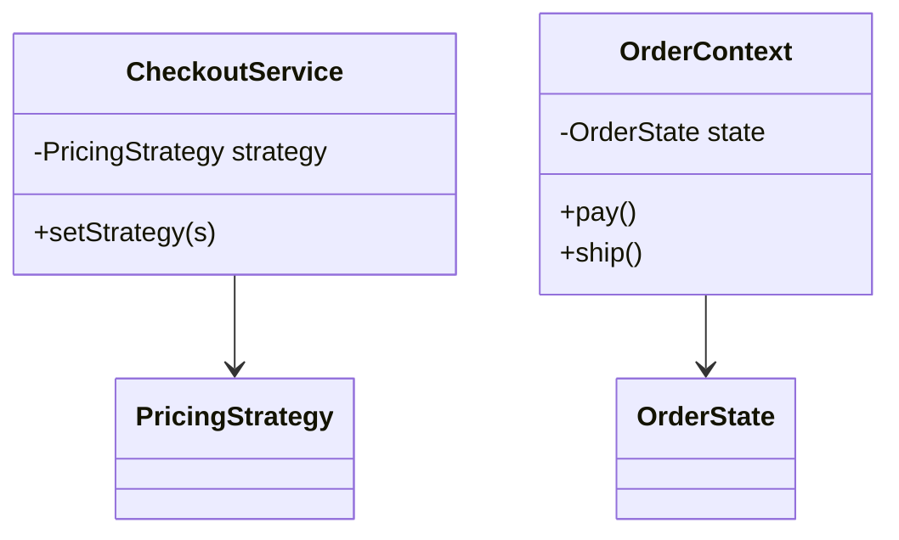
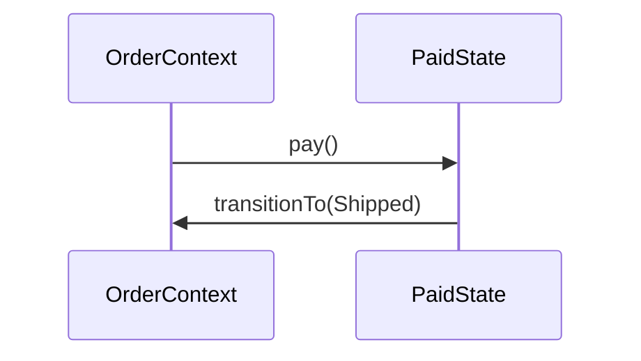

### Problem & Intent

**Strategy** swaps interchangeable **algorithms** chosen externally. **State** changes **behavior as internal lifecycle phase** changes. Both use delegation — the difference is **who drives change** and whether **transitions** are domain rules.

---

### Pattern Comparison at a Glance

| Dimension | Strategy | State |
| :--- | :--- | :--- |
| **Who selects** | Client / context setter | Context on transition |
| **Transitions** | None between strategies | Core feature |
| **Typical domain** | Payment method, pricing tier | Order status, TCP phase |
| **Smell fixed** | `switch` on mode | `if (status == …)` |

---

### When to Use / When NOT to Use

| Situation | Strategy | State |
| :--- | :---: | :---: |
| Checkout picks payment method | Yes | — |
| Order: Pending → Paid → Shipped | — | Yes |
| User role (not lifecycle) | Yes | — |
| Fixed workflow, one varying step | — | — → [Template Method](/design-patterns/04-behavioral-patterns/template-method-pattern/) |

---

### Structure (Class Diagram)

---

### Interaction Flow

---

### Implementation

See [Strategy](/design-patterns/04-behavioral-patterns/strategy-pattern/) and [State](/design-patterns/04-behavioral-patterns/state-pattern/).

---

### Trade-offs & Operational Realities

| Tradeoff | Strategy | State |
| :--- | :--- | :--- |
| **Concurrency** | Usually stateless algos | Transitions must be atomic |
| **Go fit** | Small interfaces | State structs + context |

---

### Junior Mistakes

- State for configuration that never transitions.
- Strategy when invalid operations depend on lifecycle phase.

---

### Senior Questions

1. Can a State object contain a Strategy?
2. How do you test all transitions?

---

### Revision Cheat Sheet

- **Strategy** → external algorithm swap.
- **State** → internal phase machine.

---

### See Also

- [Behavioral 3-way guide](/design-patterns/05-pattern-comparisons/strategy-vs-state-vs-template-method/)
- [Parking Lot LLD](/design-patterns/08-lld-case-studies/parking-lot/)
