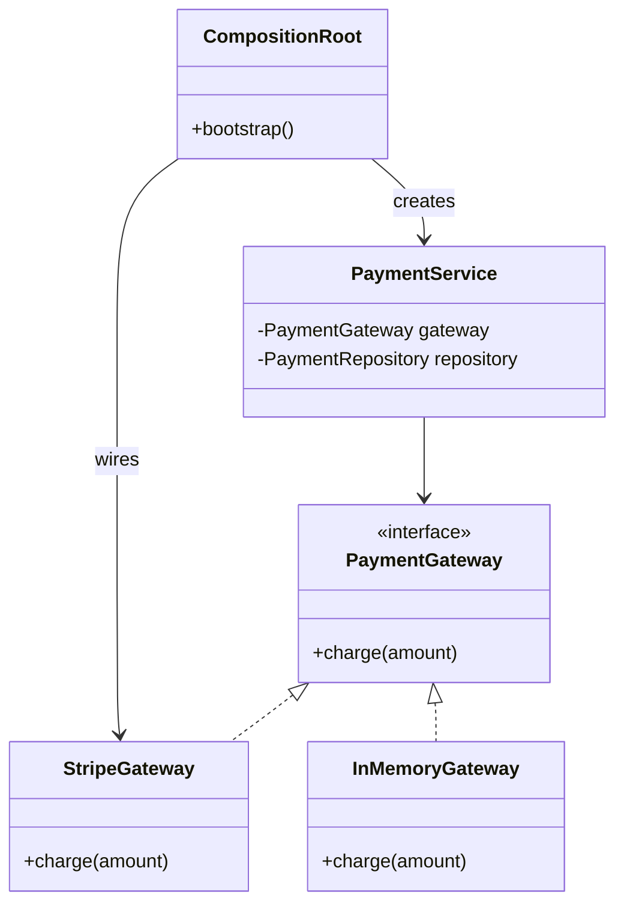
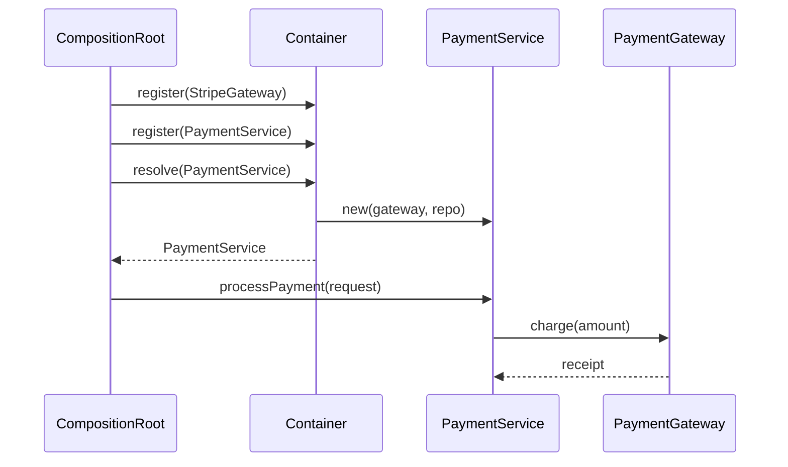

### Problem & Intent

**Inversion of Control (IoC)** flips ownership: a framework or composition root decides object lifetimes and wiring instead of each class calling `new` on its collaborators. **Dependency Injection (DI)** is the mechanism — dependencies are supplied through constructors, setters, or factory parameters. The goal is testable, loosely coupled modules where high-level policy does not hard-code low-level implementations.

---

### When to Use / When NOT to Use

| Situation | Use? | Why |
| :--- | :---: | :--- |
| Services depend on interfaces with multiple runtime implementations | Yes | Container swaps real vs mock vs feature-flagged beans |
| Constructor has more than two collaborators or deep object graphs | Yes | Composition root assembles the graph once |
| Unit tests must replace DB, HTTP, or clock dependencies | Yes | Inject fakes without subclassing production code |
| 10-line CLI or single-file script | No | Manual `main` wiring is clearer than a container |
| Every dependency is a concrete stdlib type with no test double need | No | DI adds indirection without benefit |
| Team lacks discipline on container lifecycle (singleton vs request scope) | No | Fix scope rules first; DI misuse causes subtle bugs |

---

### Structure (Class Diagram)



---

### Interaction Flow



---

### Implementation




**Violation — class constructs its own dependencies:**

```java
public class PaymentService {
    private final StripeClient stripe = new StripeClient(System.getenv("STRIPE_KEY"));
    private final JdbcPaymentRepository repository = new JdbcPaymentRepository();

    public Receipt process(PaymentRequest request) {
        stripe.charge(request.getAmount());
        repository.save(request);
        return new Receipt(request.getId());
    }
}
```

**Constructor injection — IoC-friendly:**

```java
public interface PaymentGateway {
    void charge(Money amount);
}

public final class PaymentService {
    private final PaymentGateway gateway;
    private final PaymentRepository repository;

    public PaymentService(PaymentGateway gateway, PaymentRepository repository) {
        this.gateway = gateway;
        this.repository = repository;
    }

    public Receipt process(PaymentRequest request) {
        gateway.charge(request.getAmount());
        repository.save(Payment.from(request));
        return new Receipt(request.getId());
    }
}

// Spring composition root
@Configuration
public class PaymentConfig {
    @Bean PaymentGateway paymentGateway() { return new StripeGateway(); }
    @Bean PaymentService paymentService(PaymentGateway g, PaymentRepository r) {
        return new PaymentService(g, r);
    }
}
```

Prefer **constructor injection** — dependencies are required, immutable, and visible in tests.




**Violation:**

```go
type PaymentService struct{}

func (s *PaymentService) Process(req PaymentRequest) (Receipt, error) {
    stripe := NewStripeClient(os.Getenv("STRIPE_KEY"))
    repo := NewPostgresPaymentRepo(defaultDBURL())
    if err := stripe.Charge(req.Amount); err != nil {
        return Receipt{}, err
    }
    return Receipt{ID: req.ID}, repo.Save(req)
}
```

**Constructor injection via explicit wiring:**

```go
type PaymentGateway interface {
    Charge(ctx context.Context, amount Money) error
}

type PaymentService struct {
    gateway PaymentGateway
    repo    PaymentRepository
}

func NewPaymentService(gateway PaymentGateway, repo PaymentRepository) *PaymentService {
    return &PaymentService{gateway: gateway, repo: repo}
}

func (s *PaymentService) Process(ctx context.Context, req PaymentRequest) (Receipt, error) {
    if err := s.gateway.Charge(ctx, req.Amount); err != nil {
        return Receipt{}, err
    }
    if err := s.repo.Save(ctx, PaymentFrom(req)); err != nil {
        return Receipt{}, err
    }
    return Receipt{ID: req.ID}, nil
}

// cmd/api/main.go — composition root
func main() {
    gateway := stripe.NewGateway(os.Getenv("STRIPE_KEY"))
    repo := postgres.NewPaymentRepo(db)
    svc := payments.NewPaymentService(gateway, repo)
    http.Handle("/pay", newHandler(svc))
}
```

Go has no Spring — **`main` is the composition root**; use `wire`, `fx`, or manual constructor calls.




```python
from typing import Protocol

class ExamplePort(Protocol):
    def execute(self) -> None: ...

class ExampleService:
    def __init__(self, port: ExamplePort) -> None:
        self._port = port

    def run(self) -> None:
        self._port.execute()
```




---

### Trade-offs & Operational Realities

| Concern | Impact |
| :--- | :--- |
| **Testability** | Tests pass `InMemoryGateway` and stub repos without bytecode magic |
| **Complexity** | Container config, bean scopes, and circular dependency resolution add learning curve |
| **Framework fit** | Spring autowires by type; Go relies on explicit `main` or codegen (`wire`) |
| **Runtime failures** | Missing bean or ambiguous `@Qualifier` surfaces at startup — fail-fast is good, but cryptic errors hurt |

---

### Junior Mistakes

- Field injection (`@Autowired` on private fields) — hard to test and hides required deps
- Service locator anti-pattern: `context.getBean(PaymentGateway.class)` inside business logic
- Registering concrete classes everywhere instead of interfaces — blocks swapping implementations
- `@Component` on every class including DTOs and entities — pollutes the container

---

### Senior Questions

1. Constructor vs setter vs method injection — when is setter injection justified?
2. How do you break a circular dependency between `OrderService` and `InventoryService`?
3. Request-scoped bean inside singleton — what breaks and how does Spring solve it?
4. How does DI relate to DIP — same concept or different layer?
5. When would you choose manual wiring in Go over `uber/fx` or `google/wire`?

---

### Revision Cheat Sheet

- **One line:** Don't call `new` on collaborators — receive them from a composition root.
- **Trigger smell:** `new StripeClient()` inside a `@Service` method.
- **Pairs with:** [DIP](/design-patterns/01-solid-principles/dependency-inversion-principle/), [Repository & UoW](/design-patterns/06-architectural-principles/repository-and-unit-of-work/), [Strategy Pattern](/design-patterns/04-behavioral-patterns/strategy-pattern/)
- **Avoid when:** No alternate implementations and no testing need for doubles.
- **Interview tip:** Name the composition root (`@Configuration`, `main`, test fixture).

---

### See Also

- [Dependency Inversion Principle](/design-patterns/01-solid-principles/dependency-inversion-principle/)
- [Open-Closed Principle](/design-patterns/01-solid-principles/open-closed-principle/)
- [Repository & Unit of Work](/design-patterns/06-architectural-principles/repository-and-unit-of-work/)
- [Layered vs Hexagonal Architecture](/design-patterns/06-architectural-principles/layered-vs-hexagonal-architecture/)
