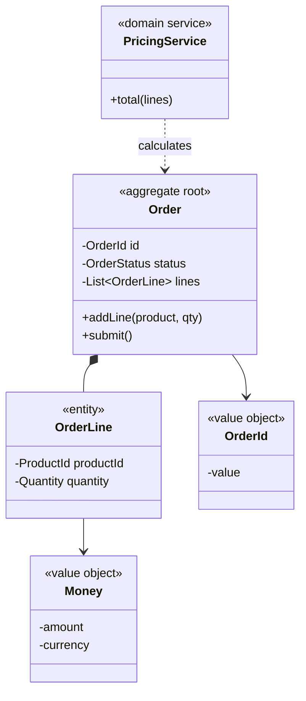
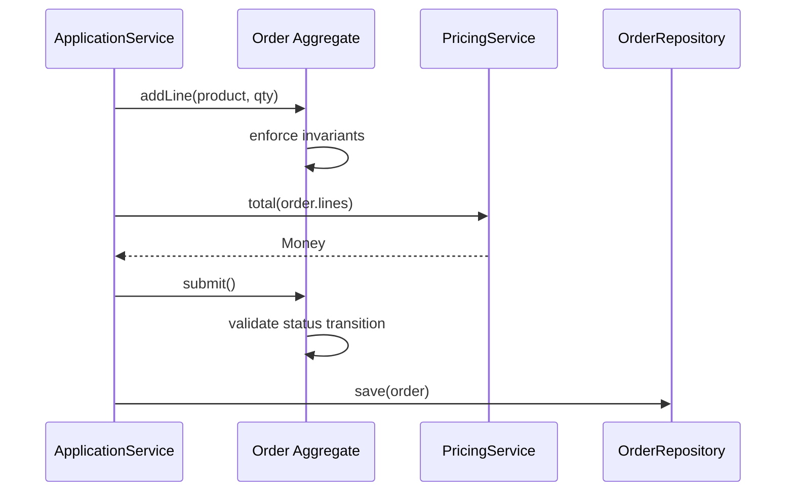

### Problem & Intent

Domain-Driven Design (DDD) building blocks give precise names to model elements so teams share a vocabulary for business logic. An **Entity** has identity that persists over time; a **Value Object** is defined only by its attributes and is immutable. An **Aggregate** clusters entities and value objects under one **Aggregate Root** that enforces invariants and is the sole entry point for changes. A **Domain Service** holds logic that does not belong naturally on a single entity. These blocks keep rich behavior in the domain instead of anemic data classes with rules scattered in services.

---

### When to Use / When NOT to Use

| Situation | Use? | Why |
| :--- | :---: | :--- |
| Complex business rules with invariants spanning multiple fields | Yes | Aggregate root enforces consistency inside the boundary |
| Concepts like Money, Email, or Address compared by value | Yes | Value objects prevent primitive obsession |
| Order + line items must update atomically | Yes | Aggregate defines transaction and consistency boundary |
| Simple CRUD with no domain rules | No | Entity/VO ceremony adds friction without behavioral gain |
| Read-only reporting aggregates across many bounded contexts | No | Use projections or query models, not rich aggregates |
| Team has no ubiquitous language workshop — DDD terms used cosmetically | No | Fix modeling conversations first; patterns won't rescue vague domains |

---

### Structure (Class Diagram)



---

### Interaction Flow



---

### Implementation




**Anemic model — logic outside domain:**

```java
public class OrderEntity {
    public Long id;
    public String status;
    public List<OrderLineEntity> lines;
}

public class OrderService {
    public void submit(OrderEntity order) {
        if ("SHIPPED".equals(order.status)) {
            throw new IllegalStateException("already shipped");
        }
        if (order.lines.isEmpty()) {
            throw new IllegalArgumentException("empty order");
        }
        order.status = "SUBMITTED";
        repository.save(order);
    }
}
```

**Rich aggregate + value objects:**

```java
public record Money(BigDecimal amount, Currency currency) {
    public Money {
        if (amount.signum() < 0) throw new IllegalArgumentException("negative");
    }
    public Money add(Money other) {
        if (!currency.equals(other.currency)) throw new IllegalArgumentException("currency");
        return new Money(amount.add(other.amount), currency);
    }
}

public final class Order { // aggregate root
    private final OrderId id;
    private OrderStatus status;
    private final List<OrderLine> lines = new ArrayList<>();

    public void addLine(ProductId productId, int quantity) {
        if (status != OrderStatus.DRAFT) throw new DomainException("not draft");
        lines.add(new OrderLine(productId, quantity));
    }

    public void submit() {
        if (lines.isEmpty()) throw new DomainException("empty order");
        status = OrderStatus.SUBMITTED;
    }

    public Money total(PricingService pricing) {
        return pricing.total(lines);
    }
}

public final class PricingService { // domain service
    public Money total(List<OrderLine> lines) {
        return lines.stream()
            .map(OrderLine::lineTotal)
            .reduce(Money::add)
            .orElseThrow();
    }
}
```




**Anemic model:**

```go
type OrderRow struct {
    ID     int64
    Status string
    Lines  []LineRow
}

func SubmitOrder(repo OrderRepo, id int64) error {
    o, _ := repo.Find(id)
    if o.Status == "SHIPPED" {
        return errors.New("already shipped")
    }
    o.Status = "SUBMITTED"
    return repo.Save(o)
}
```

**Rich aggregate:**

```go
type Money struct {
    Amount   int64
    Currency string
}

func (m Money) Add(other Money) (Money, error) {
    if m.Currency != other.Currency {
        return Money{}, errors.New("currency mismatch")
    }
    return Money{Amount: m.Amount + other.Amount, Currency: m.Currency}, nil
}

type Order struct {
    id     OrderID
    status OrderStatus
    lines  []OrderLine
}

func (o *Order) AddLine(product ProductID, qty int) error {
    if o.status != Draft {
        return errors.New("not draft")
    }
    o.lines = append(o.lines, OrderLine{Product: product, Qty: qty})
    return nil
}

func (o *Order) Submit() error {
    if len(o.lines) == 0 {
        return errors.New("empty order")
    }
    o.status = Submitted
    return nil
}

type PricingService struct{}

func (PricingService) Total(lines []OrderLine) (Money, error) {
  // sum line totals
}
```

Export only aggregate-root constructors; keep `Order` mutation methods on the root type.




```python
from typing import Protocol

class ExamplePort(Protocol):
    def execute(self) -> None: ...

class ExampleService:
    def __init__(self, port: ExamplePort) -> None:
        self._port = port

    def run(self) -> None:
        self._port.execute()
```




---

### Trade-offs & Operational Realities

| Concern | Impact |
| :--- | :--- |
| **Testability** | Aggregate unit tests exercise invariants without DB; domain services tested with sample aggregates |
| **Complexity** | Mapping aggregates to relational tables (1-N lines) requires thoughtful repository design |
| **Framework fit** | JPA `@Entity` on aggregate root only; avoid `@OneToMany` cascade traps on large graphs |
| **Consistency boundary** | One aggregate per transaction — cross-aggregate updates use domain events or sagas |

---

### Junior Mistakes

- Making every table row an aggregate root — no consistency boundary
- Mutable value objects (setters on `Money`) — breaks equality semantics
- Domain service for logic that clearly belongs on the entity ("just a static helper")
- Loading entire object graphs with lazy collections outside the transaction

---

### Senior Questions

1. Order vs OrderLine — which is the aggregate root and who creates line items?
2. How do you persist a value object — embed columns or JSON blob?
3. When does logic move from aggregate to domain service?
4. How large can an aggregate grow before performance forces splitting?
5. How do domain events relate to aggregate state changes?

---

### Revision Cheat Sheet

- **One line:** Entity has ID; Value Object has no identity; Aggregate Root guards invariants.
- **Trigger smell:** `OrderService` with 200 lines of `if status == ...` and public field mutation.
- **Pairs with:** [Repository & UoW](/design-patterns/06-architectural-principles/repository-and-unit-of-work/), [Specification](/design-patterns/06-architectural-principles/specification-pattern/), [DTO Mapper](/design-patterns/06-architectural-principles/dto-entity-mapper-separation/)
- **Avoid when:** No real domain rules — CRUD doesn't need DDD taxonomy.
- **Interview tip:** Sketch one aggregate, name the root, list two invariants it enforces.

---

### See Also

- [Repository & Unit of Work](/design-patterns/06-architectural-principles/repository-and-unit-of-work/)
- [Specification Pattern](/design-patterns/06-architectural-principles/specification-pattern/)
- [DTO vs Entity Mapper Separation](/design-patterns/06-architectural-principles/dto-entity-mapper-separation/)
- [Layered vs Hexagonal Architecture](/design-patterns/06-architectural-principles/layered-vs-hexagonal-architecture/)
