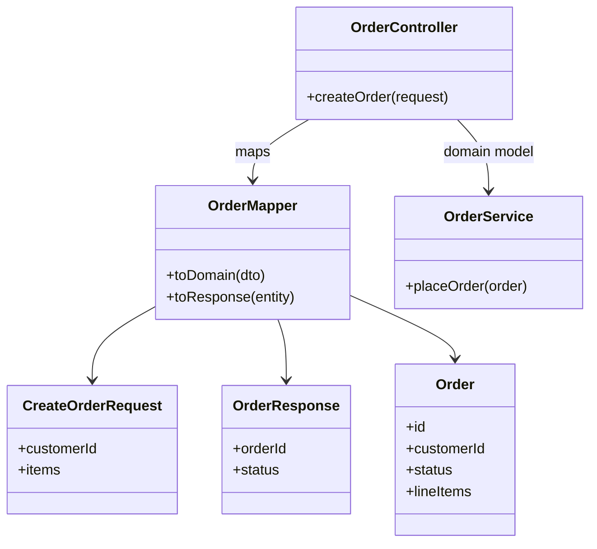
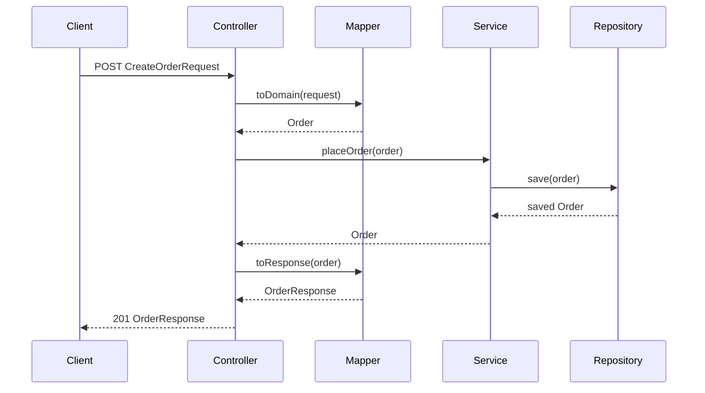

### Problem & Intent

**DTOs (Data Transfer Objects)** carry data across process boundaries — HTTP request/response bodies, message payloads, and UI views. **Entities** (or domain models) represent persistence and business invariants inside the application core. Leaking entities to the API couples clients to your schema, exposes internal fields (password hashes, lazy proxies), and forces API versioning every time a column changes. A dedicated **mapper** translates between the two shapes at the edge.

---

### When to Use / When NOT to Use

| Situation | Use? | Why |
| :--- | :---: | :--- |
| Public REST API with consumers outside your team | Yes | DTOs stabilize the contract; entities evolve independently |
| Entity has fields clients must never see (internal flags, relations) | Yes | Map only safe, intentional fields to the response DTO |
| Request shape differs from domain model (flattened address, combined name) | Yes | Mapper absorbs structural differences |
| Internal admin tool on same codebase with no external API | No | Direct entity use may be acceptable for speed |
| Identical 1:1 field mapping on a throwaway prototype | No | YAGNI — add mapper when the API stabilizes |
| Heavy read models with projection queries (CQRS) | No | Return query DTOs from the read side; don't map full entities |

---

### Structure (Class Diagram)



---

### Interaction Flow



---

### Implementation




**Violation — JPA entity returned from REST controller:**

```java
@RestController
public class OrderController {
    @Autowired OrderRepository repository;

    @PostMapping("/orders")
    public OrderEntity create(@RequestBody OrderEntity body) {
        return repository.save(body); // leaks schema, enables over-posting
    }
}
```

**DTO + mapper at the boundary:**

```java
public record CreateOrderRequest(Long customerId, List<LineItemDto> items) {}

public record OrderResponse(String orderId, String status, BigDecimal total) {}

public final class OrderMapper {
    public Order toDomain(CreateOrderRequest dto) {
        return new Order(dto.customerId(), dto.items().stream()
            .map(i -> new LineItem(i.sku(), i.quantity()))
            .toList());
    }

    public OrderResponse toResponse(Order order) {
        return new OrderResponse(
            order.getId().value(),
            order.getStatus().name(),
            order.total());
    }
}

@RestController
public class OrderController {
    private final OrderService service;
    private final OrderMapper mapper;

    public OrderController(OrderService service, OrderMapper mapper) {
        this.service = service;
        this.mapper = mapper;
    }

    @PostMapping("/orders")
    public OrderResponse create(@RequestBody CreateOrderRequest request) {
        Order saved = service.placeOrder(mapper.toDomain(request));
        return mapper.toResponse(saved);
    }
}
```

MapStruct or manual mappers — keep mapping **out of** domain services.




**Violation:**

```go
type Order struct {
    ID         int64  `json:"id" db:"id"`
    CustomerID int64  `json:"customer_id" db:"customer_id"`
    Internal   string `json:"internal_flag" db:"internal_flag"`
}

func (h *Handler) Create(w http.ResponseWriter, r *http.Request) {
    var o Order
    json.NewDecoder(r.Body).Decode(&o)
    h.repo.Save(r.Context(), o)
    json.NewEncoder(w).Encode(o) // exposes internal_flag to clients
}
```

**DTO + mapper:**

```go
type CreateOrderRequest struct {
    CustomerID int64          `json:"customer_id"`
    Items      []LineItemDTO  `json:"items"`
}

type OrderResponse struct {
    OrderID string  `json:"order_id"`
    Status  string  `json:"status"`
    Total   float64 `json:"total"`
}

type Order struct {
    ID         OrderID
    CustomerID int64
    Status     OrderStatus
    Items      []LineItem
    internal   string // unexported — never mapped out
}

func ToDomain(req CreateOrderRequest) Order {
    items := make([]LineItem, len(req.Items))
    for i, it := range req.Items {
        items[i] = LineItem{SKU: it.SKU, Qty: it.Qty}
    }
    return Order{CustomerID: req.CustomerID, Items: items}
}

func ToResponse(o Order) OrderResponse {
    return OrderResponse{
        OrderID: o.ID.String(),
        Status:  string(o.Status),
        Total:   o.Total(),
    }
}
```

Use separate struct tags only on DTOs — domain types stay JSON-agnostic.




---

### Trade-offs & Operational Realities

| Concern | Impact |
| :--- | :--- |
| **Testability** | Mapper unit tests verify field mapping without HTTP or DB |
| **Complexity** | Duplicate field lists — MapStruct/codegen reduces drift; manual mappers need discipline |
| **Framework fit** | Spring: `@RestController` + records; Go: handler calls pure `ToDomain`/`ToResponse` functions |
| **Performance** | Extra allocation per request — negligible vs I/O; batch APIs may need streamlined projections |

---

### Junior Mistakes

- Using the same class for JPA `@Entity` and `@RequestBody` — over-posting and lazy-load serialization bugs
- Putting mapping logic inside domain entities (`order.toResponse()`) — couples domain to API shape
- Returning `Map<String,Object>` instead of typed DTOs — loses contract clarity
- Copy-pasting mapper code per endpoint instead of shared mapper component

---

### Senior Questions

1. Where does validation live — DTO bean validation, domain, or both?
2. How do you version APIs when DTO v2 diverges from entity shape?
3. Mapper in controller vs dedicated `OrderAssembler` — who owns the boundary?
4. When is MapStruct worth it vs hand-written mapping for 5 fields?
5. How do read-optimized CQRS projections change the need for entity→DTO mapping?

---

### Revision Cheat Sheet

- **One line:** API speaks DTO; core speaks domain/entity; mapper translates at the edge.
- **Trigger smell:** `@Entity` class annotated with `@JsonIgnoreProperties` everywhere.
- **Pairs with:** [DDD Building Blocks](/design-patterns/06-architectural-principles/domain-driven-design-building-blocks/), [Layered vs Hexagonal](/design-patterns/06-architectural-principles/layered-vs-hexagonal-architecture/), [SRP](/design-patterns/01-solid-principles/single-responsibility-principle/)
- **Avoid when:** Internal-only API with identical shapes and no stability requirement.
- **Interview tip:** Name one field you'd never expose (password, cost price, internal state).

---

### See Also

- [Domain-Driven Design Building Blocks](/design-patterns/06-architectural-principles/domain-driven-design-building-blocks/)
- [Layered vs Hexagonal Architecture](/design-patterns/06-architectural-principles/layered-vs-hexagonal-architecture/)
- [Repository & Unit of Work](/design-patterns/06-architectural-principles/repository-and-unit-of-work/)
- [Single Responsibility Principle](/design-patterns/01-solid-principles/single-responsibility-principle/)
