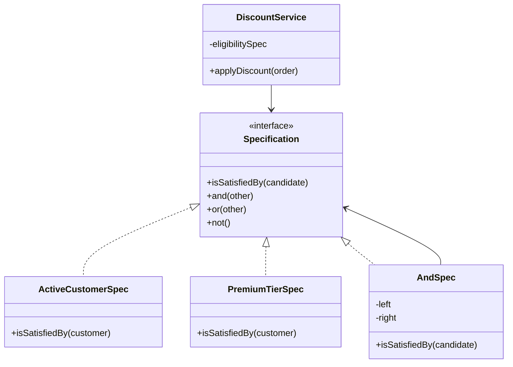
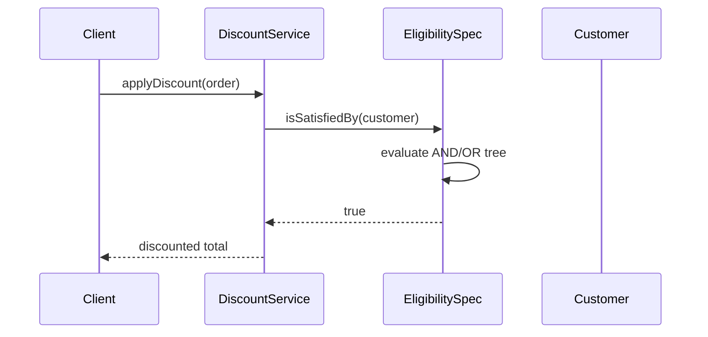

### Problem & Intent

The **Specification Pattern** encapsulates a business rule as a predicate that answers whether a candidate object satisfies a condition. Specifications compose with **and**, **or**, and **not** to build complex rules from small, testable units. Use them for in-memory validation, domain rule checks before state transitions, and (when extended) translation to database query criteria. It replaces scattered boolean methods and duplicated `if` chains with named, reusable rule objects.

---

### When to Use / When NOT to Use

| Situation | Use? | Why |
| :--- | :---: | :--- |
| Multiple overlapping eligibility rules combined differently per use case | Yes | Compose specs instead of multiplying `isEligibleForX` methods |
| Same rule used for validation and repository filtering | Yes | Single source of truth for "active premium customer" |
| Rules must be unit-tested in isolation with table-driven cases | Yes | Each spec is one class or function |
| One simple check (`age >= 18`) used once | No | Inline predicate is clearer |
| Rules are entirely data-driven config with no code structure | No | Rule engine or DSL may fit better |
| Heavy dynamic SQL with ten-way joins | No | Query object or repository method may be simpler than spec-to-SQL |

---

### Structure (Class Diagram)



---

### Interaction Flow



---

### Implementation




**Scattered boolean checks:**

```java
public boolean canApplyHolidayDiscount(Customer c, Order o) {
    return c.isActive() && "PREMIUM".equals(c.getTier())
        && o.getTotal().compareTo(new BigDecimal("50")) > 0
        && !o.hasPromoCode();
}
```

**Composable specifications:**

```java
public interface Specification<T> {
    boolean isSatisfiedBy(T candidate);

    default Specification<T> and(Specification<T> other) {
        return c -> this.isSatisfiedBy(c) && other.isSatisfiedBy(c);
    }
    default Specification<T> or(Specification<T> other) {
        return c -> this.isSatisfiedBy(c) || other.isSatisfiedBy(c);
    }
    default Specification<T> not() {
        return c -> !this.isSatisfiedBy(c);
    }
}

public final class ActiveCustomerSpec implements Specification<Customer> {
    @Override
    public boolean isSatisfiedBy(Customer c) {
        return c.status() == CustomerStatus.ACTIVE;
    }
}

public final class PremiumTierSpec implements Specification<Customer> {
    @Override
    public boolean isSatisfiedBy(Customer c) {
        return c.tier() == Tier.PREMIUM;
    }
}

public final class DiscountService {
    private final Specification<Customer> eligibility =
        new ActiveCustomerSpec().and(new PremiumTierSpec());

    public Money applyDiscount(Customer customer, Order order) {
        if (!eligibility.isSatisfiedBy(customer)) {
            return order.total();
        }
        return order.total().multiply(new BigDecimal("0.90"));
    }
}
```

Optional: `CustomerRepository.findSatisfying(Specification<Customer>)` with JPA Criteria translation for query pushdown.




**Scattered checks:**

```go
func CanApplyHolidayDiscount(c Customer, o Order) bool {
    return c.Active && c.Tier == "PREMIUM" && o.Total > 50 && !o.HasPromo
}
```

**Composable specifications:**

```go
type Spec[T any] func(T) bool

func (s Spec[T]) And(other Spec[T]) Spec[T] {
    return func(t T) bool { return s(t) && other(t) }
}

func (s Spec[T]) Or(other Spec[T]) Spec[T] {
    return func(t T) bool { return s(t) || other(t) }
}

func (s Spec[T]) Not() Spec[T] {
    return func(t T) bool { return !s(t) }
}

var ActiveCustomer Spec[Customer] = func(c Customer) bool { return c.Status == Active }
var PremiumTier Spec[Customer] = func(c Customer) bool { return c.Tier == Premium }

type DiscountService struct {
    eligibility Spec[Customer]
}

func NewDiscountService() *DiscountService {
    return &DiscountService{
        eligibility: ActiveCustomer.And(PremiumTier),
    }
}

func (s *DiscountService) ApplyDiscount(c Customer, o Order) float64 {
    if !s.eligibility(c) {
        return o.Total
    }
    return o.Total * 0.90
}
```

Go uses **function types** as specs — structs when a spec needs configuration (e.g. `MinOrderTotalSpec{Min: 50}`).




---

### Trade-offs & Operational Realities

| Concern | Impact |
| :--- | :--- |
| **Testability** | Each spec tested with 2–3 cases; composed specs tested via component specs |
| **Complexity** | Deep AND/OR trees become hard to read — name composite specs explicitly |
| **Framework fit** | Spring Data JPA: optional `Specification<T>` for Criteria queries; domain specs stay pure |
| **Performance** | In-memory filtering on large collections needs repository-level spec translation |

---

### Junior Mistakes

- Creating a specification class per endpoint instead of per business rule
- Putting I/O inside `isSatisfiedBy` — specs should be pure predicates
- Duplicating the same rule in SQL, service, and validator with no shared spec
- Over-using specs for trivial one-liners — `Spec` type noise without reuse

---

### Senior Questions

1. How do you translate an in-memory spec to a JPA `CriteriaQuery` without duplication?
2. Specification vs Strategy vs Chain of Responsibility — classify a discount pipeline.
3. When does a named spec deserve its own class vs a lambda in a registry?
4. How do you debug which sub-spec failed in a composite AND tree?
5. Spec pattern vs validation framework (`@Valid`) — where is the boundary?

---

### Revision Cheat Sheet

- **One line:** Business rules as composable predicates (`and` / `or` / `not`).
- **Trigger smell:** Five methods like `isEligibleForPromoA`, `isEligibleForPromoB` sharing partial checks.
- **Pairs with:** [Strategy Pattern](/design-patterns/04-behavioral-patterns/strategy-pattern/), [DDD Building Blocks](/design-patterns/06-architectural-principles/domain-driven-design-building-blocks/), [Open-Closed](/design-patterns/01-solid-principles/open-closed-principle/)
- **Avoid when:** Single-use, one-line condition with no reuse or composition.
- **Interview tip:** Write two atomic specs and compose them live for a discount rule.

---

### See Also

- [Strategy Pattern](/design-patterns/04-behavioral-patterns/strategy-pattern/)
- [Domain-Driven Design Building Blocks](/design-patterns/06-architectural-principles/domain-driven-design-building-blocks/)
- [Open-Closed Principle](/design-patterns/01-solid-principles/open-closed-principle/)
- [Chain of Responsibility Pattern](/design-patterns/04-behavioral-patterns/chain-of-responsibility-pattern/)
