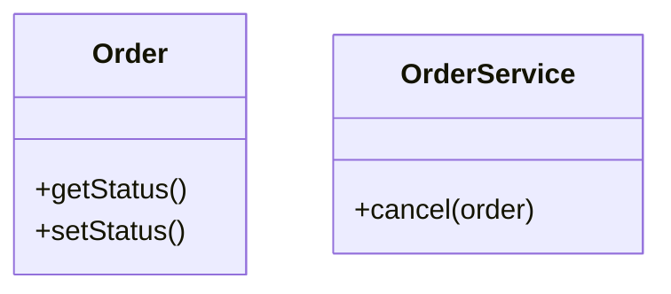
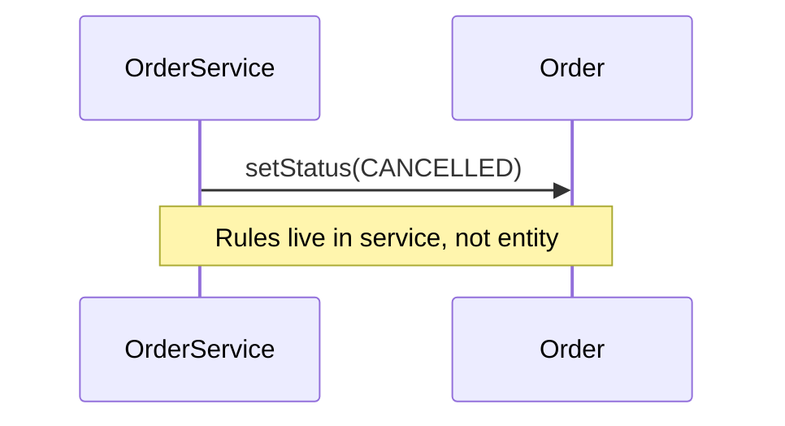

### Problem & Intent

**Anemic domain model** puts all behavior in service classes while entities are getters/setters. CRUD templates encourage it — but business rules scatter, invariants leak, and [DDD aggregates](/design-patterns/06-architectural-principles/domain-driven-design-building-blocks/) cannot enforce consistency.

---

### When to Use / When NOT to Use

| Situation | Anemic? | Why |
| :--- | :---: | :--- |
| `OrderService` mutates `Order` fields directly | Yes | Move rules into `Order` |
| Read-only reporting DTO | OK | Not domain core |
| Rich `Order.cancel()` checks state | No | Rich model |

---

### Structure (Class Diagram)



---

### Interaction Flow



---

### Implementation




**Violation — anemic entity:**

```java
public class Order {
    private String status;
    public String getStatus() { return status; }
    public void setStatus(String status) { this.status = status; }
}

public class OrderService {
    public void cancel(Order order) {
        if ("SHIPPED".equals(order.getStatus())) throw new IllegalStateException();
        order.setStatus("CANCELLED");
    }
}
```

**Fixed — rich domain:**

```java
public class Order {
    private OrderStatus status;
    public void cancel() {
        if (status == OrderStatus.SHIPPED) {
            throw new IllegalStateException("Cannot cancel shipped order");
        }
        this.status = OrderStatus.CANCELLED;
    }
}
```




**Violation:**

```go
type Order struct { Status string }

func (s *OrderService) Cancel(o *Order) error {
    if o.Status == "SHIPPED" { return errors.New("cannot cancel") }
    o.Status = "CANCELLED"
    return nil
}
```

**Fixed:**

```go
func (o *Order) Cancel() error {
    if o.Status == Shipped {
        return errors.New("cannot cancel shipped order")
    }
    o.Status = Cancelled
    return nil
}
```




**Violation:**

```python
class OrderManager:
    def place(self, req: dict) -> None:
        # many unrelated responsibilities in one type
        ...
```

**Fixed:**

```python
class OrderService:
    def __init__(self, validator, repo, notifier) -> None:
        self._validator = validator
        self._repo = repo
        self._notifier = notifier

    def place(self, req: dict) -> str:
        self._validator.check(req)
        return self._repo.save(req)
```




---

### Trade-offs & Operational Realities

| Approach | Pros | Cons |
| :--- | :--- | :--- |
| **Anemic + services** | Fast CRUD scaffolding | Rules scatter |
| **Rich domain** | Cohesive invariants | Steeper learning curve |

---

### Junior Mistakes

- Treating DTOs as domain entities.
- Testing only service layer, never domain rules.

---

### Senior Questions

1. Where should cross-aggregate rules live?
2. How does anemic model relate to [Transaction Script](/design-patterns/06-architectural-principles/domain-driven-design-building-blocks/)?

---

### Revision Cheat Sheet

- **Tell, don't ask** — entities own behavior.
- **Services** orchestrate, not replace domain logic.

---

### See Also

- [DDD Building Blocks](/design-patterns/06-architectural-principles/domain-driven-design-building-blocks/)
- [DTO Separation](/design-patterns/06-architectural-principles/dto-entity-mapper-separation/)
