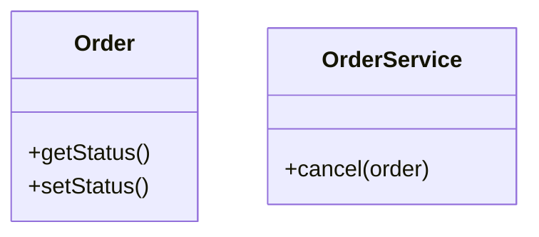
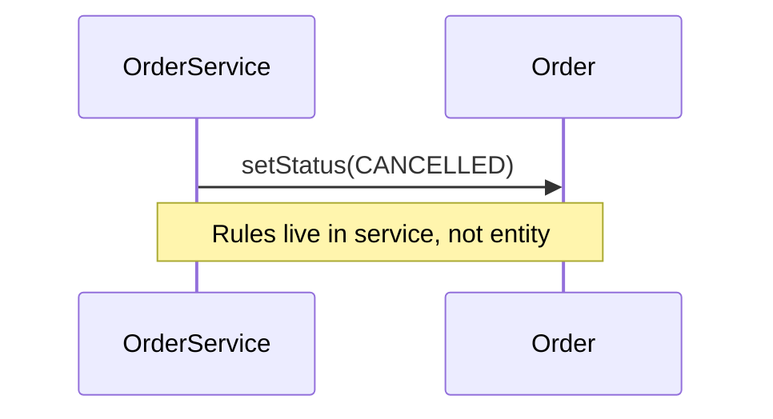

### Problem & Intent

**Anemic domain model** puts all behavior in service classes while entities are getters/setters. CRUD templates encourage it — but business rules scatter, invariants leak, and [DDD aggregates](/design-patterns/06-architectural-principles/domain-driven-design-building-blocks/) cannot enforce consistency.

---

### When to Use / When NOT to Use

| Situation | Anemic? | Why |
| :--- | :---: | :--- |
| `OrderService` mutates `Order` fields directly | Yes | Move rules into `Order` |
| Read-only reporting DTO | OK | Not domain core |
| Rich `Order.cancel()` checks state | No | Rich model |

---

### Structure (Class Diagram)

---

### Interaction Flow

---

### Implementation

Move invariants into entities; services coordinate transactions and infrastructure.

---

### Trade-offs & Operational Realities

| Approach | Pros | Cons |
| :--- | :--- | :--- |
| **Anemic + services** | Fast CRUD scaffolding | Rules scatter |
| **Rich domain** | Cohesive invariants | Steeper learning curve |

---

### Junior Mistakes

- Treating DTOs as domain entities.
- Testing only service layer, never domain rules.

---

### Senior Questions

1. Where should cross-aggregate rules live?
2. How does anemic model relate to [Transaction Script](/design-patterns/06-architectural-principles/domain-driven-design-building-blocks/)?

---

### Revision Cheat Sheet

- **Tell, don't ask** — entities own behavior.
- **Services** orchestrate, not replace domain logic.

---

### See Also

- [DDD Building Blocks](/design-patterns/06-architectural-principles/domain-driven-design-building-blocks/)
- [DTO Separation](/design-patterns/06-architectural-principles/dto-entity-mapper-separation/)
