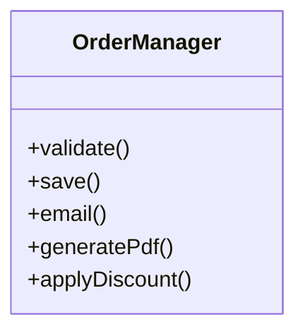
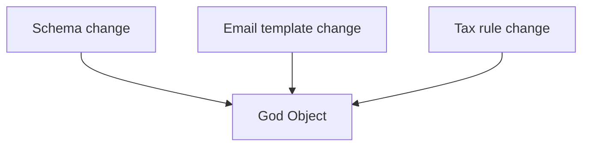

### Problem & Intent

A **god object** centralizes too many responsibilities — persistence, validation, notifications, reporting — becoming the single point every change touches. It violates [SRP](/design-patterns/01-solid-principles/single-responsibility-principle/) and blocks independent testing.

---

### When to Use / When NOT to Use

| Situation | God Object? | Why |
| :--- | :---: | :--- |
| Class name is `Manager`, `Handler`, `Util` with 20+ methods | Smell | Split by reason to change |
| Prototype script under 200 lines | Maybe OK | Revisit before production |
| Legacy module with no tests | Anti-pattern | Incremental extract |

---

### Structure (Class Diagram)



---

### Interaction Flow



---

### Implementation




**Violation — god object:**

```java
public class OrderManager {
    public void placeOrder(OrderRequest req) {
        validate(req);
        jdbc.save(req);
        smtp.send(req.getEmail(), buildBody(req));
        pdf.generate(req);
    }
    // + discount, tax, inventory, audit...
}
```

**Fixed — SRP splits:**

```java
public class OrderService {
    private final OrderValidator validator;
    private final OrderRepository repository;
    private final OrderNotifier notifier;

    public OrderId place(OrderRequest req) {
        validator.validate(req);
        Order order = repository.save(req);
        notifier.sendConfirmation(order);
        return order.id();
    }
}
```




**Violation:**

```go
type OrderManager struct{}

func (m *OrderManager) Place(req OrderRequest) error {
    // validate + save + email + pdf in one type
    return nil
}
```

**Fixed:**

```go
type OrderService struct {
    repo     OrderRepository
    notify   Notifier
    validate Validator
}

func (s *OrderService) Place(ctx context.Context, req OrderRequest) (OrderID, error) {
    if err := s.validate.Check(req); err != nil {
        return "", err
    }
    order, err := s.repo.Save(ctx, req)
    if err != nil {
        return "", err
    }
    _ = s.notify.Confirmation(ctx, order)
    return order.ID, nil
}
```




**Violation:**

```python
class OrderManager:
    def place(self, req: dict) -> None:
        # validate + persist + email + pdf in one class
        ...
```

**Fixed:**

```python
class OrderService:
    def __init__(self, validator, repo, notifier) -> None:
        self._validator = validator
        self._repo = repo
        self._notifier = notifier

    def place(self, req: dict) -> str:
        self._validator.check(req)
        oid = self._repo.save(req)
        self._notifier.confirm(oid)
        return oid
```




---

### Trade-offs & Operational Realities

| Approach | Pros | Cons |
| :--- | :--- | :--- |
| **Big-bang rewrite** | Clean model | High risk |
| **Strangler extract** | Safer | Temporary duplication |

---

### Junior Mistakes

- Renaming `OrderManager` to `OrderService` without splitting responsibilities.
- Adding another `if` branch instead of new class.

---

### Senior Questions

1. How do you prioritize extractions from a god class?
2. What metrics prove the refactor worked?

---

### Revision Cheat Sheet

- **Symptom:** many unrelated imports, huge test setup.
- **Fix:** SRP splits + DIP for dependencies.

---

### See Also

- [SRP](/design-patterns/01-solid-principles/single-responsibility-principle/)
- [SOLID composition guide](/design-patterns/01-solid-principles/solid-principles-composition-guide/)
- [Shotgun Surgery](/design-patterns/07-anti-patterns/shotgun-surgery/)
