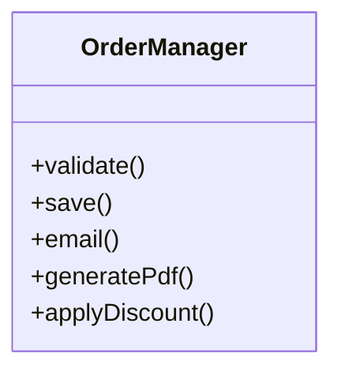
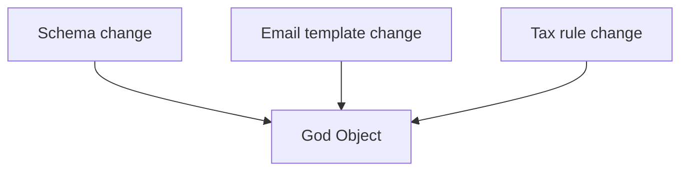

### Problem & Intent

A **god object** centralizes too many responsibilities — persistence, validation, notifications, reporting — becoming the single point every change touches. It violates [SRP](/design-patterns/01-solid-principles/single-responsibility-principle/) and blocks independent testing.

---

### When to Use / When NOT to Use

| Situation | God Object? | Why |
| :--- | :---: | :--- |
| Class name is `Manager`, `Handler`, `Util` with 20+ methods | Smell | Split by reason to change |
| Prototype script under 200 lines | Maybe OK | Revisit before production |
| Legacy module with no tests | Anti-pattern | Incremental extract |

---

### Structure (Class Diagram)

---

### Interaction Flow

---

### Implementation

**Corrective pattern:** Extract [Facade](/design-patterns/03-structural-patterns/facade-pattern/) only after splitting services — facade orchestrates, it does not absorb all logic.

---

### Trade-offs & Operational Realities

| Approach | Pros | Cons |
| :--- | :--- | :--- |
| **Big-bang rewrite** | Clean model | High risk |
| **Strangler extract** | Safer | Temporary duplication |

---

### Junior Mistakes

- Renaming `OrderManager` to `OrderService` without splitting responsibilities.
- Adding another `if` branch instead of new class.

---

### Senior Questions

1. How do you prioritize extractions from a god class?
2. What metrics prove the refactor worked?

---

### Revision Cheat Sheet

- **Symptom:** many unrelated imports, huge test setup.
- **Fix:** SRP splits + DIP for dependencies.

---

### See Also

- [SRP](/design-patterns/01-solid-principles/single-responsibility-principle/)
- [SOLID composition guide](/design-patterns/01-solid-principles/solid-principles-composition-guide/)
- [Shotgun Surgery](/design-patterns/07-anti-patterns/shotgun-surgery/)
