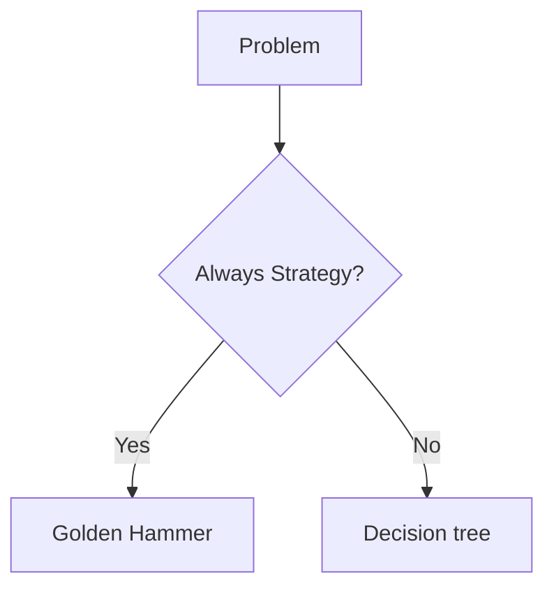
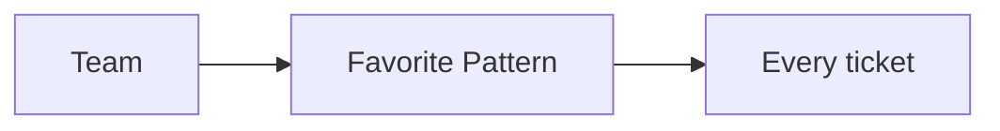

### Problem & Intent

**Golden hammer** — every problem looks like a nail for your favorite pattern (Singleton, microservices, event sourcing). Patterns are tools; misapplication adds ceremony without reducing change cost.

---

### When to Use / When NOT to Use

| Situation | Golden Hammer? | Why |
| :--- | :---: | :--- |
| Singleton for every shared bean | Yes | Use DI scope |
| Strategy for one never-changing algorithm | Yes | YAGNI |
| Appropriate State for order lifecycle | No | Legitimate fit |

---

### Structure (Class Diagram)



---

### Interaction Flow



---

### Implementation




**Violation — Kafka for everything:**

```java
public class UserController {
    @PostMapping("/users")
    public User create(@RequestBody User u) {
        kafka.send("user-create", u);
        return userRepo.findById(u.getId());
    }
}
```

**Fixed — match pattern to problem:**

```java
public class UserController {
  private final UserService users;
  @PostMapping("/users")
  public User create(@RequestBody CreateUser cmd) {
    return users.create(cmd); // sync + transactional
  }
}
```




**Violation:** Redis on every read because "Netflix uses it."

**Fixed:** Measure p99; cache hot keys with explicit TTL and invalidation only.




**Violation:**

```python
class OrderManager:
    def place(self, req: dict) -> None:
        # many unrelated responsibilities in one type
        ...
```

**Fixed:**

```python
class OrderService:
    def __init__(self, validator, repo, notifier) -> None:
        self._validator = validator
        self._repo = repo
        self._notifier = notifier

    def place(self, req: dict) -> str:
        self._validator.check(req)
        return self._repo.save(req)
```




Use [pattern decision tree](/design-patterns/09-pattern-selection-guide/pattern-decision-tree/) before adopting a pattern.

---

### Trade-offs & Operational Realities

| Cost of misuse | Example |
| :--- | :--- |
| **Test burden** | Mocking unnecessary factories |
| **Onboarding** | Juniors learn patterns not domain |

---

### Junior Mistakes

- Naming classes `XStrategy` without swappable algorithms.
- Singleton for testability destruction.

---

### Senior Questions

1. How do architects review for pattern fit vs fashion?
2. What ADR documents pattern rejection?

---

### Revision Cheat Sheet

- **Ask:** what force does this pattern solve?
- **Read:** [Pattern selection guide](/design-patterns/09-pattern-selection-guide/)

---

### See Also

- [Singleton](/design-patterns/02-creational-patterns/singleton-pattern/)
- [When to use which pattern](/design-patterns/09-pattern-selection-guide/when-to-use-which-pattern/)
