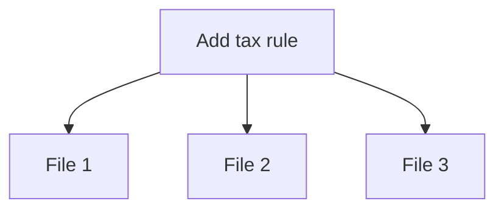
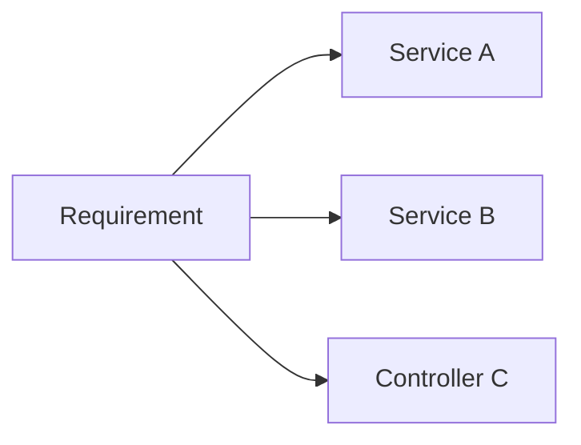

### Problem & Intent

**Shotgun surgery** — one logical change requires edits across many classes. It often violates [OCP](/design-patterns/01-solid-principles/open-closed-principle/) and indicates missing abstraction or duplicated policy.

---

### When to Use / When NOT to Use

| Situation | Shotgun? | Why |
| :--- | :---: | :--- |
| New report format touches 12 packages | Yes | Extract strategy or template |
| Rename field in one bounded context | No | Normal refactor |

---

### Structure (Class Diagram)

---

### Interaction Flow

---

### Implementation

Consolidate variation behind [Strategy](/design-patterns/04-behavioral-patterns/strategy-pattern/), [Template Method](/design-patterns/04-behavioral-patterns/template-method-pattern/), or configuration.

---

### Trade-offs & Operational Realities

| Approach | Benefit |
| :--- | :--- |
| **Extract policy object** | Single edit point |
| **Feature flags** | Decouple deploy from code paths |

---

### Junior Mistakes

- Copy-paste `if (country == "US")` across layers.
- Fear of abstraction → repeated surgery.

---

### Senior Questions

1. How do you measure blast radius before/after refactor?
2. When does DRY cause wrong abstraction?

---

### Revision Cheat Sheet

- **One change → many files** = smell.
- **Fix:** encapsulate what varies (OCP).

---

### See Also

- [OCP](/design-patterns/01-solid-principles/open-closed-principle/)
- [Golden Hammer](/design-patterns/07-anti-patterns/golden-hammer/)
