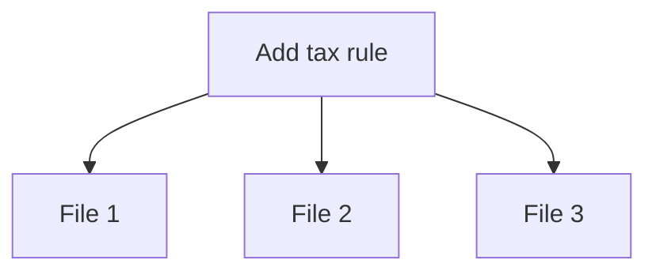
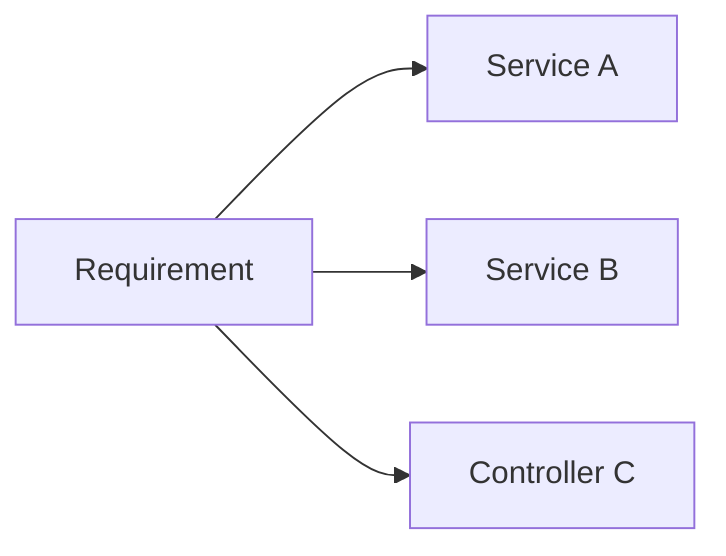

### Problem & Intent

**Shotgun surgery** — one logical change requires edits across many classes. It often violates [OCP](/design-patterns/01-solid-principles/open-closed-principle/) and indicates missing abstraction or duplicated policy.

---

### When to Use / When NOT to Use

| Situation | Shotgun? | Why |
| :--- | :---: | :--- |
| New report format touches 12 packages | Yes | Extract strategy or template |
| Rename field in one bounded context | No | Normal refactor |

---

### Structure (Class Diagram)



---

### Interaction Flow



---

### Implementation




**Violation — tax rule in 12 files:**

```java
// Controller, service, PDF, email template each duplicate:
if ("US".equals(order.getCountry())) { rate = 0.08; }
```

**Fixed — single policy:**

```java
public interface TaxPolicy { Money rateFor(Order order); }

public class OrderPricing {
    private final TaxPolicy tax;
    public Money total(Order o) { return o.subtotal().plus(tax.rateFor(o)); }
}
```




```go
type TaxPolicy interface { Rate(o Order) decimal.Decimal }

func Total(o Order, tax TaxPolicy) decimal.Decimal {
    return o.Subtotal.Add(tax.Rate(o))
}
```




**Violation:**

```python
class OrderManager:
    def place(self, req: dict) -> None:
        # many unrelated responsibilities in one type
        ...
```

**Fixed:**

```python
class OrderService:
    def __init__(self, validator, repo, notifier) -> None:
        self._validator = validator
        self._repo = repo
        self._notifier = notifier

    def place(self, req: dict) -> str:
        self._validator.check(req)
        return self._repo.save(req)
```




Consolidate variation behind [Strategy](/design-patterns/04-behavioral-patterns/strategy-pattern/) or [Template Method](/design-patterns/04-behavioral-patterns/template-method-pattern/).

---

### Trade-offs & Operational Realities

| Approach | Benefit |
| :--- | :--- |
| **Extract policy object** | Single edit point |
| **Feature flags** | Decouple deploy from code paths |

---

### Junior Mistakes

- Copy-paste `if (country == "US")` across layers.
- Fear of abstraction → repeated surgery.

---

### Senior Questions

1. How do you measure blast radius before/after refactor?
2. When does DRY cause wrong abstraction?

---

### Revision Cheat Sheet

- **One change → many files** = smell.
- **Fix:** encapsulate what varies (OCP).

---

### See Also

- [OCP](/design-patterns/01-solid-principles/open-closed-principle/)
- [Golden Hammer](/design-patterns/07-anti-patterns/golden-hammer/)
