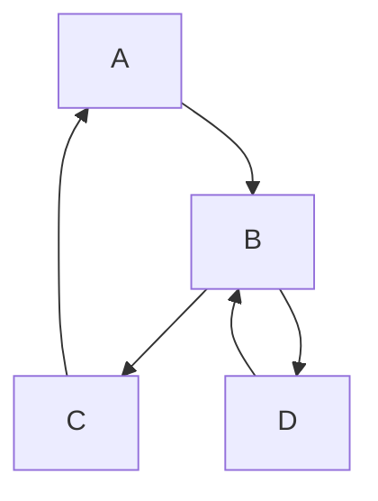

### Problem & Intent

**Spaghetti code** tangles control flow — cyclic dependencies, global state, and callbacks with no clear entry point. It differs from a legitimately complex workflow that still has bounded modules and tests.

---

### When to Use / When NOT to Use

| Situation | Spaghetti? | Why |
| :--- | :---: | :--- |
| Cannot trace request path without 6 hops | Yes | Introduce layers / facades |
| Event-driven with documented boundaries | No | Complexity with structure |

---

### Structure (Class Diagram)



---

### Interaction Flow


---

### Implementation




**Violation — tangled control flow:**

```java
public void process(Order o) {
    if (o.getType().equals("A")) {
        repo.save(o);
        if (o.isVip()) { email.send(o); }
        for (Line l : o.getLines()) { inventory.reserve(l); }
    } else if (o.getType().equals("B")) {
        // 80 lines of nested if/else...
    }
}
```

**Fixed — layered pipeline:**

```java
public class OrderPipeline {
    private final List<OrderHandler> handlers;
    public void process(Order o) {
        for (OrderHandler h : handlers) {
            h.handle(o);
        }
    }
}
```




**Violation:** one `Process` function with nested switches and global `var config`.

**Fixed:** small packages per concern; `handler` interface; dependency injection via constructor.

```go
type Handler interface { Handle(ctx context.Context, o *Order) error }

func RunPipeline(ctx context.Context, o *Order, handlers ...Handler) error {
    for _, h := range handlers {
        if err := h.Handle(ctx, o); err != nil {
            return err
        }
    }
    return nil
}
```




**Violation:**

```python
class OrderManager:
    def place(self, req: dict) -> None:
        # many unrelated responsibilities in one type
        ...
```

**Fixed:**

```python
class OrderService:
    def __init__(self, validator, repo, notifier) -> None:
        self._validator = validator
        self._repo = repo
        self._notifier = notifier

    def place(self, req: dict) -> str:
        self._validator.check(req)
        return self._repo.save(req)
```




Break cycles with [DIP](/design-patterns/01-solid-principles/dependency-inversion-principle/), introduce [Facade](/design-patterns/03-structural-patterns/facade-pattern/), extract [Chain of Responsibility](/design-patterns/04-behavioral-patterns/chain-of-responsibility-pattern/) for pipelines.

---

### Trade-offs & Operational Realities

| Fix | Risk |
| :--- | :--- |
| Module boundaries | Temporary feature freeze |
| Incremental strangler | Parallel paths during migration |

---

### Junior Mistakes

- Adding `// TODO refactor` for years.
- Copy-paste branches instead of shared abstractions.

---

### Senior Questions

1. How do you map dependencies to find cycles?
2. When is event spaghetti acceptable?

---

### Revision Cheat Sheet

- **Symptom:** fear of touching one file.
- **Fix:** layers, interfaces, kill globals.

---

### See Also

- [God Object](/design-patterns/07-anti-patterns/god-object/)
- [Layered vs Hexagonal](/design-patterns/06-architectural-principles/layered-vs-hexagonal-architecture/)
