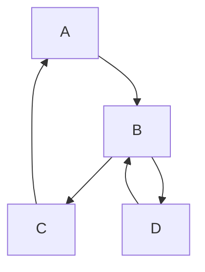

### Problem & Intent

**Spaghetti code** tangles control flow — cyclic dependencies, global state, and callbacks with no clear entry point. It differs from a legitimately complex workflow that still has bounded modules and tests.

---

### When to Use / When NOT to Use

| Situation | Spaghetti? | Why |
| :--- | :---: | :--- |
| Cannot trace request path without 6 hops | Yes | Introduce layers / facades |
| Event-driven with documented boundaries | No | Complexity with structure |

---

### Structure (Class Diagram)

---

### Interaction Flow

---

### Implementation

Break cycles with [DIP](/design-patterns/01-solid-principles/dependency-inversion-principle/), introduce [Facade](/design-patterns/03-structural-patterns/facade-pattern/), extract [Chain of Responsibility](/design-patterns/04-behavioral-patterns/chain-of-responsibility-pattern/) for pipelines.

---

### Trade-offs & Operational Realities

| Fix | Risk |
| :--- | :--- |
| Module boundaries | Temporary feature freeze |
| Incremental strangler | Parallel paths during migration |

---

### Junior Mistakes

- Adding `// TODO refactor` for years.
- Copy-paste branches instead of shared abstractions.

---

### Senior Questions

1. How do you map dependencies to find cycles?
2. When is event spaghetti acceptable?

---

### Revision Cheat Sheet

- **Symptom:** fear of touching one file.
- **Fix:** layers, interfaces, kill globals.

---

### See Also

- [God Object](/design-patterns/07-anti-patterns/god-object/)
- [Layered vs Hexagonal](/design-patterns/06-architectural-principles/layered-vs-hexagonal-architecture/)
