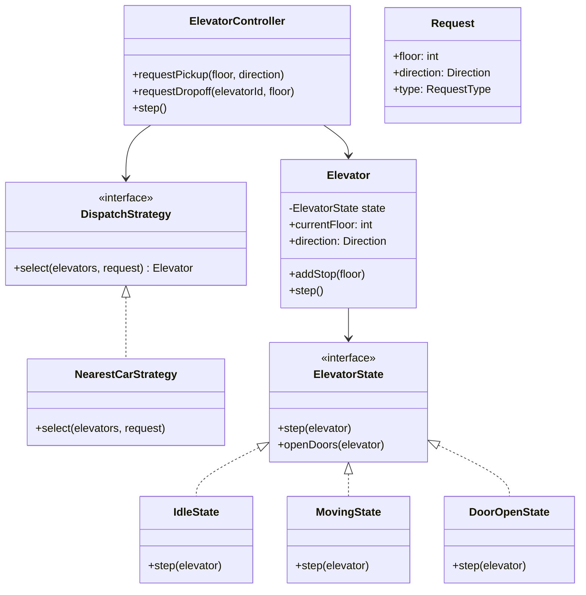
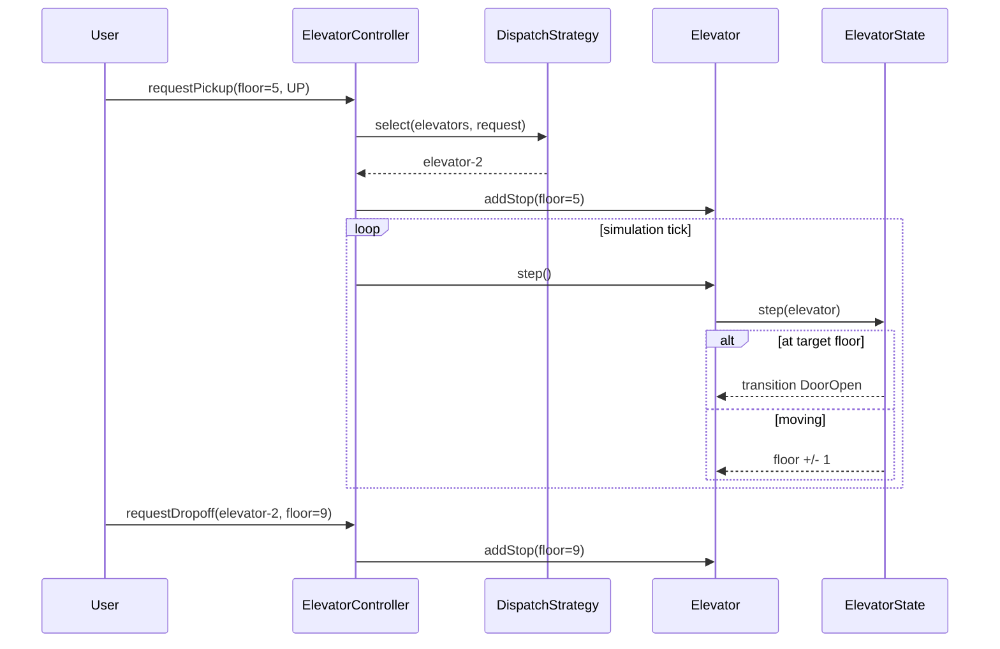

### Problem & Intent

An elevator control system coordinates **multiple cabins** across floors under asynchronous hall and cabin requests. The dominant design forces are (1) **state-driven cabin behavior** — idle, moving, door open — and (2) **pluggable dispatch algorithms** that pick which elevator serves a request. [State](/design-patterns/04-behavioral-patterns/state-pattern/) encapsulates legal transitions per cabin; [Strategy](/design-patterns/04-behavioral-patterns/strategy-pattern/) swaps scheduling policies (nearest-car, SCAN, priority floors) without rewriting the controller.

---

### When to Use / When NOT to Use

| Situation | Use? | Why |
| :--- | :---: | :--- |
| Cabin behavior changes by mode (maintenance, fire service, normal) | Yes | State objects own transition rules |
| Dispatch policy may change (energy-saving vs latency-optimized) | Yes | Strategy isolates scheduling from cabin physics |
| Multiple elevators competing for the same request queue | Yes | Central dispatcher + per-elevator state machines |
| Single elevator, fixed FCFS scheduling in a toy simulation | No | A sorted request list and one enum suffice |
| Hard real-time safety certification (IEC 61508) | No | Production systems need formal state charts and hardware interlocks beyond LLD scope |
| Building-wide traffic prediction with ML | No | Prediction layer sits above the dispatcher interface |

---

### Structure (Class Diagram)



---

### Interaction Flow



---

### Implementation




**Junior approach — giant switch on elevator status:**

```java
public class Elevator {
  int floor, target;
  String status; // IDLE, MOVING, DOOR_OPEN

  public void step() {
    switch (status) {
      case "IDLE" -> { /* ... */ }
      case "MOVING" -> { floor += target > floor ? 1 : -1; }
      case "DOOR_OPEN" -> { status = "IDLE"; }
    }
  }
}
```

**State + Strategy:**

```java
public enum Direction { UP, DOWN, NONE }

public interface ElevatorState {
    void step(Elevator context);
}

public final class MovingState implements ElevatorState {
    @Override
    public void step(Elevator e) {
        if (e.getCurrentFloor() == e.peekNextStop()) {
            e.setState(new DoorOpenState());
            return;
        }
        e.moveOneFloor();
    }
}

public interface DispatchStrategy {
    Elevator select(List<Elevator> elevators, Request request);
}

public final class NearestCarStrategy implements DispatchStrategy {
    @Override
    public Elevator select(List<Elevator> elevators, Request request) {
        return elevators.stream()
            .min(Comparator.comparingInt(e -> Math.abs(e.getCurrentFloor() - request.floor())))
            .orElseThrow();
    }
}

public final class Elevator {
    private ElevatorState state = new IdleState();
    private final TreeSet<Integer> upStops = new TreeSet<>();
    private final TreeSet<Integer> downStops = new TreeSet<>(Comparator.reverseOrder());
    private int currentFloor;

    public void addStop(int floor) {
        if (floor >= currentFloor) upStops.add(floor);
        else downStops.add(floor);
        if (state instanceof IdleState) setState(new MovingState());
    }

    public void step() { state.step(this); }
    public void setState(ElevatorState state) { this.state = state; }
    // getters, moveOneFloor(), peekNextStop() ...
}

public final class ElevatorController {
    private final List<Elevator> elevators;
    private final DispatchStrategy dispatchStrategy;

    public void requestPickup(int floor, Direction direction) {
        Request req = new Request(floor, direction, RequestType.PICKUP);
        Elevator chosen = dispatchStrategy.select(elevators, req);
        chosen.addStop(floor);
    }

    public void tick() {
        elevators.forEach(Elevator::step);
    }
}
```




**Junior approach:**

```go
type Elevator struct {
    Floor  int
    Status string // "IDLE", "MOVING", "DOOR_OPEN"
}

func (e *Elevator) Step() {
    switch e.Status {
    case "MOVING":
        e.Floor++
    case "DOOR_OPEN":
        e.Status = "IDLE"
    }
}
```

**State + Strategy:**

```go
type Direction int
const (
    Up Direction = iota
    Down
    None
)

type Request struct {
    Floor     int
    Direction Direction
}

type ElevatorState interface {
    Step(e *Elevator)
}

type MovingState struct{}

func (MovingState) Step(e *Elevator) {
    if e.CurrentFloor == e.PeekNextStop() {
        e.SetState(DoorOpenState{})
        return
    }
    e.MoveOneFloor()
}

type DispatchStrategy interface {
    Select(elevators []*Elevator, req Request) *Elevator
}

type NearestCar struct{}

func (NearestCar) Select(elevators []*Elevator, req Request) *Elevator {
    best := elevators[0]
    bestDist := abs(best.CurrentFloor - req.Floor)
    for _, el := range elevators[1:] {
        if d := abs(el.CurrentFloor - req.Floor); d < bestDist {
            best, bestDist = el, d
        }
    }
    return best
}

type Elevator struct {
    CurrentFloor int
    upStops      *intSet
    downStops    *intSet
    state        ElevatorState
}

func (e *Elevator) AddStop(floor int) {
    if floor >= e.CurrentFloor {
        e.upStops.Add(floor)
    } else {
        e.downStops.Add(floor)
    }
    if _, ok := e.state.(IdleState); ok {
        e.SetState(MovingState{})
    }
}

type ElevatorController struct {
    elevators []*Elevator
    dispatch  DispatchStrategy
}

func (c *ElevatorController) RequestPickup(floor int, dir Direction) {
    req := Request{Floor: floor, Direction: dir}
    chosen := c.dispatch.Select(c.elevators, req)
    chosen.AddStop(floor)
}

func (c *ElevatorController) Tick() {
    for _, e := range c.elevators {
        e.Step()
    }
}
```




---

### Trade-offs & Operational Realities

| Concern | Impact |
| :--- | :--- |
| **Testability** | States and strategies unit-test independently; controller tests use stub elevators |
| **Complexity** | State + strategy adds classes — justified when modes and dispatch policies multiply |
| **Framework fit** | Typically embedded firmware or simulation — not Spring-centric; Go channels optional for async ticks |
| **Concurrency** | Real buildings use PLC-level synchronization; LLD uses single-threaded `tick()` or per-elevator mutex |
| **Scaling** | Multi-bank buildings partition by zone; global optimum dispatch is NP-hard — heuristics (SCAN, nearest) trade optimality for latency |

---

### Junior Mistakes

- Encoding state as `String` or `int` constants with a monolithic `step()` switch — illegal transitions slip through
- Confusing **Strategy** (pick elevator) with **State** (cabin lifecycle) — merging them into one class
- Ignoring direction: assigning a DOWN request to an elevator heading UP with no stops between
- No door-open dwell time — instant transitions make simulation unrealistic and hide race bugs
- Dispatching to "nearest floor" without checking capacity or maintenance lockout

---

### Senior Questions

1. How do you add **fire-service mode** (bypass normal dispatch, return to ground) without editing every state class?
2. State vs Strategy — classify `SCAN` scheduling vs `DoorOpen` behavior.
3. How would you make `tick()` thread-safe when hall buttons and cabin panels update concurrently?
4. When does nearest-car perform worse than collective SCAN? Give a concrete traffic pattern.
5. How do you test that `MovingState` never opens doors between floors?

---

### Revision Cheat Sheet

- **One line:** State drives each cabin; strategy picks which cabin serves a request.
- **Trigger smell:** `switch(status)` growing with maintenance, fire, and normal modes.
- **Pairs with:** [State Pattern](/design-patterns/04-behavioral-patterns/state-pattern/), [Strategy Pattern](/design-patterns/04-behavioral-patterns/strategy-pattern/), [Command Pattern](/design-patterns/04-behavioral-patterns/command-pattern/)
- **Avoid when:** Single elevator, one scheduling rule, no mode variations.
- **Interview tip:** Clarify pickup vs dropoff requests before drawing the diagram.

---

### See Also

- [State Pattern](/design-patterns/04-behavioral-patterns/state-pattern/)
- [Strategy vs State vs Template Method](/design-patterns/05-pattern-comparisons/strategy-vs-state-vs-template-method/)
- [Strategy Pattern](/design-patterns/04-behavioral-patterns/strategy-pattern/)
- [Parking Lot System LLD](/design-patterns/08-lld-case-studies/parking-lot/)
