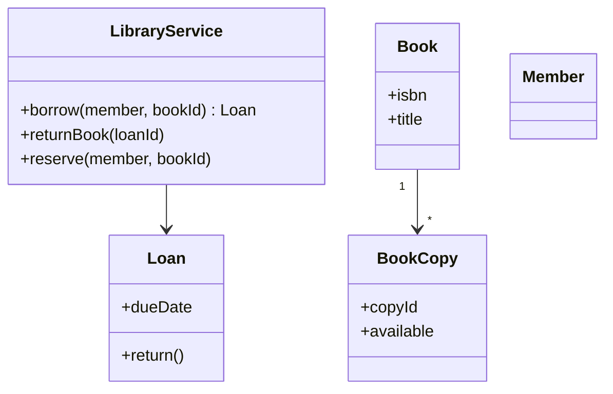
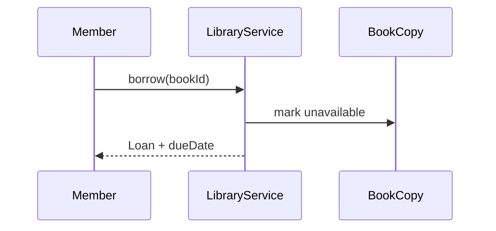

### Problem & Intent

**Library management:** members borrow and return books, reservations queue for unavailable copies, fines accrue on late return. Forces: **inventory per copy**, **loan lifecycle**, **fine policy**.

---

### When to Use / When NOT to Use

| Situation | Include? | Why |
| :--- | :---: | :--- |
| Multiple copies per title | Yes | Copy vs Book separation |
| Reservation queue | Yes | Fairness rules |
| Inter-library loan network | Scope out | Federation complexity |

---

### Structure (Class Diagram)



---

### Interaction Flow



---

### Implementation




```java
public record Loan(String id, String memberId, String copyId, LocalDate dueDate) {
    public Money fineOn(LocalDate returnDate, FinePolicy policy) {
        return policy.calculate(dueDate, returnDate);
    }
}
```




```go
type Loan struct {
    ID, MemberID, CopyID string
    DueDate            time.Time
}
```




```python
from dataclasses import dataclass
from datetime import date
from typing import Protocol

class FinePolicy(Protocol):
    def calculate(self, due: date, returned: date) -> float: ...

@dataclass
class Loan:
    id: str
    member_id: str
    copy_id: str
    due_date: date

    def fine_on(self, returned: date, policy: FinePolicy) -> float:
        return policy.calculate(self.due_date, returned)
```




---

### Trade-offs & Operational Realities

| Decision | Tradeoff |
| :--- | :--- |
| Fine as Strategy | Flexible policies |
| Reservation FIFO | Simple; priority needs heap |

---

### Junior Mistakes

- Single `Book` entity with `available: boolean` for 50 copies.
- Fines calculated in controller.

---

### Senior Questions

1. How do two members reserve the last copy?
2. State vs Strategy for loan status?

---

### Revision Cheat Sheet

- **Book** (title) vs **BookCopy** (inventory unit).
- **Loan** owns return + fine calculation hook.

---

### See Also

- [State Pattern](/design-patterns/04-behavioral-patterns/state-pattern/)
- [Library fine anti-patterns](/design-patterns/07-anti-patterns/anemic-domain-model/)
