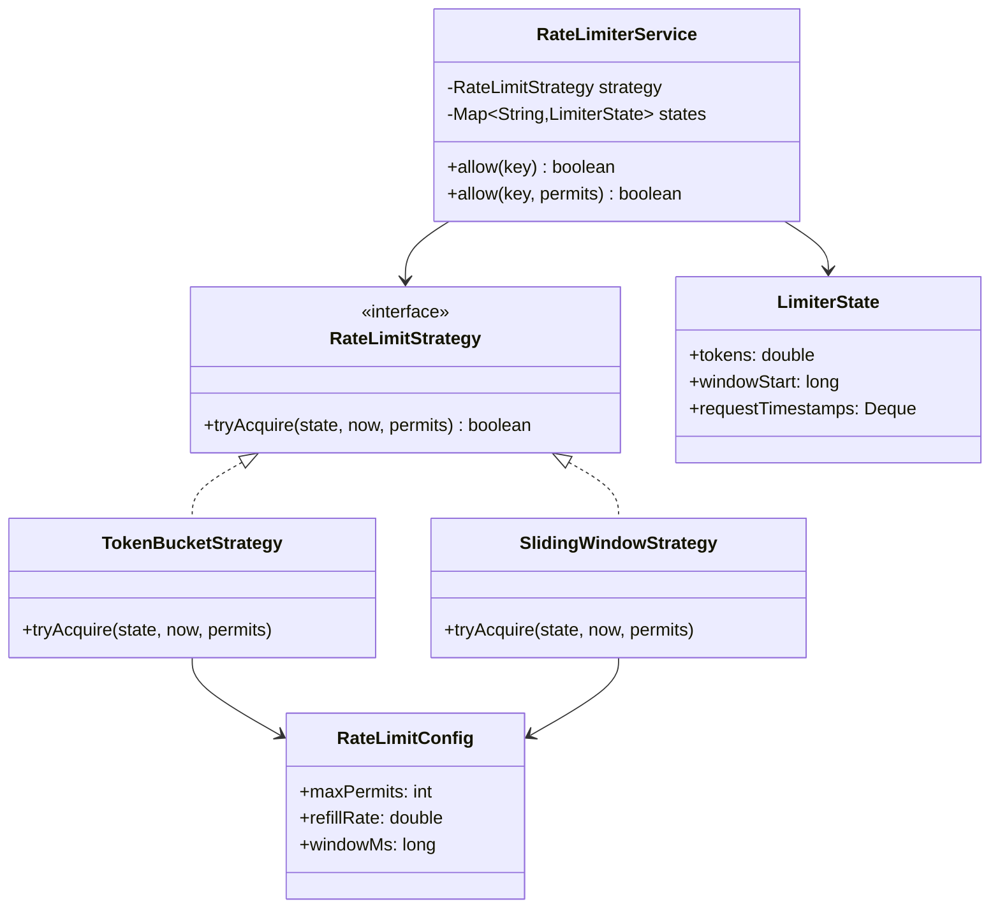
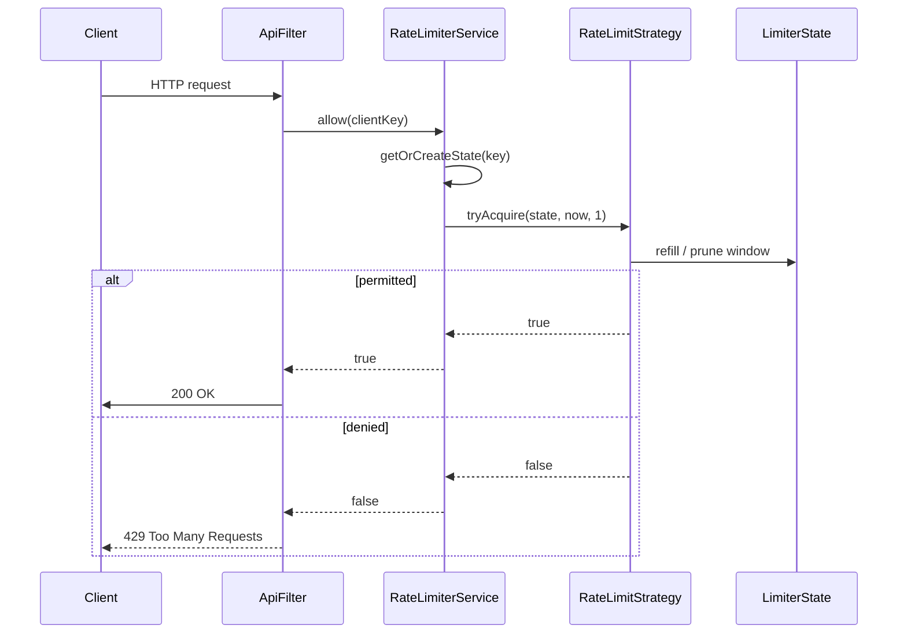

### Problem & Intent

A rate limiter protects a service by **rejecting or delaying excess requests** from a caller (client IP, API key, user ID). The dominant design force is **interchangeable limiting algorithms** — token bucket (smooth burst), fixed window (simple counters), sliding window (accurate bounds) — combined with **thread-safe in-memory state** per key. [Strategy](/design-patterns/04-behavioral-patterns/strategy-pattern/) isolates algorithm math; the facade service owns key lookup and synchronization policy.

---

### When to Use / When NOT to Use

| Situation | Use? | Why |
| :--- | :---: | :--- |
| Per-process throttling before expensive handlers | Yes | In-memory limiter is fast and allocation-light |
| Algorithm may change (burst-friendly vs strict window) | Yes | Swap `RateLimitStrategy` without touching filter code |
| Single JVM / single pod enforcement is acceptable | Yes | No cross-node coordination needed |
| Global limits across a cluster | No | Use Redis (`INCR` + TTL) or Envoy/API gateway rate limits |
| Sub-millisecond fairness across thousands of keys | No | Consider sharded counters or approximate structures (Redis Cell) |
| Compliance audit requiring durable deny logs | No | Add async audit sink — limiter only returns allow/deny |

---

### Structure (Class Diagram)



---

### Interaction Flow



---

### Implementation




**Junior approach — unsynchronized global counter:**

```java
public class RateLimiter {
    private int count = 0;

    public boolean allow(String key) {
        count++;  // race: lost updates across threads
        return count <= 100;
    }
}
```

**Strategy + per-key synchronized state:**

```java
public interface RateLimitStrategy {
    boolean tryAcquire(LimiterState state, long nowEpochMs, int permits);
}

public final class TokenBucketStrategy implements RateLimitStrategy {
    private final double capacity;
    private final double refillPerMs;

    public TokenBucketStrategy(int maxPerSecond) {
        this.capacity = maxPerSecond;
        this.refillPerMs = maxPerSecond / 1000.0;
    }

    @Override
    public boolean tryAcquire(LimiterState state, long now, int permits) {
        double elapsed = now - state.getLastRefillMs();
        double refilled = Math.min(capacity, state.getTokens() + elapsed * refillPerMs);
        state.setLastRefillMs(now);
        if (refilled < permits) {
            state.setTokens(refilled);
            return false;
        }
        state.setTokens(refilled - permits);
        return true;
    }
}

public final class RateLimiterService {
    private final RateLimitStrategy strategy;
    private final ConcurrentHashMap<String, LimiterState> states = new ConcurrentHashMap<>();

    public boolean allow(String key) {
        LimiterState state = states.computeIfAbsent(key, k -> new LimiterState());
        synchronized (state) {
            return strategy.tryAcquire(state, System.currentTimeMillis(), 1);
        }
    }
}
```

**Sliding window sketch:** store timestamps in a `Deque`, drop entries older than `windowMs`, deny if size ≥ limit.




**Junior approach:**

```go
type RateLimiter struct {
    count int // not safe for concurrent use
}

func (r *RateLimiter) Allow(key string) bool {
    r.count++
    return r.count <= 100
}
```

**Strategy + per-key mutex:**

```go
type LimiterState struct {
    mu           sync.Mutex
    tokens       float64
    lastRefillMs int64
}

type RateLimitStrategy interface {
    TryAcquire(state *LimiterState, nowMs int64, permits int) bool
}

type TokenBucket struct {
    Capacity     float64
    RefillPerMs  float64
}

func (tb TokenBucket) TryAcquire(s *LimiterState, nowMs int64, permits int) bool {
    elapsed := float64(nowMs - s.lastRefillMs)
    refilled := math.Min(tb.Capacity, s.tokens+elapsed*tb.RefillPerMs)
    s.lastRefillMs = nowMs
    if refilled < float64(permits) {
        s.tokens = refilled
        return false
    }
    s.tokens = refilled - float64(permits)
    return true
}

type RateLimiterService struct {
    strategy RateLimitStrategy
    states   sync.Map // key -> *LimiterState
}

func (s *RateLimiterService) Allow(key string) bool {
    raw, _ := s.states.LoadOrStore(key, &LimiterState{tokens: 0})
    state := raw.(*LimiterState)
    state.mu.Lock()
    defer state.mu.Unlock()
    return s.strategy.TryAcquire(state, time.Now().UnixMilli(), 1)
}
```

Go's `sync.Map` suits many keys with scattered access; a sharded `map[string]*LimiterState` with `RWMutex` per shard scales further.




```python
import time
from collections import deque

class SlidingWindowLimiter:
    def __init__(self, limit: int, window_sec: float) -> None:
        self._limit = limit
        self._window = window_sec
        self._ts: deque[float] = deque()

    def allow(self) -> bool:
        now = time.monotonic()
        while self._ts and now - self._ts[0] > self._window:
            self._ts.popleft()
        if len(self._ts) >= self._limit:
            return False
        self._ts.append(now)
        return True
```




---

### Trade-offs & Operational Realities

| Concern | Impact |
| :--- | :--- |
| **Testability** | Strategies test with frozen clocks and fabricated `LimiterState`; service tests verify per-key isolation |
| **Complexity** | Token bucket math is trickier than fixed window — document refill semantics |
| **Framework fit** | Servlet `Filter`, Spring `HandlerInterceptor`, or Go `http.Handler` middleware wrap `allow(key)` |
| **Concurrency** | Lock per key, not global map — reduces contention; `ConcurrentHashMap` + `synchronized(state)` is a common Java pattern |
| **Scaling** | In-memory state resets on restart and diverges across pods — cluster limits need Redis or sidecar proxy |

---

### Junior Mistakes

- One global counter for all clients — a single heavy user blocks everyone
- Checking `count++` without synchronization — race conditions allow 2× the intended rate
- Fixed window without explaining **boundary burst** (2× traffic at window edges)
- Storing unlimited per-key state with no eviction — memory leak on spoofed keys
- Returning 500 on deny instead of **429** with `Retry-After` header

---

### Senior Questions

1. How do you add **sliding window log** without modifying `RateLimiterService`?
2. Token bucket vs leaky bucket — which allows bursts and when does it matter for APIs?
3. How would you shard limiter state across 16 mutex stripes for hot keys?
4. Strategy vs Decorator — would you wrap a limiter around a client or embed it in a filter chain?
5. How do you test refill behavior without `Thread.sleep` in unit tests?

---

### Revision Cheat Sheet

- **One line:** Per-key state + interchangeable algorithm decides allow/deny.
- **Trigger smell:** `if (requestCount > 100)` with no key, window, or thread safety.
- **Pairs with:** [Strategy Pattern](/design-patterns/04-behavioral-patterns/strategy-pattern/), [Proxy Pattern](/design-patterns/03-structural-patterns/proxy-pattern/)
- **Avoid when:** Cluster-wide enforcement or durable quotas are required.
- **Interview tip:** State the algorithm, draw one sequence, then mention distributed gap.

---

### See Also

- [Strategy Pattern](/design-patterns/04-behavioral-patterns/strategy-pattern/)
- [Proxy Pattern](/design-patterns/03-structural-patterns/proxy-pattern/)
- [Task Scheduler LLD](/design-patterns/08-lld-case-studies/task-scheduler-lld/)
- [Notification Service LLD](/design-patterns/08-lld-case-studies/notification-system/)
