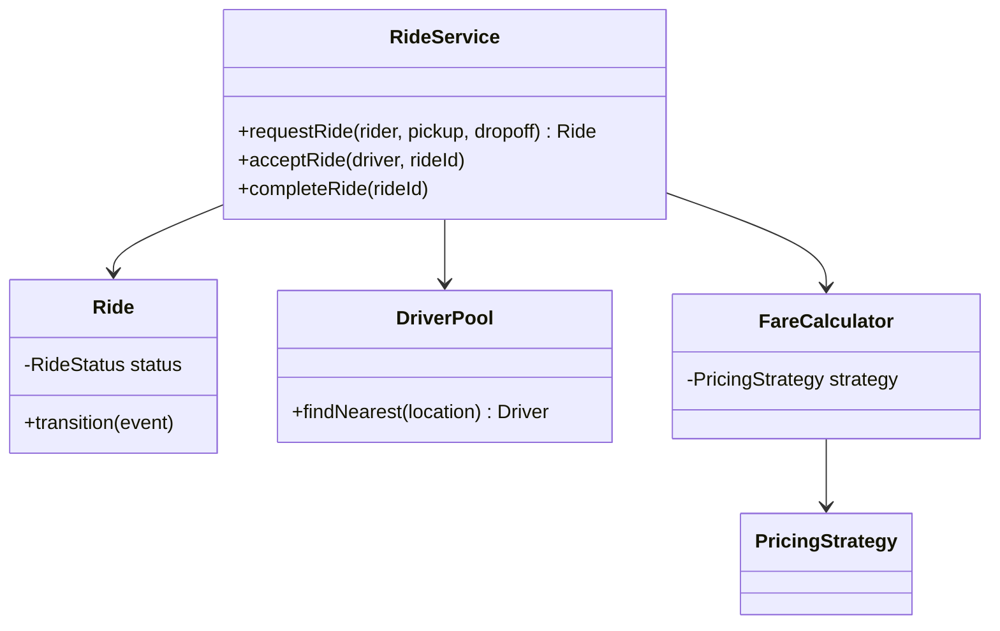
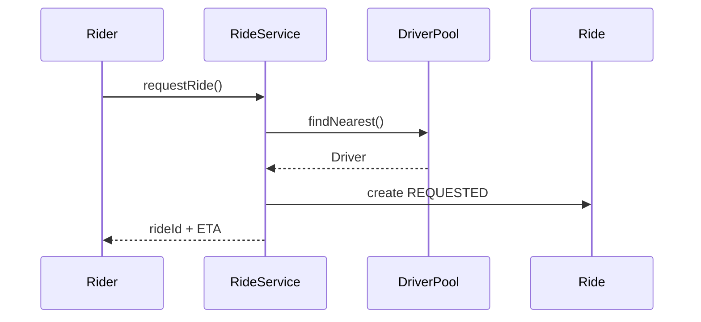

### Problem & Intent

Design a **ride-sharing** system: riders request trips, drivers accept, fares compute with surge pricing, and trip state progresses from requested → in-progress → completed. Forces: **matching**, **pricing strategy**, **state machine**, concurrency on driver availability.

---

### When to Use / When NOT to Use

| Situation | Include? | Why |
| :--- | :---: | :--- |
| Nearest-driver matching | Yes | Core dispatch |
| Surge by demand zone | Yes | [Strategy](/design-patterns/04-behavioral-patterns/strategy-pattern/) |
| Multi-city fleet ops | Scope out | Needs distributed index |
| Real-time GPS streaming | Mention | Out of in-memory LLD scope |

---

### Structure (Class Diagram)



---

### Interaction Flow



---

### Implementation




```java
public enum RideStatus { REQUESTED, ACCEPTED, IN_PROGRESS, COMPLETED, CANCELLED }

public final class Ride {
    private RideStatus status = RideStatus.REQUESTED;
    public void accept() {
        if (status != RideStatus.REQUESTED) throw new IllegalStateException();
        status = RideStatus.ACCEPTED;
    }
}
```




```go
type RideStatus int
const (
    Requested RideStatus = iota
    Accepted
    InProgress
    Completed
)

type Ride struct {
    status RideStatus
}
```




```python
from dataclasses import dataclass, field
from enum import Enum, auto

class RideStatus(Enum):
    REQUESTED = auto()
    ACCEPTED = auto()
    IN_PROGRESS = auto()
    COMPLETED = auto()
    CANCELLED = auto()

@dataclass
class Ride:
    status: RideStatus = RideStatus.REQUESTED

    def accept(self) -> None:
        if self.status is not RideStatus.REQUESTED:
            raise ValueError("invalid transition")
        self.status = RideStatus.ACCEPTED
```




---

### Trade-offs & Operational Realities

| Decision | Tradeoff |
| :--- | :--- |
| In-memory driver pool | Fast LLD; production needs geo index |
| Strategy for surge | Extensible; avoid if single flat rate |

---

### Junior Mistakes

- God `RideManager` with matching + payment + notification.
- No explicit trip state — boolean flags everywhere.

---

### Senior Questions

1. How do you handle driver race on accept?
2. Where do domain events vs integration events go?

---

### Revision Cheat Sheet

- **Entities:** Rider, Driver, Ride.
- **Patterns:** State (trip), Strategy (fare), SRP services.

---

### See Also

- [State Pattern](/design-patterns/04-behavioral-patterns/state-pattern/)
- [Strategy Pattern](/design-patterns/04-behavioral-patterns/strategy-pattern/)
- [Parking Lot LLD](/design-patterns/08-lld-case-studies/parking-lot/)
