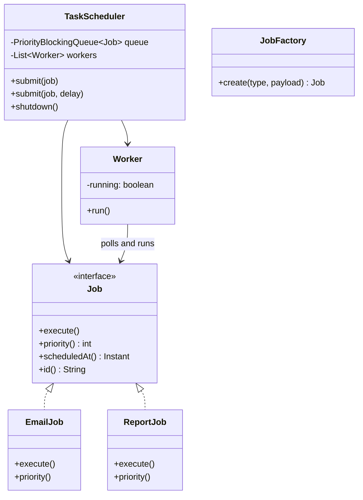
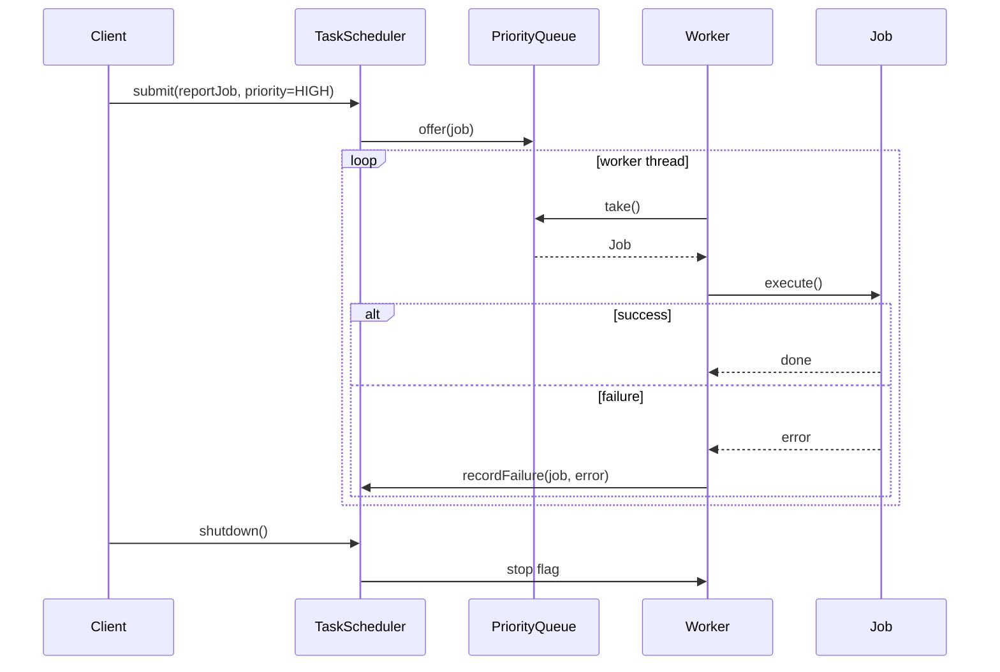

### Problem & Intent

A task scheduler accepts **jobs with priority and optional delay**, queues them, and executes them via a **fixed worker pool** without blocking submitters. The dominant design forces are (1) **encapsulated executable work** ([Command](/design-patterns/04-behavioral-patterns/command-pattern/) — `Runnable`/`Job` with `execute()`), and (2) **fair-ish ordering** via a priority queue with tie-breaking. The scheduler owns threading and backpressure; job types stay ignorant of queue mechanics.

---

### When to Use / When NOT to Use

| Situation | Use? | Why |
| :--- | :---: | :--- |
| Heterogeneous background work (email, reports, webhooks) with priorities | Yes | Command interface + shared executor |
| Bounded parallelism required to protect CPU/IO | Yes | Worker pool caps concurrency |
| Delayed and recurring tasks in one process | Yes | Priority queue keyed on `scheduledAt` |
| One async `@Async` call in a Spring app | No | Framework executor is enough |
| Cluster-wide job orchestration with failover | No | Use Quartz cluster, Temporal, or Celery |
| Strict FIFO only, unlimited threads acceptable | No | `ExecutorService.newCachedThreadPool()` is simpler |

---

### Structure (Class Diagram)



---

### Interaction Flow



---

### Implementation




**Junior approach — unbounded `newThread` per task:**

```java
public void runReport(Report r) {
    new Thread(() -> generate(r)).start(); // no pool, no priority, no backpressure
}
```

**Command + priority queue + worker pool:**

```java
public interface Job extends Comparable<Job> {
    String id();
    int priority();          // lower = higher priority
    Instant scheduledAt();
    void execute() throws Exception;

    @Override
    default int compareTo(Job other) {
        int byTime = this.scheduledAt().compareTo(other.scheduledAt());
        if (byTime != 0) return byTime;
        return Integer.compare(this.priority(), other.priority());
    }
}

public final class EmailJob implements Job {
    private final String id;
    private final Runnable send;

    public EmailJob(String id, Runnable send) { this.id = id; this.send = send; }

    @Override public String id() { return id; }
    @Override public int priority() { return 2; }
    @Override public Instant scheduledAt() { return Instant.now(); }
    @Override public void execute() { send.run(); }
}

public final class TaskScheduler {
    private final PriorityBlockingQueue<Job> queue = new PriorityBlockingQueue<>();
    private final List<Thread> workers = new ArrayList<>();
    private volatile boolean running = true;

    public TaskScheduler(int poolSize) {
        for (int i = 0; i < poolSize; i++) {
            Thread t = new Thread(() -> {
                while (running) {
                    try {
                        Job job = queue.take();
                        if (job.scheduledAt().isAfter(Instant.now())) {
                            queue.offer(job);
                            Thread.sleep(10);
                            continue;
                        }
                        job.execute();
                    } catch (InterruptedException e) {
                        Thread.currentThread().interrupt();
                        break;
                    } catch (Exception ex) {
                        // log + optional dead-letter
                    }
                }
            }, "worker-" + i);
            t.start();
            workers.add(t);
        }
    }

    public void submit(Job job) {
        queue.offer(job);
    }

    public void submit(Job job, Duration delay) {
        queue.offer(new DelayedJob(job, Instant.now().plus(delay)));
    }

    public void shutdown() {
        running = false;
        workers.forEach(Thread::interrupt);
    }
}
```




**Junior approach:**

```go
func RunReport(r Report) {
    go generate(r) // unbounded goroutines
}
```

**Command + heap + worker pool:**

```go
type Job interface {
    ID() string
    Priority() int
    ScheduledAt() time.Time
    Execute() error
}

type jobItem struct {
    job Job
}

// min-heap by scheduledAt, then priority
type jobHeap []jobItem

func (h jobHeap) Less(i, j int) bool {
    a, b := h[i].job.ScheduledAt(), h[j].job.ScheduledAt()
    if !a.Equal(b) { return a.Before(b) }
    return h[i].job.Priority() < h[j].job.Priority()
}

type TaskScheduler struct {
    jobs    jobHeap
    mu      sync.Mutex
    cond    *sync.Cond
    workers int
    quit    chan struct{}
}

func NewTaskScheduler(poolSize int) *TaskScheduler {
    s := &TaskScheduler{workers: poolSize, quit: make(chan struct{})}
    s.cond = sync.NewCond(&s.mu)
    heap.Init(&s.jobs)
    for i := 0; i < poolSize; i++ {
        go s.workerLoop()
    }
    return s
}

func (s *TaskScheduler) Submit(job Job) {
    s.mu.Lock()
    heap.Push(&s.jobs, jobItem{job: job})
    s.mu.Unlock()
    s.cond.Signal()
}

func (s *TaskScheduler) workerLoop() {
    for {
        select {
        case <-s.quit:
            return
        default:
        }
        job := s.pollReady()
        if job == nil {
            continue
        }
        if err := job.Execute(); err != nil {
            log.Printf("job %s failed: %v", job.ID(), err)
        }
    }
}

func (s *TaskScheduler) Shutdown() {
    close(s.quit)
}
```

Go alternative: `container/heap` internally, or channel-per-priority for simpler semantics at lower scale.




```python
from typing import Protocol

class DomainPort(Protocol):
    def execute(self) -> None: ...

class ApplicationService:
    def __init__(self, port: DomainPort) -> None:
        self._port = port

    def run(self) -> None:
        self._port.execute()
```




---

### Trade-offs & Operational Realities

| Concern | Impact |
| :--- | :--- |
| **Testability** | Submit stub `Job` implementations; assert execution order with controllable `scheduledAt` |
| **Complexity** | Delayed re-queue spin (`sleep(10)`) is naive — production uses `DelayQueue` or timer wheel |
| **Framework fit** | Spring: `@Scheduled` + `TaskExecutor` for simple cases; custom scheduler when priorities mix |
| **Concurrency** | `PriorityBlockingQueue` is thread-safe; workers compete fairly on `take()` |
| **Scaling** | In-process pool bounded by one machine — distributed schedulers need lease-based job claiming |

---

### Junior Mistakes

- Spawning unbounded threads/goroutines — OOM under load spikes
- Priority inversion: starving low-priority jobs forever without aging
- No shutdown hook — jobs lost mid-flight on deploy
- Giant `Runnable` lambdas with business logic instead of named `Job` types — untestable blobs
- Swallowing exceptions silently — failures invisible until customers complain

---

### Senior Questions

1. How do you add **cron recurrence** without bloating `TaskScheduler`?
2. Command vs Strategy — classify `EmailJob` vs compression algorithm selection.
3. How would you persist the queue so jobs survive process crash?
4. What happens when the queue is full — block, drop, or shed load?
5. How do you test priority ordering with multiple workers nondeterministically?

---

### Revision Cheat Sheet

- **One line:** Priority queue feeds a fixed pool executing Command-style jobs.
- **Trigger smell:** `new Thread()` everywhere, no shared backpressure.
- **Pairs with:** [Command Pattern](/design-patterns/04-behavioral-patterns/command-pattern/), [Strategy Pattern](/design-patterns/04-behavioral-patterns/strategy-pattern/)
- **Avoid when:** Framework scheduler or external orchestrator already covers the use case.
- **Interview tip:** Mention `DelayQueue`, dead-letter queue, and graceful shutdown.

---

### See Also

- [Command Pattern](/design-patterns/04-behavioral-patterns/command-pattern/)
- [Strategy Pattern](/design-patterns/04-behavioral-patterns/strategy-pattern/)
- [Notification Service LLD](/design-patterns/08-lld-case-studies/notification-system/)
- [In-Memory Rate Limiter LLD](/design-patterns/08-lld-case-studies/rate-limiter/)
