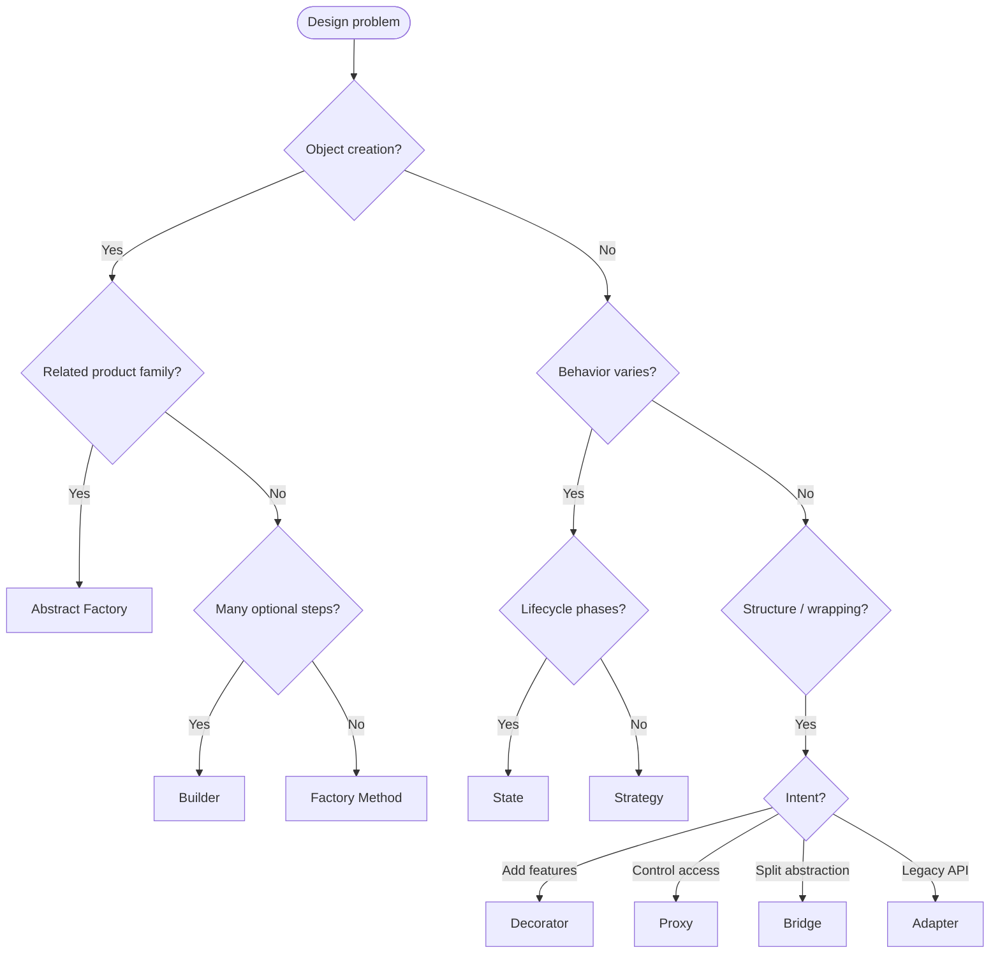

# Pattern Decision Tree

Use this tree in design reviews and interviews. Full explanations live on linked canonical pages only.

## Creational Sub-tree

| Question | Pattern |
| :--- | :--- |
| One product, which impl? | [Factory Method](/design-patterns/02-creational-patterns/factory-method-pattern/) |
| Consistent family? | [Abstract Factory](/design-patterns/02-creational-patterns/abstract-factory-pattern/) |
| Stepwise build + validation? | [Builder](/design-patterns/02-creational-patterns/builder-pattern/) |

## Comparison Shortcuts

- Factory vs Builder → [comparison](/design-patterns/05-pattern-comparisons/factory-vs-builder/)
- Strategy vs State → [comparison](/design-patterns/05-pattern-comparisons/strategy-vs-state/)
- Decorator vs Proxy vs Bridge → [comparison](/design-patterns/05-pattern-comparisons/decorator-vs-proxy-vs-bridge/)

## See Also

- [When to use which pattern](/design-patterns/09-pattern-selection-guide/when-to-use-which-pattern/)
- [Anti-patterns](/design-patterns/07-anti-patterns/)
