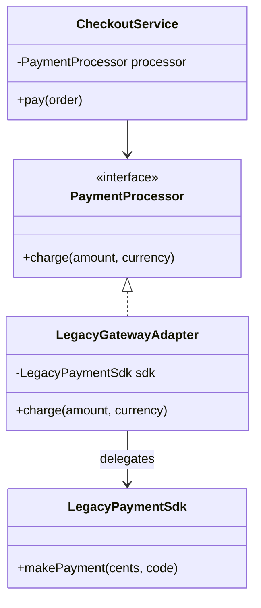
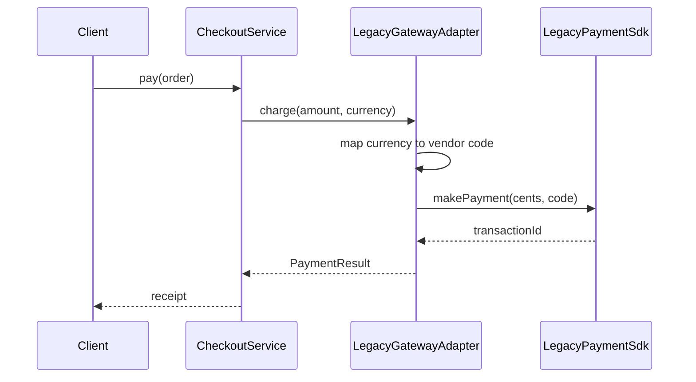

### Problem & Intent

The Adapter Pattern converts the interface of a class into another interface clients expect. It lets incompatible APIs work together **without rewriting** either side. The dominant force is **integration boundary mismatch** — a legacy SOAP client, a vendor SDK, or an internal service whose method names and types do not match your domain ports.

---

### When to Use / When NOT to Use

| Situation | Use? | Why |
| :--- | :---: | :--- |
| Third-party or legacy API with a different interface than your port | Yes | Adapter translates at the boundary; domain stays clean |
| You own both sides and can change the API directly | No | Fix the source interface instead of wrapping |
| Multiple incompatible APIs behind one domain interface | Yes | One adapter per vendor; client depends only on the port |
| Simple field rename or one-liner mapping | No | Direct mapping in the caller is enough |
| You need to add behavior around calls (logging, cache) | No | Prefer [Decorator](/design-patterns/decorator-pattern/) or [Proxy](/design-patterns/proxy-pattern/) |
| Wrapping to hide a god-class you wrote yesterday | No | Refactor the class; adapter is not a decomposition tool |

---

### Structure (Class Diagram)



---

### Interaction Flow



---

### Implementation




**Without adapter — domain leaks vendor types:**

```java
public void checkout(Order order) {
    LegacyPaymentSdk sdk = new LegacyPaymentSdk();
    // Domain knows vendor method names and currency codes
    sdk.makePayment(order.totalCents(), "USD_CODE_840");
}
```

**Adapter approach:**

```java
public interface PaymentProcessor {
    PaymentResult charge(Money amount);
}

public final class LegacyGatewayAdapter implements PaymentProcessor {
    private final LegacyPaymentSdk sdk;

    public LegacyGatewayAdapter(LegacyPaymentSdk sdk) {
        this.sdk = sdk;
    }

    @Override
    public PaymentResult charge(Money amount) {
        String vendorCode = CurrencyMapper.toVendorCode(amount.currency());
        String txnId = sdk.makePayment(amount.cents(), vendorCode);
        return new PaymentResult(txnId, amount);
    }
}

public final class CheckoutService {
    private final PaymentProcessor processor;

    public CheckoutService(PaymentProcessor processor) {
        this.processor = processor;
    }

    public Receipt pay(Order order) {
        PaymentResult result = processor.charge(order.total());
        return Receipt.from(order, result);
    }
}
```

**Spring wiring:** register each vendor adapter as a `@Component` implementing `PaymentProcessor`; select by profile or `@Qualifier`.




**Without adapter:**

```go
func Checkout(order Order) error {
    sdk := legacy.NewPaymentSdk()
    return sdk.MakePayment(order.TotalCents, "USD_CODE_840") // vendor leak
}
```

**Adapter approach:**

```go
type Money struct {
    Cents    int64
    Currency string
}

type PaymentResult struct {
    TransactionID string
    Amount        Money
}

type PaymentProcessor interface {
    Charge(amount Money) (PaymentResult, error)
}

type LegacyPaymentSdk interface {
    MakePayment(cents int64, currencyCode string) (string, error)
}

type LegacyGatewayAdapter struct {
    sdk LegacyPaymentSdk
}

func (a *LegacyGatewayAdapter) Charge(amount Money) (PaymentResult, error) {
    code := ToVendorCurrencyCode(amount.Currency)
    txnID, err := a.sdk.MakePayment(amount.Cents, code)
    if err != nil {
        return PaymentResult{}, err
    }
    return PaymentResult{TransactionID: txnID, Amount: amount}, nil
}

type CheckoutService struct {
    processor PaymentProcessor
}

func (s *CheckoutService) Pay(order Order) (Receipt, error) {
    result, err := s.processor.Charge(order.Total())
    if err != nil {
        return Receipt{}, err
    }
    return NewReceipt(order, result), nil
}
```

Go favors **small port interfaces** at package boundaries; adapters live in an `integration` or `vendor` package to keep import cycles clean.




---

### Trade-offs & Operational Realities

| Concern | Impact |
| :--- | :--- |
| **Testability** | Domain tests use a fake `PaymentProcessor`; adapter tests mock the legacy SDK |
| **Complexity** | One extra type per integration; pays off when vendors multiply |
| **Framework fit** | Spring: adapter beans behind a port; Go: constructor injection of the port interface |
| **Error mapping** | Vendor exceptions must translate to domain errors — adapter owns that mapping |
| **Version drift** | SDK upgrades touch only the adapter, not every caller |

---

### Junior Mistakes

- Renaming methods in the adapter without owning the domain port (adapter should implement **your** interface)
- Putting business rules inside the adapter instead of keeping it a thin translation layer
- Using Adapter when you control both sides and could align interfaces directly
- Confusing Adapter with Facade — Adapter **changes** interface shape; Facade **simplifies** a subsystem you already own

---

### Senior Questions

1. How do you add a second payment vendor without changing `CheckoutService`?
2. Adapter vs Facade vs Decorator — classify wrapping a Stripe SDK for checkout.
3. Where do retry, timeout, and circuit-breaker logic live — adapter or a wrapping proxy?
4. How do you test currency and error-code mapping without calling the real vendor?
5. Object adapter (composition) vs class adapter (inheritance) — when is each appropriate in Java?

---

### Revision Cheat Sheet

- **One line:** Translate a foreign interface into the one your client expects.
- **Trigger smell:** `import com.vendor.*` scattered through domain services.
- **Pairs with:** [Dependency Inversion](/design-patterns/dependency-inversion-principle/), [Facade](/design-patterns/facade-pattern/), [Repository](/design-patterns/repository-and-unit-of-work/)
- **Avoid when:** You own both APIs and can unify them, or mapping is trivial inline.
- **Interview tip:** Adapter solves **incompatibility**; it does not simplify or add behavior.

---

### See Also

- [Facade Pattern](/design-patterns/facade-pattern/)
- [Decorator vs Proxy vs Bridge](/design-patterns/decorator-vs-proxy-vs-bridge/)
- [Dependency Inversion Principle](/design-patterns/dependency-inversion-principle/)
- [Notification Service LLD](/design-patterns/notification-service-lld/) — channel adapters in practice
