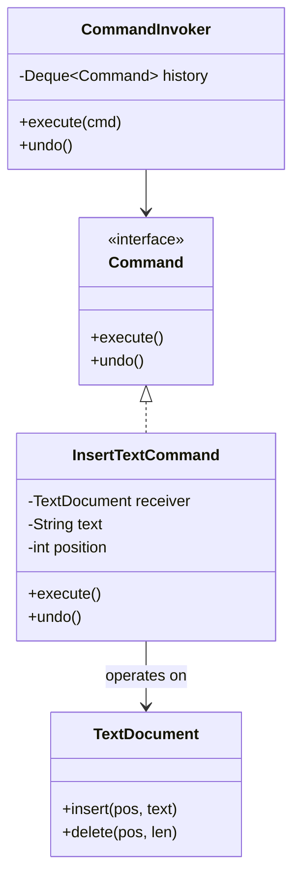
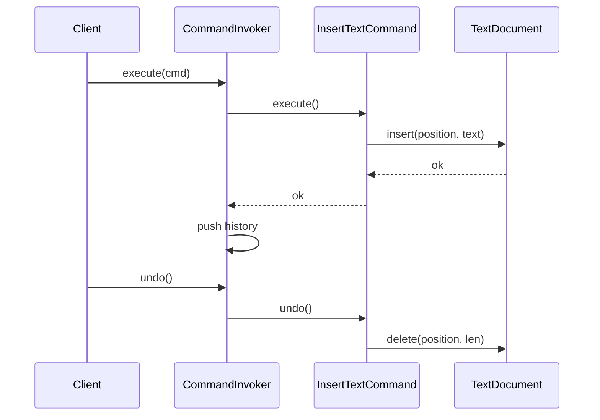

### Problem & Intent

The Command Pattern **encapsulates a request as an object**, letting you parameterize clients with different requests, queue or log operations, and support undo/redo. The invoker holds a command interface and calls `execute()` without knowing receiver details. It turns "do this action later" or "reverse this action" into first-class objects — essential for job queues, macro recording, and audit trails.

---

### When to Use / When NOT to Use

| Situation | Use? | Why |
| :--- | :---: | :--- |
| Undo/redo, transaction rollback, or compensating actions | Yes | `undo()` mirrors `execute()` on the same object |
| Decouple UI buttons from business logic (menu actions) | Yes | Invoker binds command instances to controls |
| Queue, schedule, or retry operations asynchronously | Yes | Commands serialize to jobs or messages |
| Audit log of every user action | Yes | Commands are natural log entries |
| Simple CRUD with no undo, queue, or logging needs | No | Direct service method call is enough |
| Command objects would be huge snapshots of entire app state | No | Reconsider granularity or use [Memento](/design-patterns/memento-pattern/) |
| Highly data-driven rules with no object identity | No | Plain functions or strategy objects may suffice |

---

### Structure (Class Diagram)



---

### Interaction Flow



---

### Implementation




**Junior approach — logic trapped in UI handler:**

```java
@EventListener
public void onButtonClick(ButtonClickEvent e) {
    if ("INSERT".equals(e.getAction())) {
        document.insert(cursor, textField.getText());
        // no undo, no audit trail
    }
}
```

**Command approach:**

```java
public interface Command {
    void execute();
    void undo();
}

public final class InsertTextCommand implements Command {
    private final TextDocument document;
    private final int position;
    private final String text;

    public InsertTextCommand(TextDocument document, int position, String text) {
        this.document = document;
        this.position = position;
        this.text = text;
    }

    @Override
    public void execute() {
        document.insert(position, text);
    }

    @Override
    public void undo() {
        document.delete(position, text.length());
    }
}

public final class CommandInvoker {
    private final Deque<Command> history = new ArrayDeque<>();

    public void execute(Command command) {
        command.execute();
        history.push(command);
    }

    public void undo() {
        if (!history.isEmpty()) {
            history.pop().undo();
        }
    }
}
```

**Spring / messaging:** serialize command DTOs to a queue; consumer deserializes and calls `execute()`. Pair with idempotency keys for safe retries.




```go
type TextDocument struct {
    Content string
}

func (d *TextDocument) Insert(pos int, text string) {
    d.Content = d.Content[:pos] + text + d.Content[pos:]
}

func (d *TextDocument) Delete(pos, length int) {
    d.Content = d.Content[:pos] + d.Content[pos+length:]
}

type Command interface {
    Execute()
    Undo()
}

type InsertTextCommand struct {
    doc      *TextDocument
    position int
    text     string
}

func (c *InsertTextCommand) Execute() { c.doc.Insert(c.position, c.text) }
func (c *InsertTextCommand) Undo()    { c.doc.Delete(c.position, len(c.text)) }

type Invoker struct {
    history []Command
}

func (i *Invoker) Run(cmd Command) {
    cmd.Execute()
    i.history = append(i.history, cmd)
}

func (i *Invoker) Undo() {
    if len(i.history) == 0 {
        return
    }
    cmd := i.history[len(i.history)-1]
    i.history = i.history[:len(i.history)-1]
    cmd.Undo()
}
```

Go favors **small command structs** and explicit invoker types; use closures only when undo is not required.




---

### Trade-offs & Operational Realities

| Concern | Impact |
| :--- | :--- |
| **Testability** | Each command unit-tested; invoker tested with stub commands |
| **Complexity** | Undo for composite commands needs careful ordering (macro commands) |
| **Framework fit** | Spring: `@Async` job runners; Go: worker pools consuming command interfaces |
| **Memory** | Unbounded history stacks need pruning or snapshot limits |

---

### Junior Mistakes

- Implementing `undo()` as "delete everything and rebuild" instead of inverse operation
- Commands that reach into global singletons instead of holding receiver references
- No idempotency when commands are retried from a message queue
- Creating a command class for every trivial one-liner with no undo/queue benefit
- Macro commands without transactional semantics across sub-commands

---

### Senior Questions

1. How do you model **redo** after undo without re-executing side effects twice?
2. Command vs Strategy — when is "encapsulated request" different from "encapsulated algorithm"?
3. How would you persist command history for crash recovery?
4. Composite command: all-or-nothing undo when step 3 of 5 fails?
5. CQRS: are write models just command handlers? What breaks that mapping?

---

### Revision Cheat Sheet

- **One line:** Wrap each action in an object with `execute` (and optionally `undo`).
- **Trigger smell:** UI or API layer duplicates the same operation in many places with no audit trail.
- **Pairs with:** [Memento](/design-patterns/memento-pattern/), [Chain of Responsibility](/design-patterns/chain-of-responsibility-pattern/), [Task Scheduler LLD](/design-patterns/task-scheduler-lld/)
- **Avoid when:** No undo, queue, logging, or parameterization of requests.
- **Go tip:** Keep commands as plain structs; avoid interface proliferation for one-off scripts.

---

### See Also

- [Memento Pattern](/design-patterns/memento-pattern/)
- [Task Scheduler LLD](/design-patterns/task-scheduler-lld/)
- [Chain of Responsibility Pattern](/design-patterns/chain-of-responsibility-pattern/)
- [Strategy Pattern](/design-patterns/strategy-pattern/)
