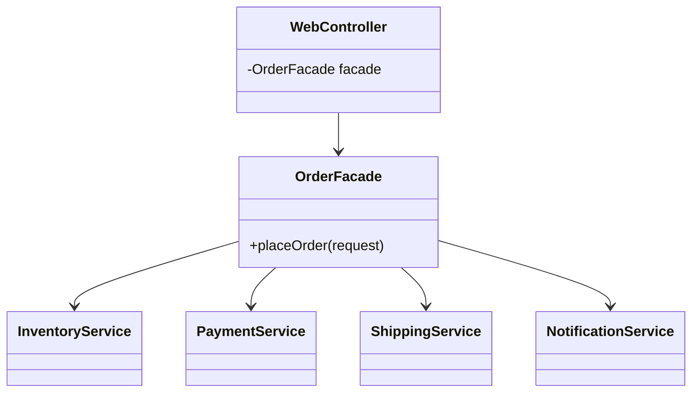
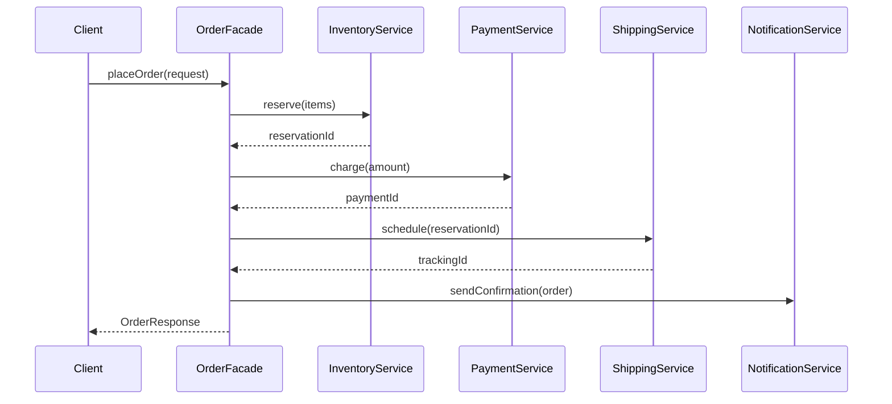

### Problem & Intent

The Facade Pattern provides a **unified, simplified interface** to a set of interfaces in a subsystem. Clients call one entry point instead of orchestrating inventory, payment, shipping, and notification services themselves. The dominant force is **subsystem complexity at the client boundary** — reducing coupling and cognitive load without hiding subsystem internals from other subsystem peers.

---

### When to Use / When NOT to Use

| Situation | Use? | Why |
| :--- | :---: | :--- |
| Clients repeatedly orchestrate the same multi-step subsystem calls | Yes | Facade owns the workflow; clients get one method |
| Onboarding new teams to a large module | Yes | Document the happy path through a single API |
| Subsystem classes must interact freely with each other | Yes | Facade is for **external** clients; peers talk directly |
| Subsystem has one class and one method | No | Facade adds indirection with no benefit |
| You need to translate a foreign API to your domain | No | Prefer [Adapter](/design-patterns/adapter-pattern/) |
| Facade becomes a god-class with all business logic | No | Push rules into domain services; facade orchestrates only |

---

### Structure (Class Diagram)



---

### Interaction Flow



---

### Implementation




**Without facade — client orchestrates everything:**

```java
@RestController
public class OrderController {
    private final InventoryService inventory;
    private final PaymentService payment;
    // ... four more dependencies

    @PostMapping("/orders")
    public OrderResponse place(OrderRequest req) {
        var reservation = inventory.reserve(req.items());
        var payment = payment.charge(req.total());
        var tracking = shipping.schedule(reservation.id());
        notifier.sendConfirmation(req.email(), tracking);
        return new OrderResponse(payment.id(), tracking);
    }
}
```

**Facade approach:**

```java
public final class OrderFacade {
    private final InventoryService inventory;
    private final PaymentService payment;
    private final ShippingService shipping;
    private final NotificationService notifier;

    public OrderFacade(InventoryService inventory,
                       PaymentService payment,
                       ShippingService shipping,
                       NotificationService notifier) {
        this.inventory = inventory;
        this.payment = payment;
        this.shipping = shipping;
        this.notifier = notifier;
    }

    public OrderResponse placeOrder(OrderRequest request) {
        Reservation reservation = inventory.reserve(request.items());
        PaymentResult payment = payment.charge(request.total());
        Shipment shipment = shipping.schedule(reservation.id());
        notifier.sendConfirmation(request.email(), shipment.trackingId());
        return OrderResponse.of(payment, shipment);
    }
}

@RestController
public class OrderController {
    private final OrderFacade orders;

    @PostMapping("/orders")
    public OrderResponse place(@RequestBody OrderRequest req) {
        return orders.placeOrder(req);
    }
}
```




**Without facade:**

```go
func (h *OrderHandler) Place(w http.ResponseWriter, r *http.Request) {
    // handler knows inventory → payment → shipping → notify sequence
}
```

**Facade approach:**

```go
type OrderFacade struct {
    inventory InventoryService
    payment   PaymentService
    shipping  ShippingService
    notifier  NotificationService
}

func (f *OrderFacade) PlaceOrder(ctx context.Context, req OrderRequest) (OrderResponse, error) {
    reservation, err := f.inventory.Reserve(ctx, req.Items)
    if err != nil {
        return OrderResponse{}, err
    }
    payment, err := f.payment.Charge(ctx, req.Total)
    if err != nil {
        return OrderResponse{}, err
    }
    shipment, err := f.shipping.Schedule(ctx, reservation.ID)
    if err != nil {
        return OrderResponse{}, err
    }
    if err := f.notifier.SendConfirmation(ctx, req.Email, shipment.TrackingID); err != nil {
        return OrderResponse{}, err
    }
    return NewOrderResponse(payment, shipment), nil
}

type OrderHandler struct {
    facade *OrderFacade
}

func (h *OrderHandler) Place(w http.ResponseWriter, r *http.Request) {
    // decode request, call h.facade.PlaceOrder, write response
}
```

Keep transaction and saga boundaries explicit — the facade orchestrates but should not swallow partial-failure semantics.




---

### Trade-offs & Operational Realities

| Concern | Impact |
| :--- | :--- |
| **Testability** | Facade integration tests with fakes per subsystem; controller tests mock only the facade |
| **Complexity** | One orchestration layer — risk of becoming a god-class if business rules accumulate |
| **Framework fit** | Spring: `@Service` facade injected into `@RestController`; Go: package-level facade struct |
| **Evolution** | New subsystem steps change the facade, not every client |
| **Transparency** | Facade does not prevent advanced clients from using subsystem APIs directly when needed |

---

### Junior Mistakes

- Putting validation, pricing rules, and persistence logic **inside** the facade instead of domain services
- Using Facade to wrap a single external vendor API (that is an Adapter)
- Blocking all access to subsystem classes — peers inside the module still need direct collaboration
- Creating multiple overlapping facades with no clear audience (web vs batch vs admin)

---

### Senior Questions

1. How do you add a fraud-check step to checkout without changing the controller?
2. Facade vs Adapter vs Application Service — where does each live in hexagonal architecture?
3. How do you handle partial failure (payment succeeded, shipping failed) in a facade?
4. Should the facade own `@Transactional` boundaries?
5. When does a facade become an anti-pattern (god orchestrator)?

---

### Revision Cheat Sheet

- **One line:** One simple entry point over a complex subsystem you already own.
- **Trigger smell:** Controllers importing six subsystem types for one user action.
- **Pairs with:** [Single Responsibility](/design-patterns/single-responsibility-principle/), [Adapter](/design-patterns/adapter-pattern/), [Mediator](/design-patterns/mediator-pattern/)
- **Avoid when:** Subsystem is already small or you need interface translation, not simplification.
- **Interview tip:** Facade reduces **client** coupling; subsystem internals stay visible to each other.

---

### See Also

- [Adapter Pattern](/design-patterns/adapter-pattern/)
- [Mediator Pattern](/design-patterns/mediator-pattern/)
- [Layered vs Hexagonal Architecture](/design-patterns/layered-vs-hexagonal-architecture/)
- [Parking Lot System LLD](/design-patterns/parking-lot-system-lld/) — subsystem orchestration
