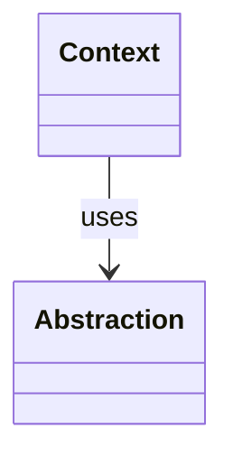
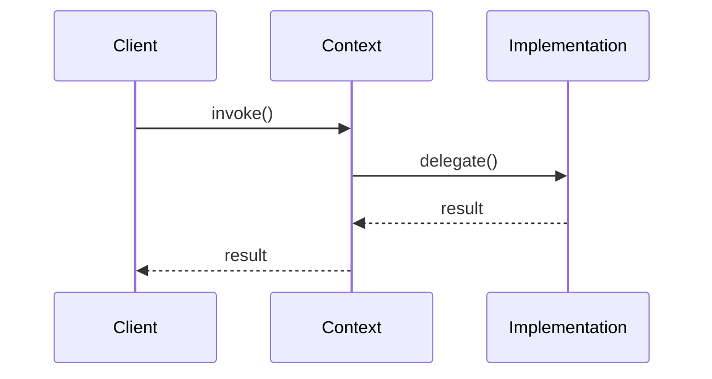

### Problem & Intent

_TODO: Describe what Factory Method Pattern solves and the dominant design force it addresses._

---

### When to Use / When NOT to Use

| Situation | Use? | Why |
| :--- | :---: | :--- |
| _TODO: positive scenario_ | Yes | _reason_ |
| _TODO: negative scenario_ | No | _prefer simpler approach_ |

---

### Structure (Class Diagram)



---

### Interaction Flow



---


### Implementation




```java
// TODO: minimal Java reference implementation
public interface Example {
    void execute();
}
```




```go
// TODO: idiomatic Go equivalent
type Example interface {
    Execute()
}
```




---

### Trade-offs & Operational Realities

| Concern | Impact |
| :--- | :--- |
| **Testability** | _TODO_ |
| **Complexity** | _TODO_ |
| **Framework fit** | _TODO_ |

---

### Junior Mistakes

- _TODO: common misapplication_
- _TODO: pattern for pattern's sake_

---

### Senior Questions

1. _TODO: extension without modification probe_
2. _TODO: comparison with adjacent pattern_
3. _TODO: testing strategy_
4. _TODO: production trade-off_

---

### Revision Cheat Sheet

- **One line:** _TODO_
- **Trigger smell:** _TODO_
- **Pairs with:** _TODO_
- **Avoid when:** _TODO_

---

### See Also

- _TODO: link related LLD topics_
