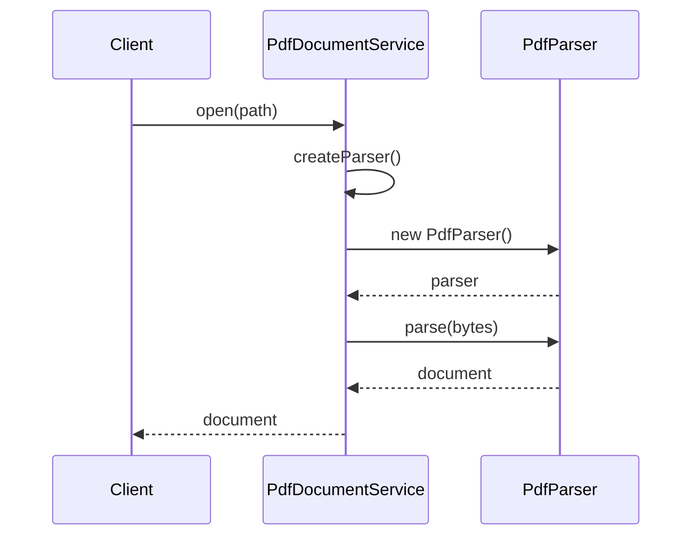
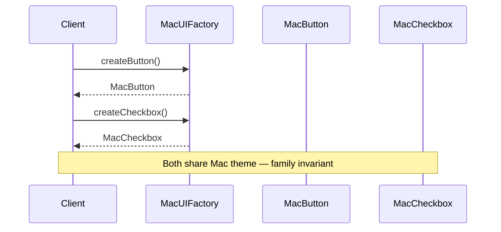
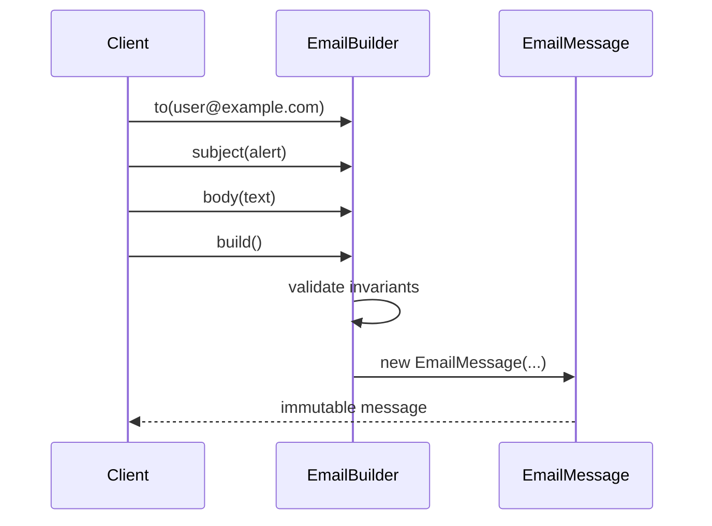

### Problem & Intent

**Factory Method**, **Abstract Factory**, and **Builder** all hide object creation from clients — but they optimize for different shapes of complexity:

- **Factory Method** — defer **which single product** to a subclass or provider method (`createConnection()`).
- **Abstract Factory** — create **families of related products** that must stay consistent (`WinButton` + `WinScrollbar`).
- **Builder** — assemble a **complex object step-by-step** with optional parts and invariant checks (`HttpRequest` with headers, body, timeout).

Pick wrong and you get a Builder with two fields, or an Abstract Factory for one type. This guide is the creational decision matrix for interviews and production wiring.

---

### Pattern Comparison at a Glance

| Dimension | Factory Method | Abstract Factory | Builder |
| :--- | :--- | :--- | :--- |
| **Primary intent** | Subclass decides concrete product | Factory produces related product family | Separate construction from representation |
| **Products created** | One per factory method | Multiple related types per factory | One aggregate, many optional steps |
| **Client knows** | Product interface | Family interfaces | Director or fluent API; not every ctor arg |
| **Variation axis** | Which implementation of **one** type | Which **consistent set** of types | Which **steps/fields** in one object |
| **Construction flow** | Single call | Multiple `createX()` on same factory | `setA().setB().build()` |
| **Typical smell** | `new` scattered + `switch` on type | Mismatched themes (Mac button + Win scroll) | 15-parameter constructor or telescoping ctor |
| **Go idiom** | `func NewX(opts...) X` or small factory func | struct holding related constructors | functional options + `Build()` validation |

---

### When to Use / When NOT to Use

| Situation | Factory Method | Abstract Factory | Builder | Why |
| :--- | :---: | :---: | :---: | :--- |
| Create `PostgresConnection` vs `MysqlConnection` based on config | Yes | — | — | One product; provider selects impl |
| UI toolkit: buttons + checkboxes must match OS theme | — | Yes | — | Family consistency constraint |
| `HttpRequest` with 12 optional fields + validation | — | — | Yes | Stepwise assembly; readable call site |
| Spring `@Bean` method returns `PaymentGateway` impl | Yes | — | — | Classic factory method in DI |
| Cloud abstraction: AWS S3 + SQS + Secrets vs GCP equivalents | — | Yes | — | Swap whole platform bundle |
| Domain aggregate with invariants across fields | — | — | Yes | `build()` enforces rules once |
| Only one concrete type, config via ctor args | No | No | Maybe | Plain constructor or options struct |
| Two unrelated products, no consistency rule | Yes × 2 | No | — | Two factory methods, not a family |
| Immutable object with 3 required fields | No | No | Maybe | Record/struct literal may suffice |
| Object graph built from JSON / user wizard steps | — | — | Yes | Builder mirrors staged input |

---

### Structure (Class Diagram)

```mermaid
classDiagram
    direction TB

    namespace FactoryMethod {
        class DocumentService {
            <<creator>>
            +open(path) Document*
            #createParser() Parser*
        }
        class PdfDocumentService {
            #createParser()
        }
        class MarkdownDocumentService {
            #createParser()
        }
        class Parser {
            <<product>>
            +parse(bytes)
        }
        class PdfParser
        class MarkdownParser
        DocumentService <|-- PdfDocumentService
        DocumentService <|-- MarkdownDocumentService
        DocumentService --> Parser : creates
        Parser <|.. PdfParser
        Parser <|.. MarkdownParser
    }

    namespace AbstractFactory {
        class UIFactory {
            <<abstract factory>>
            +createButton() Button
            +createCheckbox() Checkbox
        }
        class MacUIFactory
        class WinUIFactory
        class Button
        class Checkbox
        UIFactory <|-- MacUIFactory
        UIFactory <|-- WinUIFactory
        MacUIFactory ..> Button : MacButton
        MacUIFactory ..> Checkbox : MacCheckbox
        WinUIFactory ..> Button : WinButton
        WinUIFactory ..> Checkbox : WinCheckbox
    }

    namespace Builder {
        class EmailMessage {
            -to
            -subject
            -body
            -attachments
        }
        class EmailBuilder {
            +to(addr)
            +subject(s)
            +body(b)
            +attach(file)
            +build() EmailMessage
        }
        EmailBuilder ..> EmailMessage : builds
    }
```

---

### Interaction Flow

**Factory Method — creator calls virtual factory hook, returns product:**



**Abstract Factory — client asks factory for multiple related products:**



**Builder — accumulate steps, validate, then materialize:**



---

### Implementation




**Factory Method — document service picks parser:**

```java
public interface Parser {
    Document parse(byte[] bytes);
}

public abstract class DocumentService {
    public final Document open(String path, byte[] bytes) {
        Parser parser = createParser();
        return parser.parse(bytes);
    }

    protected abstract Parser createParser();
}

public final class PdfDocumentService extends DocumentService {
    @Override
    protected Parser createParser() {
        return new PdfParser();
    }
}
```

**Abstract Factory — consistent UI family:**

```java
public interface UIFactory {
    Button createButton();
    Checkbox createCheckbox();
}

public final class MacUIFactory implements UIFactory {
    @Override
    public Button createButton() { return new MacButton(); }

    @Override
    public Checkbox createCheckbox() { return new MacCheckbox(); }
}

public final class Application {
    private final UIFactory uiFactory;

    public Application(UIFactory uiFactory) {
        this.uiFactory = uiFactory;
    }

    public void renderForm() {
        Button ok = uiFactory.createButton();
        Checkbox agree = uiFactory.createCheckbox();
        // MacButton + MacCheckbox — never mixed with Win*
    }
}
```

**Builder — email with validation at build time:**

```java
public final class EmailMessage {
    private final String to;
    private final String subject;
    private final String body;
    private final List<Attachment> attachments;

    private EmailMessage(EmailBuilder builder) {
        this.to = builder.to;
        this.subject = builder.subject;
        this.body = builder.body;
        this.attachments = List.copyOf(builder.attachments);
    }

    public static final class EmailBuilder {
        private String to;
        private String subject = "";
        private String body = "";
        private final List<Attachment> attachments = new ArrayList<>();

        public EmailBuilder to(String to) { this.to = to; return this; }
        public EmailBuilder subject(String s) { this.subject = s; return this; }
        public EmailBuilder body(String b) { this.body = b; return this; }
        public EmailBuilder attach(Attachment a) { attachments.add(a); return this; }

        public EmailMessage build() {
            if (to == null || to.isBlank()) {
                throw new IllegalStateException("to is required");
            }
            return new EmailMessage(this);
        }
    }
}

// new EmailMessage.EmailBuilder().to("a@b.com").subject("Hi").build()
```




**Factory Method — constructor function selects impl:**

```go
type Parser interface {
    Parse(data []byte) (Document, error)
}

type PdfParser struct{}
func (PdfParser) Parse(data []byte) (Document, error) { /* ... */ return Document{}, nil }

type MarkdownParser struct{}
func (MarkdownParser) Parse(data []byte) (Document, error) { /* ... */ return Document{}, nil }

func OpenDocument(format string, data []byte) (Document, error) {
    var parser Parser
    switch format {
    case "pdf":
        parser = PdfParser{}
    case "md":
        parser = MarkdownParser{}
    default:
        return Document{}, fmt.Errorf("unknown format: %s", format)
    }
    return parser.Parse(data)
}
```

**Abstract Factory — struct holds family constructors:**

```go
type Button interface { Render() }
type Checkbox interface { Render() }

type UIFactory struct {
    NewButton   func() Button
    NewCheckbox func() Checkbox
}

var MacUI = UIFactory{
    NewButton:   func() Button { return MacButton{} },
    NewCheckbox: func() Checkbox { return MacCheckbox{} },
}

func RenderForm(f UIFactory) {
    ok := f.NewButton()
    agree := f.NewCheckbox()
    ok.Render()
    agree.Render()
}
```

**Builder — functional options or explicit builder struct:**

```go
type EmailMessage struct {
    To          string
    Subject     string
    Body        string
    Attachments []Attachment
}

type EmailBuilder struct {
    msg EmailMessage
}

func (b *EmailBuilder) To(addr string) *EmailBuilder {
    b.msg.To = addr
    return b
}

func (b *EmailBuilder) Subject(s string) *EmailBuilder {
    b.msg.Subject = s
    return b
}

func (b *EmailBuilder) Build() (EmailMessage, error) {
    if b.msg.To == "" {
        return EmailMessage{}, errors.New("to is required")
    }
    return b.msg, nil
}

// Alternative: type EmailOption func(*EmailMessage)
// func NewEmail(opts ...EmailOption) (EmailMessage, error)
```

Go favors **package-level factory functions** and **functional options** over deep inheritance hierarchies.




---

### Trade-offs & Operational Realities

| Concern | Factory Method | Abstract Factory | Builder |
| :--- | :--- | :--- | :--- |
| **Testability** | Inject creator or override factory method in test subclass | Swap whole `UIFactory` fake in one place | Test `build()` validation paths independently |
| **Complexity** | Lowest — one product indirection | Medium — N products × M families | Medium — fluent API + invariant matrix |
| **Framework fit** | Spring `@Bean`, Java `Optional` suppliers | Spring `@Configuration` producing related beans | Lombok `@Builder`, OkHttp `Request.Builder`, gRPC builders |
| **Discoverability** | IDE finds `createX()` | Factory interface documents family | Fluent API is self-documenting at call site |
| **Immutability** | Product may be mutable or not | Family usually created together | Builder often builds immutable product |
| **Misuse cost** | Abstract Factory for one type — overkill | Mixing families causes subtle UI bugs | Mutable builder reused across goroutines — data races in Go |

---

### Junior Mistakes

- Using Builder for a **two-field** object — use constructor or struct literal
- Abstract Factory when products are **unrelated** — use separate Factory Methods
- Factory Method as a **static util** `create(String type)` with giant switch — no extension point ([Open-Closed](/design-patterns/open-closed-principle/) violation)
- Builder without **`build()` validation** — invalid objects leak into domain
- Confusing Abstract Factory with [Factory Method](/design-patterns/factory-method-pattern/) because both have "factory" in the name
- In Go, copying Java's `MacUIFactory extends …` instead of a **struct of func fields**
- Reusing same Builder instance across requests without `Reset()` — stale state

---

### Senior Questions

1. Spring `@Configuration` with `@Bean DataSource`, `@Bean TransactionManager`, `@Bean JdbcTemplate` — Abstract Factory or separate Factory Methods?
2. When does **Prototype** beat Factory Method for object creation?
3. How do **functional options** (`func Option`) in Go map to Builder? Trade-offs vs explicit `EmailBuilder`?
4. Multi-tenant app: per-tenant `PaymentGateway` — Factory Method registry vs Abstract Factory per tenant?
5. `build()` throws on invalid state — where do errors belong in REST API (400 vs 500)?
6. Immutable aggregate with 20 fields — Builder + record, or staged domain factory?
7. How do you test that Mac UI factory never returns `WinButton` without reflection?

---

### Revision Cheat Sheet

- **Factory Method:** "One product, creation deferred to provider/subclass." Smell: `new Concrete()` + `switch` in business code. Pairs with [Factory Method](/design-patterns/factory-method-pattern/), [DI](/design-patterns/dependency-injection-inversion-of-control/).
- **Abstract Factory:** "Bundle of related products, swap the bundle." Smell: risk of mixing incompatible concretes. Pairs with [Abstract Factory](/design-patterns/abstract-factory-pattern/).
- **Builder:** "Step-by-step; validate at end." Smell: telescoping constructors or 10-arg `new`. Pairs with [Builder](/design-patterns/builder-pattern/), immutable domain models.
- **Avoid Factory Method when:** `new` is fine and type never varies.
- **Avoid Abstract Factory when:** no family consistency requirement.
- **Avoid Builder when:** ≤3 fields, all required, no invariants — struct literal wins.
- **Interview one-liner:** Factory Method = **which one**; Abstract Factory = **which set**; Builder = **how to assemble one complex thing**.

---

### See Also

- [Factory Method Pattern](/design-patterns/factory-method-pattern/)
- [Abstract Factory Pattern](/design-patterns/abstract-factory-pattern/)
- [Builder Pattern](/design-patterns/builder-pattern/)
- [Prototype Pattern](/design-patterns/prototype-pattern/)
- [Singleton Pattern](/design-patterns/singleton-pattern/)
- [Open-Closed Principle](/design-patterns/open-closed-principle/)
- [Dependency Injection & IoC](/design-patterns/dependency-injection-inversion-of-control/)
- [Notification Service LLD](/design-patterns/notification-service-lld/) — factories in practice
