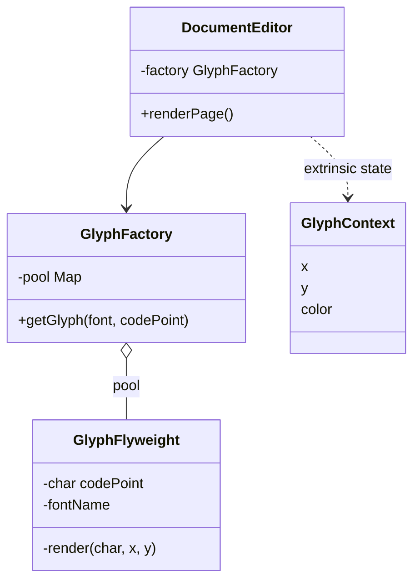
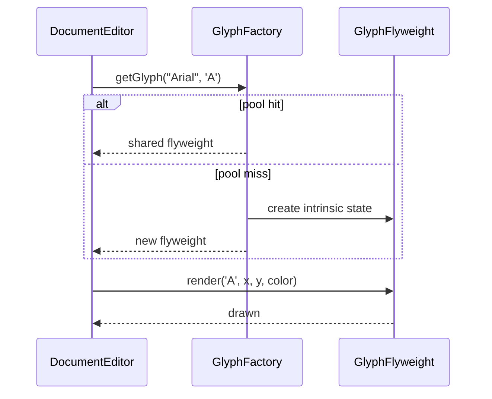

### Problem & Intent

The Flyweight Pattern uses **sharing** to support large numbers of fine-grained objects efficiently. **Intrinsic state** (font name, glyph shape, texture atlas region) is stored once in a flyweight pool; **extrinsic state** (x/y position, color, user id) is passed in at use time. The dominant force is **memory pressure** from millions of near-duplicate objects — text editors, game particles, map tiles, icon grids.

---

### When to Use / When NOT to Use

| Situation | Use? | Why |
| :--- | :---: | :--- |
| Huge count of objects differing mostly in shared immutable data | Yes | Pool flyweights by intrinsic key |
| Extrinsic state is small and passed per call | Yes | Keeps flyweights stateless and thread-safe |
| Object count is small or each instance is truly unique | No | Pool overhead without benefit |
| Intrinsic state must mutate per instance | No | Sharing breaks correctness |
| You need transparent caching of expensive remote calls | No | Prefer [Proxy](/design-patterns/proxy-pattern/) |
| Concurrency requires per-object locks on shared data | No | Redesign extrinsic/intrinsic split first |

---

### Structure (Class Diagram)



---

### Interaction Flow



---

### Implementation




**One object per character on screen:**

```java
public final class Glyph {
    private final char ch;
    private final String font;
    private final int x, y; // duplicated font data millions of times
    public void render() { /* draw ch with font at x,y */ }
}
```

**Flyweight approach:**

```java
public final class GlyphFlyweight {
    private final char codePoint;
    private final String fontName;

    GlyphFlyweight(char codePoint, String fontName) {
        this.codePoint = codePoint;
        this.fontName = fontName;
    }

    public void render(Graphics g, int x, int y, Color color) {
        g.setColor(color);
        g.setFont(new Font(fontName, Font.PLAIN, 12));
        g.drawString(String.valueOf(codePoint), x, y);
    }
}

public final class GlyphFactory {
    private final Map<String, GlyphFlyweight> pool = new ConcurrentHashMap<>();

    public GlyphFlyweight get(String fontName, char codePoint) {
        String key = fontName + ":" + codePoint;
        return pool.computeIfAbsent(key, k -> new GlyphFlyweight(codePoint, fontName));
    }
}

public final class DocumentEditor {
    private final GlyphFactory factory = new GlyphFactory();
    private final List<GlyphPlacement> placements = new ArrayList<>();

    public void addChar(String font, char ch, int x, int y, Color color) {
        placements.add(new GlyphPlacement(factory.get(font, ch), x, y, color));
    }

    public void renderPage(Graphics g) {
        for (GlyphPlacement p : placements) {
            p.flyweight().render(g, p.x(), p.y(), p.color());
        }
    }

    private record GlyphPlacement(GlyphFlyweight flyweight, int x, int y, Color color) {}
}
```




**Per-instance duplication:**

```go
type Glyph struct {
    Ch   rune
    Font string
    X, Y int
}
```

**Flyweight approach:**

```go
type GlyphFlyweight struct {
    CodePoint rune
    FontName  string
}

func (g *GlyphFlyweight) Render(dst draw.Image, x, y int, color color.Color) {
    // draw g.CodePoint with g.FontName at extrinsic x,y,color
}

type GlyphFactory struct {
    mu   sync.Mutex
    pool map[string]*GlyphFlyweight
}

func (f *GlyphFactory) Get(font string, ch rune) *GlyphFlyweight {
    key := font + ":" + string(ch)
    f.mu.Lock()
    defer f.mu.Unlock()
    if g, ok := f.pool[key]; ok {
        return g
    }
    g := &GlyphFlyweight{CodePoint: ch, FontName: font}
    f.pool[key] = g
    return g
}

type GlyphPlacement struct {
    Flyweight *GlyphFlyweight
    X, Y      int
    Color     color.Color
}

type DocumentEditor struct {
    factory    GlyphFactory
    placements []GlyphPlacement
}

func (e *DocumentEditor) AddChar(font string, ch rune, x, y int, c color.Color) {
    e.placements = append(e.placements, GlyphPlacement{
        Flyweight: e.factory.Get(font, ch),
        X: x, Y: y, Color: c,
    })
}
```

Use `sync.Map` for read-heavy pools; extrinsic state stays in `GlyphPlacement`, never in the flyweight.




---

### Trade-offs & Operational Realities

| Concern | Impact |
| :--- | :--- |
| **Testability** | Factory pool tests verify deduplication; render tests pass extrinsic context |
| **Complexity** | Must discipline intrinsic vs extrinsic split — bugs when mutable state slips into flyweight |
| **Framework fit** | String interning, `Integer.valueOf` small-cache, icon fonts, game entity pools |
| **Memory** | Pool grows with distinct intrinsic keys — cap or LRU when key space is huge |
| **Thread safety** | Flyweights immutable; factory map needs concurrent access patterns |

---

### Junior Mistakes

- Storing x/y or user-specific data inside the flyweight (breaks sharing)
- Using Flyweight when only hundreds of objects exist — premature optimization
- Mutable flyweights shared across threads without synchronization
- Confusing Flyweight factory pool with [Proxy](/design-patterns/proxy-pattern/) cache — flyweight shares **identity**; proxy wraps **one** expensive subject

---

### Senior Questions

1. How do you classify intrinsic vs extrinsic state for map markers (icon, lat, lng, label)?
2. Flyweight vs Object Pool vs Prototype — when is each appropriate?
3. How does `String.intern()` relate to Flyweight? What are the JVM pitfalls?
4. How do you bound pool growth when intrinsic keys are unbounded (user-uploaded fonts)?
5. Can flyweights be garbage-collected while the pool holds strong references?

---

### Revision Cheat Sheet

- **One line:** Share immutable intrinsic state; pass extrinsic context per use.
- **Trigger smell:** Millions of small objects differing only in a few shared fields.
- **Pairs with:** [Proxy](/design-patterns/proxy-pattern/), [Factory Method](/design-patterns/factory-method-pattern/), [Singleton](/design-patterns/singleton-pattern/) (pool as single registry)
- **Avoid when:** Objects are few, unique, or intrinsic state cannot be shared safely.
- **Interview tip:** Flyweight = **memory**; Proxy = **access control**; same UML shape, different intent.

---

### See Also

- [Proxy Pattern](/design-patterns/proxy-pattern/)
- [Singleton Pattern](/design-patterns/singleton-pattern/)
- [Factory Method Pattern](/design-patterns/factory-method-pattern/)
- [Decorator vs Proxy vs Bridge](/design-patterns/decorator-vs-proxy-vs-bridge/)
