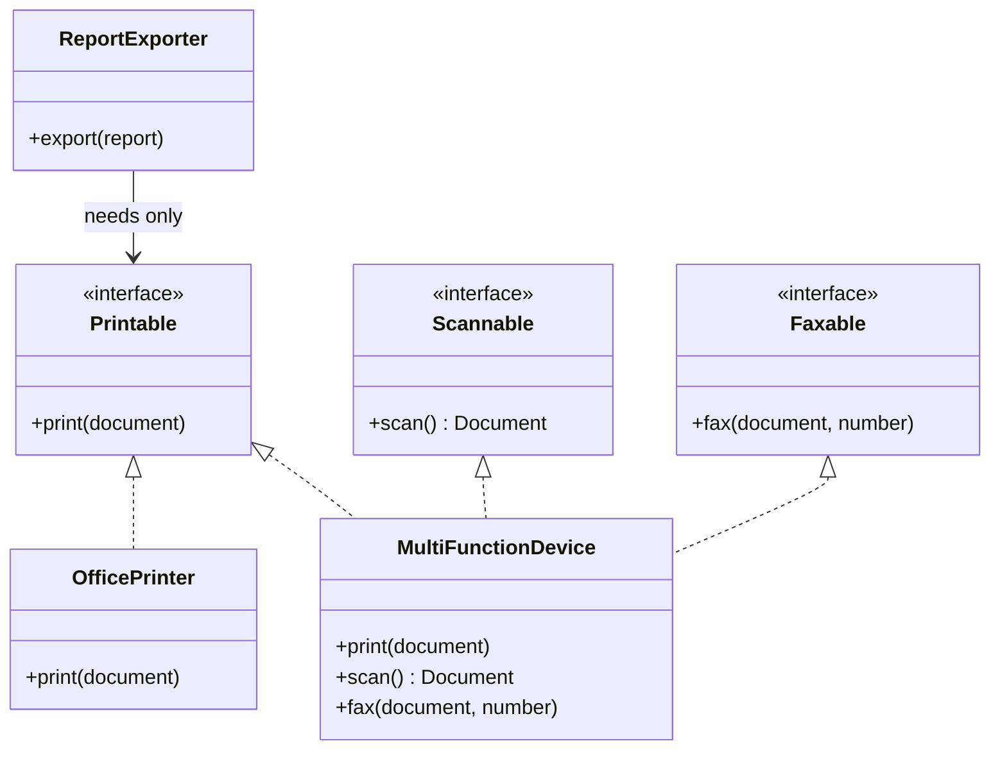
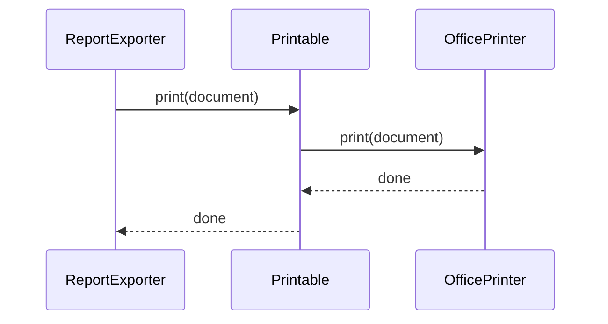

### Problem & Intent

The Interface Segregation Principle (ISP) states that **clients should not be forced to depend on methods they do not use**. A fat `Machine` interface with `print`, `scan`, and `fax` forces a simple printer to implement `fax` with no-ops or exceptions. ISP splits broad contracts into role-specific interfaces so each client depends only on what it needs — reducing coupling and LSP violations from stubbed methods.

---

### When to Use / When NOT to Use

| Situation | Use? | Why |
| :--- | :---: | :--- |
| Implementations leave methods empty or throw `UnsupportedOperationException` | Yes | Split the interface by client role |
| Different clients use disjoint subsets of the same large interface | Yes | Segregate so each client sees a minimal surface |
| Mocking in tests requires stubbing irrelevant methods | Yes | Smaller interfaces mean smaller test doubles |
| Interface has 2–3 cohesive methods always used together | No | A single interface is simpler and clearer |
| Splitting would create ten one-method interfaces with no client distinction | No | Over-segregation adds navigation cost without benefit |
| Framework mandates a single lifecycle interface (e.g. `Servlet`) | No | Wrap or adapt at the boundary; don't fight the framework type |

---

### Structure (Class Diagram)



---

### Interaction Flow



---

### Implementation




**Violation — fat interface, forced no-ops:**

```java
public interface Machine {
    void print(Document doc);
    Document scan();
    void fax(Document doc, String number);
}

public class SimplePrinter implements Machine {
    @Override
    public void print(Document doc) { /* real */ }

    @Override
    public Document scan() {
        throw new UnsupportedOperationException("no scanner");
    }

    @Override
    public void fax(Document doc, String number) {
        throw new UnsupportedOperationException("no fax");
    }
}

public class ReportExporter {
    private final Machine machine; // depends on fax/scan it never calls

    public void export(Report report) {
        machine.print(report.toDocument());
    }
}
```

**ISP-aligned — role-specific interfaces:**

```java
public interface Printable {
    void print(Document doc);
}

public interface Scannable {
    Document scan();
}

public interface Faxable {
    void fax(Document doc, String number);
}

public final class SimplePrinter implements Printable {
    @Override
    public void print(Document doc) { /* real */ }
}

public final class MultiFunctionDevice implements Printable, Scannable, Faxable {
    @Override public void print(Document doc) { /* ... */ }
    @Override public Document scan() { /* ... */ }
    @Override public void fax(Document doc, String number) { /* ... */ }
}

public final class ReportExporter {
    private final Printable printer;

    public ReportExporter(Printable printer) {
        this.printer = printer;
    }

    public void export(Report report) {
        printer.print(report.toDocument());
    }
}
```




**Violation:**

```go
type Machine interface {
    Print(doc Document)
    Scan() (Document, error)
    Fax(doc Document, number string) error
}

type SimplePrinter struct{}

func (SimplePrinter) Print(doc Document) {}

func (SimplePrinter) Scan() (Document, error) {
    return Document{}, errors.New("no scanner")
}

func (SimplePrinter) Fax(Document, string) error {
    return errors.New("no fax")
}

type ReportExporter struct {
    machine Machine // over-constrained dependency
}
```

**ISP-aligned:**

```go
type Printable interface {
    Print(doc Document)
}

type Scannable interface {
    Scan() (Document, error)
}

type Faxable interface {
    Fax(doc Document, number string) error
}

type SimplePrinter struct{}

func (SimplePrinter) Print(doc Document) {}

type MultiFunctionDevice struct{}

func (MultiFunctionDevice) Print(doc Document) {}
func (MultiFunctionDevice) Scan() (Document, error) { return Document{}, nil }
func (MultiFunctionDevice) Fax(doc Document, number string) error { return nil }

type ReportExporter struct {
    printer Printable
}

func (e *ReportExporter) Export(r Report) {
    e.printer.Print(r.ToDocument())
}
```

Go's implicit interface satisfaction makes ISP natural — define interfaces at the **consumer**, not the implementer.




---

### Trade-offs & Operational Realities

| Concern | Impact |
| :--- | :--- |
| **Testability** | `ReportExporter` tests need only a `Printable` stub — two methods instead of six |
| **Complexity** | More interface types; mitigate with clear naming (`Readable`, `Writable`, not `IThing2`) |
| **Framework fit** | Spring beans can implement multiple segregated interfaces; inject the narrowest type |
| **Adapter glue** | Multi-capability devices need one struct implementing several small interfaces — acceptable trade-off |

---

### Junior Mistakes

- Creating one interface per class "because ISP" without analyzing client needs
- Putting segregated interfaces on the implementer package instead of the consumer (Go anti-pattern)
- Using default methods on Java interfaces to smuggle fat contracts back in
- Confusing ISP with SRP — ISP is about **client dependency surface**, not class responsibility count

---

### Senior Questions

1. Which **client** owns the interface definition — caller or implementer?
2. How do you spot ISP violations in review without counting interface methods?
3. When does a read-only `List` view relate to ISP and [LSP](/design-patterns/liskov-substitution-principle/)?
4. How do you segregate a legacy God-interface without a big-bang refactor?
5. At what point does interface proliferation hurt discoverability more than fat interfaces hurt testing?

---

### Revision Cheat Sheet

- **One line:** Depend only on methods your client actually calls.
- **Trigger smell:** Empty overrides, `UnsupportedOperationException`, or "not applicable" in half the methods.
- **Pairs with:** [Liskov Substitution](/design-patterns/liskov-substitution-principle/), [Dependency Inversion](/design-patterns/dependency-inversion-principle/)
- **Avoid when:** The interface is already cohesive and every client uses every method.
- **Interview tip:** Sketch fat `Worker` vs `Workable` + `Eatable` and name which client needs which.

---

### See Also

- [Liskov Substitution Principle](/design-patterns/liskov-substitution-principle/)
- [Dependency Inversion Principle](/design-patterns/dependency-inversion-principle/)
- [Adapter Pattern](/design-patterns/adapter-pattern/)
- [SOLID Composition Guide](/design-patterns/solid-principles-composition-guide/)
