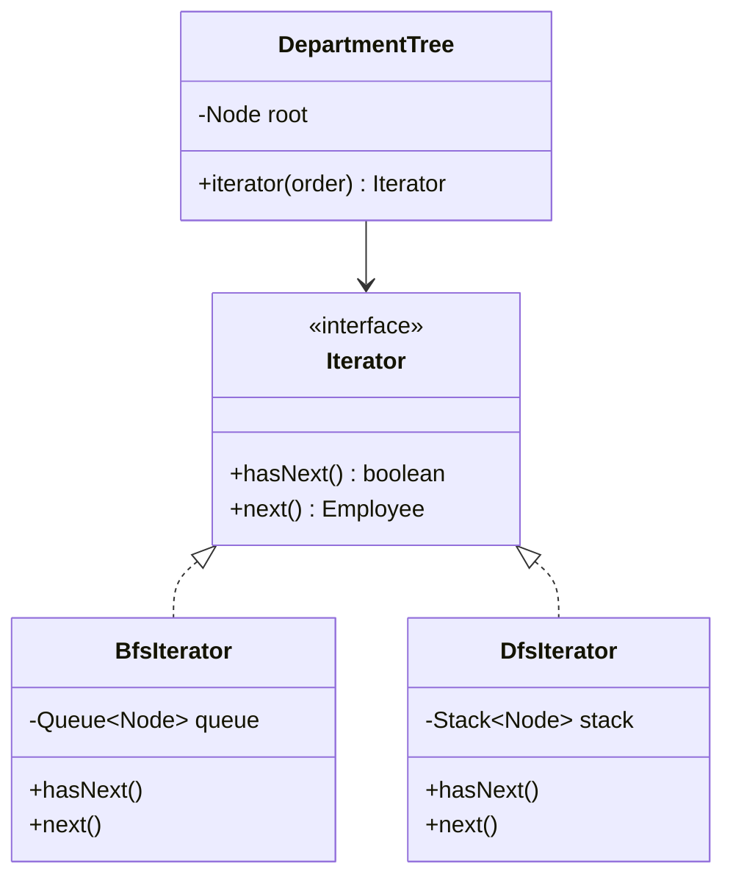
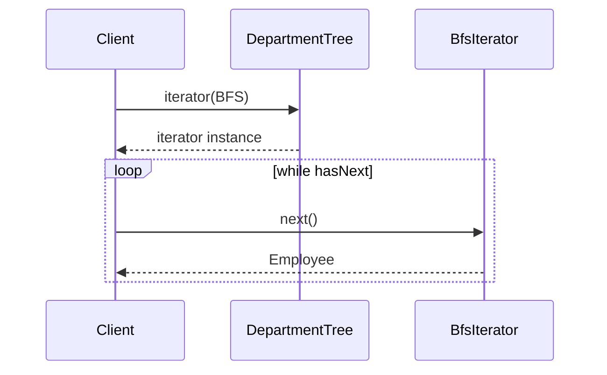

### Problem & Intent

The Iterator Pattern provides a way to **access elements of a collection sequentially without exposing its underlying representation**. Clients use a uniform `hasNext` / `next` (or `for range`) interface whether the backing structure is an array, linked list, tree, or lazy database cursor. It separates traversal algorithm from collection structure — critical for composite trees, paginated APIs, and custom data structures.

---

### When to Use / When NOT to Use

| Situation | Use? | Why |
| :--- | :---: | :--- |
| Multiple traversal orders over the same structure (BFS, DFS, in-order) | Yes | Swap iterator implementation without changing collection |
| Hide internal representation from clients | Yes | Encapsulation — clients don't index into your graph |
| Lazy/paginated traversal over large or remote data | Yes | Iterator fetches next page on demand |
| Language already provides iterators (`Iterable`, `range`) | Often built-in | Implement standard interfaces rather than custom ceremony |
| Single traversal, simple `List` or slice | No | Enhanced for-loop or `range` is enough |
| Concurrent modification during iteration | No | Needs copy-on-write, snapshot iterator, or concurrent collection |
| Need random access by index | No | Iterator is sequential; use indexed access API |

---

### Structure (Class Diagram)



---

### Interaction Flow



---

### Implementation




**Junior approach — expose internal list:**

```java
public class Department {
    private final List<Employee> employees = new ArrayList<>();

    public List<Employee> getEmployees() {
        return employees; // caller can mutate internal state
    }
}
```

**Iterator approach:**

```java
public final class DepartmentTree implements Iterable<Employee> {
    private final Node root;

    public Iterator<Employee> iterator(TraversalOrder order) {
        return switch (order) {
            case BFS -> new BfsIterator(root);
            case DFS -> new DfsIterator(root);
        };
    }

    @Override
    public Iterator<Employee> iterator() {
        return iterator(TraversalOrder.BFS);
    }
}

public final class BfsIterator implements Iterator<Employee> {
    private final Queue<Node> queue = new ArrayDeque<>();

    public BfsIterator(Node root) {
        if (root != null) queue.add(root);
    }

    @Override
    public boolean hasNext() {
        return !queue.isEmpty();
    }

    @Override
    public Employee next() {
        Node node = queue.remove();
        queue.addAll(node.children());
        return node.employee();
    }
}
```

Implement `Iterable<T>` so clients use enhanced for-loops. For streams, add `spliterator()` or map iterator to `StreamSupport.stream`.




```go
type Employee struct {
    Name string
}

type Node struct {
    Employee Employee
    Children []*Node
}

type TraversalOrder int

const (
    BFS TraversalOrder = iota
    DFS
)

func Walk(root *Node, order TraversalOrder) iter.Seq[Employee] {
    return func(yield func(Employee) bool) {
        if root == nil {
            return
        }
        switch order {
        case BFS:
            queue := []*Node{root}
            for len(queue) > 0 {
                n := queue[0]
                queue = queue[1:]
                if !yield(n.Employee) {
                    return
                }
                queue = append(queue, n.Children...)
            }
        case DFS:
            var dfs func(*Node) bool
            dfs = func(n *Node) bool {
                if !yield(n.Employee) {
                    return false
                }
                for _, c := range n.Children {
                    if !dfs(c) {
                        return false
                    }
                }
                return true
            }
            dfs(root)
        }
    }
}

// Usage: for emp := range Walk(root, BFS) { ... }
```

Go 1.23+ `iter.Seq` is the idiomatic iterator. For older code, return `[]Employee` or a custom struct with `Next() (Employee, bool)`.




---

### Trade-offs & Operational Realities

| Concern | Impact |
| :--- | :--- |
| **Testability** | Iterator tested independently with small fixture trees |
| **Complexity** | Multiple iterator types multiply; factory method selects order |
| **Framework fit** | Java `Iterator`/`Iterable`; JPA `Stream`; Go `range` and `iter.Seq` |
| **Concurrency** | Fail-fast iterators detect modification; snapshot iterators trade memory for safety |

---

### Junior Mistakes

- Returning modifiable internal collection instead of iterator
- Iterator that loads entire dataset into memory for "lazy" API
- Not implementing `Remove()` semantics or documenting that it is unsupported
- One iterator trying to support every traversal — becomes god class
- Ignoring `ConcurrentModificationException` in multi-threaded contexts

---

### Senior Questions

1. When do you expose `Stream` vs custom `Iterator` in a Java API?
2. How do you iterate a paginated REST API as a lazy iterator?
3. Iterator vs [Visitor](/design-patterns/visitor-pattern/) — traverse vs operate on structure?
4. Composite pattern + iterator — who owns `iterator()`, parent or children?
5. How does Go's `range` over channels compare to classic Iterator?

---

### Revision Cheat Sheet

- **One line:** Sequential access without revealing collection internals.
- **Trigger smell:** Clients reach into private fields or duplicate traversal logic.
- **Pairs with:** [Composite Pattern](/design-patterns/composite-pattern/), [Visitor Pattern](/design-patterns/visitor-pattern/)
- **Avoid when:** Built-in iteration suffices or random access is the primary use case.
- **Go tip:** Prefer `iter.Seq` or simple `range` over Java-style iterator structs.

---

### See Also

- [Composite Pattern](/design-patterns/composite-pattern/)
- [Visitor Pattern](/design-patterns/visitor-pattern/)
- [Factory Method Pattern](/design-patterns/factory-method-pattern/)
- [Specification Pattern](/design-patterns/specification-pattern/)
