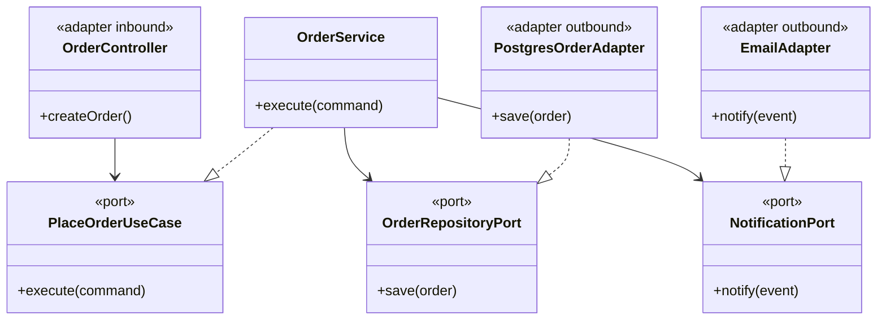
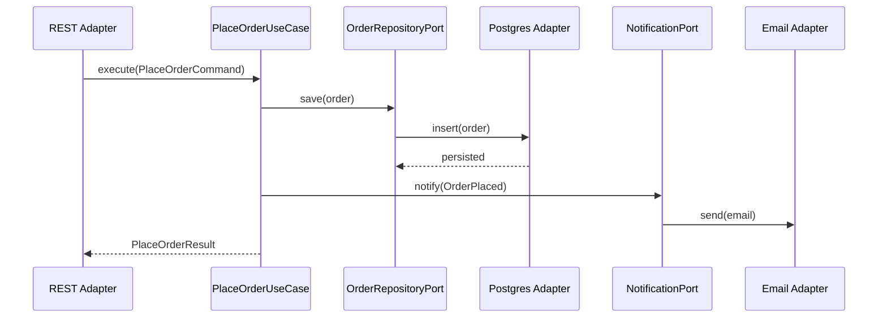

### Problem & Intent

**Layered (n-tier) architecture** stacks presentation → application → domain → infrastructure, with dependencies ideally flowing downward. **Hexagonal (ports and adapters)** places the domain at the center and defines explicit **ports** (interfaces the app needs) with **adapters** plugging in HTTP, DB, messaging, or clocks. Both organize code for maintainability; hexagonal makes dependency direction and test doubles first-class when layers tend to leak (controllers calling JPA repositories directly).

---

### When to Use / When NOT to Use

| Situation | Use? | Why |
| :--- | :---: | :--- |
| Greenfield service with multiple inbound (REST, gRPC) and outbound (DB, queue) channels | Yes (Hexagonal) | Each adapter implements a port; core stays channel-agnostic |
| CRUD Spring Boot app with clear package-by-layer structure | Yes (Layered) | Familiar conventions; Spring aligns with controller/service/repository |
| Team needs strict testability without starting containers | Yes (Hexagonal) | Swap adapters with fakes at every port |
| 500-line internal tool with one REST endpoint | No | Package folders add navigation cost |
| Layered app where every service imports `EntityManager` | No | Layers exist on paper only — refactor toward ports or tighten rules |
| Event-driven system with many integration points | Yes (Hexagonal) | Inbound/outbound adapters map naturally to handlers and publishers |

---

### Structure (Class Diagram)



---

### Interaction Flow



---

### Implementation




**Layered leak — controller reaches repository:**

```java
@RestController
public class OrderController {
    @Autowired JpaOrderRepository repository; // skips application layer

    @PostMapping("/orders")
    public OrderEntity create(@RequestBody OrderEntity body) {
        return repository.save(body);
    }
}
```

**Hexagonal — ports in core, adapters at edge:**

```java
// domain / application port
public interface PlaceOrderUseCase {
    OrderResult execute(PlaceOrderCommand command);
}

public interface OrderRepositoryPort {
    Order save(Order order);
}

// application core
public final class OrderService implements PlaceOrderUseCase {
    private final OrderRepositoryPort repository;
    private final NotificationPort notifier;

    public OrderService(OrderRepositoryPort repository, NotificationPort notifier) {
        this.repository = repository;
        this.notifier = notifier;
    }

    @Override
    public OrderResult execute(PlaceOrderCommand command) {
        Order order = repository.save(Order.from(command));
        notifier.notify(new OrderPlaced(order.id()));
        return OrderResult.from(order);
    }
}

// inbound adapter
@RestController
public class OrderController {
    private final PlaceOrderUseCase placeOrder;

    public OrderController(PlaceOrderUseCase placeOrder) {
        this.placeOrder = placeOrder;
    }

    @PostMapping("/orders")
    public OrderResponse create(@RequestBody CreateOrderRequest request) {
        return OrderResponse.from(placeOrder.execute(request.toCommand()));
    }
}
```

Layered variant: same classes in `controller`, `service`, `repository` packages with interfaces only on repositories.




**Layered leak:**

```go
func (h *Handler) Create(w http.ResponseWriter, r *http.Request) {
    var row OrderRow
    json.NewDecoder(r.Body).Decode(&row)
    h.db.Exec("INSERT INTO orders ...") // HTTP layer owns SQL
}
```

**Hexagonal layout:**

```go
// internal/core/ports.go
type PlaceOrderUseCase interface {
    Execute(ctx context.Context, cmd PlaceOrderCommand) (OrderResult, error)
}

type OrderRepository interface {
    Save(ctx context.Context, order Order) (Order, error)
}

// internal/core/order_service.go
type OrderService struct {
    repo     OrderRepository
    notifier NotificationPort
}

func (s *OrderService) Execute(ctx context.Context, cmd PlaceOrderCommand) (OrderResult, error) {
    order, err := s.repo.Save(ctx, NewOrder(cmd))
    if err != nil {
        return OrderResult{}, err
    }
    _ = s.notifier.Notify(ctx, OrderPlaced{OrderID: order.ID})
    return ToResult(order), nil
}

// internal/adapters/http/handler.go — inbound adapter
type Handler struct {
    placeOrder PlaceOrderUseCase
}

func (h *Handler) Create(w http.ResponseWriter, r *http.Request) {
    var req CreateOrderRequest
    json.NewDecoder(r.Body).Decode(&req)
    result, err := h.placeOrder.Execute(r.Context(), req.ToCommand())
    // map to response...
}
```

Package layout: `internal/core`, `internal/adapters/http`, `internal/adapters/postgres`.




---

### Trade-offs & Operational Realities

| Concern | Impact |
| :--- | :--- |
| **Testability** | Hexagonal: test `OrderService` with in-memory ports; Layered: same if interfaces enforced |
| **Complexity** | Hexagonal adds port interfaces per boundary — layered can degenerate into "packages as folders" |
| **Framework fit** | Spring Boot maps well to layered; hexagonal needs discipline so `@RestController` stays thin |
| **Onboarding** | Layered is widely understood; hexagonal requires team agreement on what is a port vs adapter |

---

### Junior Mistakes

- Calling it hexagonal while controllers import `JpaRepository` implementations
- Creating a port interface for every single method — port explosion
- Putting domain logic in outbound adapters (SQL with business rules inside)
- Confusing physical deployment tiers (load balancer, app server) with logical layers in code

---

### Senior Questions

1. Is a Spring `@Repository` a layer or an outbound adapter?
2. How do you enforce dependency direction — ArchUnit, module boundaries, or review?
3. When does hexagonal collapse into layered if you only have REST + DB?
4. Where do DTOs live — inbound adapter or shared kernel?
5. How does this compare to clean architecture onion rings — meaningful difference or naming?

---

### Revision Cheat Sheet

- **One line:** Layered stacks tiers; hexagonal centers domain with explicit ports and adapters.
- **Trigger smell:** Controller imports JDBC, JPA, or Kafka client classes.
- **Pairs with:** [DIP](/design-patterns/dependency-inversion-principle/), [DI & IoC](/design-patterns/dependency-injection-inversion-of-control/), [DTO Mapper](/design-patterns/dto-entity-mapper-separation/)
- **Avoid when:** Tiny app where folder structure costs more than leaky abstractions.
- **Interview tip:** Draw domain in the middle, two adapters — label port interfaces.

---

### See Also

- [Dependency Inversion Principle](/design-patterns/dependency-inversion-principle/)
- [Dependency Injection & Inversion of Control](/design-patterns/dependency-injection-inversion-of-control/)
- [DTO vs Entity Mapper Separation](/design-patterns/dto-entity-mapper-separation/)
- [Domain-Driven Design Building Blocks](/design-patterns/domain-driven-design-building-blocks/)
