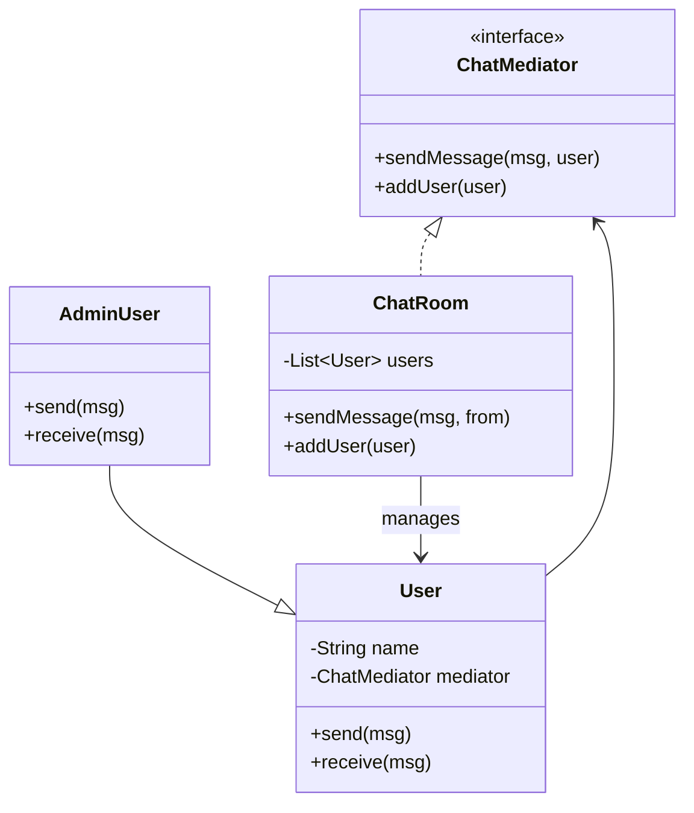
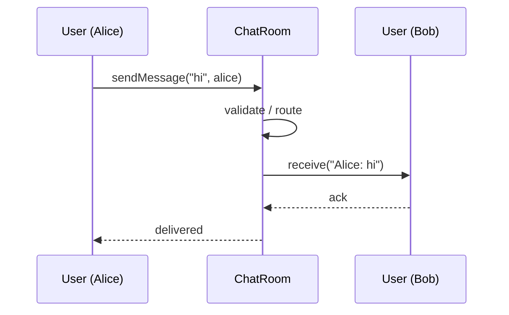

### Problem & Intent

The Mediator Pattern **centralizes communication between colleagues** (components that would otherwise reference each other directly). Instead of N×N peer connections, each colleague talks only to the mediator, which routes messages and enforces interaction rules. It tames UI dialog coordination, chat rooms, air-traffic control, and workflow orchestration where **many objects need to react to each other**.

---

### When to Use / When NOT to Use

| Situation | Use? | Why |
| :--- | :---: | :--- |
| Many objects interact in complex, many-to-many ways | Yes | Reduces coupling from N² to N |
| Interaction rules change often (who can message whom) | Yes | Update mediator, not every colleague |
| Colleagues should not know about each other | Yes | Mediator is the only hub |
| Simple one-to-one callback between two objects | No | Direct reference or [Observer](/design-patterns/observer-pattern/) |
| Mediator becomes a god object with all business logic | No | Split domains or use event bus with bounded contexts |
| Distributed system with no single process | No | Message broker replaces in-process mediator |
| Read-only fan-out from one publisher | No | Observer is lighter |

---

### Structure (Class Diagram)



---

### Interaction Flow



---

### Implementation




**Junior approach — peers reference each other:**

```java
public class User {
    private final List<User> contacts = new ArrayList<>();

    public void send(String msg, User target) {
        target.receive(name + ": " + msg); // N×N wiring
    }
}
```

**Mediator approach:**

```java
public interface ChatMediator {
    void addUser(User user);
    void sendMessage(String message, User from);
}

public final class ChatRoom implements ChatMediator {
    private final List<User> users = new ArrayList<>();

    @Override
    public void addUser(User user) {
        users.add(user);
    }

    @Override
    public void sendMessage(String message, User from) {
        for (User user : users) {
            if (user != from) {
                user.receive(from.getName() + ": " + message);
            }
        }
    }
}

public final class User {
    private final String name;
    private final ChatMediator mediator;

    public User(String name, ChatMediator mediator) {
        this.name = name;
        this.mediator = mediator;
        mediator.addUser(this);
    }

    public void send(String message) {
        mediator.sendMessage(message, this);
    }

    public void receive(String message) {
        // display or process
    }
}
```

**Spring:** `@Controller` + service layer often acts as mediator between repositories and UI — keep mediator thin.




```go
type ChatMediator interface {
    AddUser(u *User)
    SendMessage(msg string, from *User)
}

type ChatRoom struct {
    users []*User
}

func (r *ChatRoom) AddUser(u *User) {
    r.users = append(r.users, u)
}

func (r *ChatRoom) SendMessage(msg string, from *User) {
    for _, u := range r.users {
        if u != from {
            u.Receive(from.Name + ": " + msg)
        }
    }
}

type User struct {
    Name     string
    mediator ChatMediator
    onRecv   func(string)
}

func NewUser(name string, m ChatMediator, onRecv func(string)) *User {
    u := &User{Name: name, mediator: m, onRecv: onRecv}
    m.AddUser(u)
    return u
}

func (u *User) Send(msg string) { u.mediator.SendMessage(msg, u) }
func (u *User) Receive(msg string) {
    if u.onRecv != nil {
        u.onRecv(msg)
    }
}
```

Go mediators are **interfaces + registries**; avoid cyclic imports by keeping colleague types in the same package as the mediator.




---

### Trade-offs & Operational Realities

| Concern | Impact |
| :--- | :--- |
| **Testability** | Mock mediator in colleague tests; test routing rules in mediator tests |
| **Complexity** | Mediator can become a god class — extract sub-mediators per concern |
| **Framework fit** | Spring MVC front controller; message buses for cross-service mediation |
| **Scalability** | In-process mediator does not scale horizontally — event bus for distribution |

---

### Junior Mistakes

- Mediator that contains all business logic while colleagues are anemic shells
- Colleagues still holding direct references to peers "for convenience"
- Using Mediator for simple pub/sub when Observer suffices
- No interface on mediator — concrete `ChatRoom` wired everywhere
- Synchronous mediator blocking slow colleagues on broadcast

---

### Senior Questions

1. Mediator vs Observer — when is centralized routing worth the hub risk?
2. How do you prevent the mediator from becoming the only class anyone edits?
3. Would an event bus (Kafka) replace an in-process mediator at what scale?
4. How does Mediator relate to [Facade](/design-patterns/facade-pattern/) — similar or opposite?
5. UI form with 10 interdependent fields — mediator or reactive bindings?

---

### Revision Cheat Sheet

- **One line:** Colleagues talk through a central mediator, not to each other.
- **Trigger smell:** Web of bidirectional references between UI widgets or domain objects.
- **Pairs with:** [Observer Pattern](/design-patterns/observer-pattern/), [Facade Pattern](/design-patterns/facade-pattern/)
- **Avoid when:** Two-party communication or simple one-to-many notification.
- **Go tip:** Interface + registry; keep colleague packages free of peer imports.

---

### See Also

- [Observer Pattern](/design-patterns/observer-pattern/)
- [Facade Pattern](/design-patterns/facade-pattern/)
- [Notification Service LLD](/design-patterns/notification-service-lld/)
- [Single Responsibility Principle](/design-patterns/single-responsibility-principle/)
