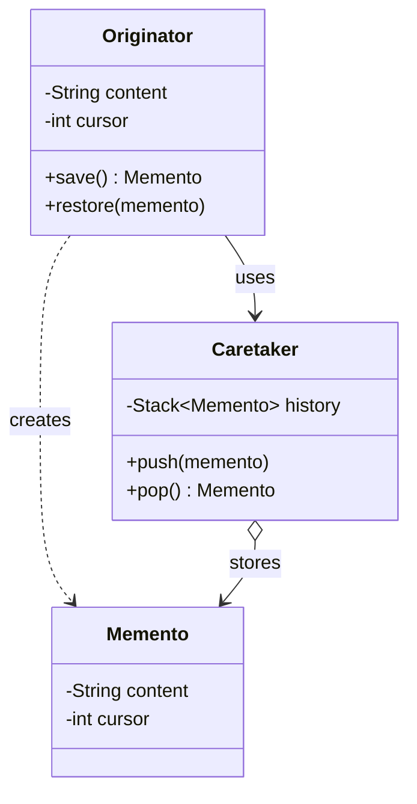
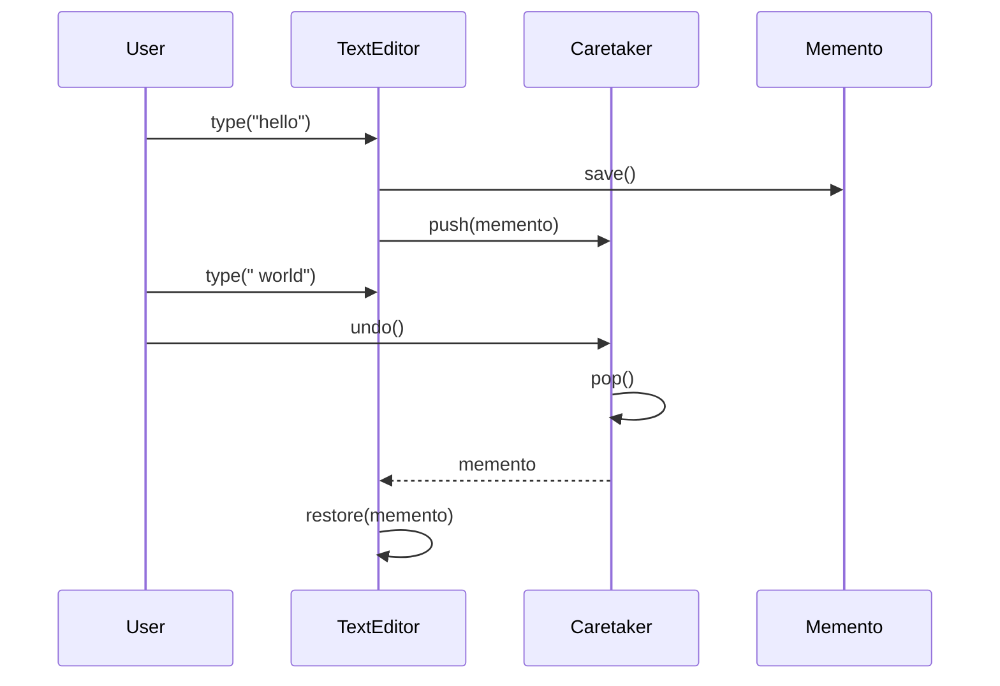

### Problem & Intent

The Memento Pattern **captures and externalizes an object's internal state** so it can be restored later, without violating encapsulation. The originator creates a memento; the caretaker stores it but cannot inspect or mutate internals. It powers undo stacks, checkpoints, game saves, and draft recovery — pairing naturally with [Command](/design-patterns/command-pattern/) when undo needs full state snapshots.

---

### When to Use / When NOT to Use

| Situation | Use? | Why |
| :--- | :---: | :--- |
| Undo/redo or rollback to prior snapshots | Yes | Restore originator from stored memento |
| State must stay encapsulated — caretaker cannot edit internals | Yes | Memento is opaque to caretaker |
| Checkpointing long-running workflows | Yes | Save at milestones; resume after failure |
| Inverse operations are cheap and well-defined | No | [Command](/design-patterns/command-pattern/) `undo()` is lighter |
| State is huge (full DB dump per keystroke) | No | Structural sharing, event sourcing, or delta snapshots |
| Serialization to JSON already exposes all fields | No | Plain serialize/deserialize may suffice |
| Multi-user concurrent editing | No | CRDT or operational transform, not local memento stack |

---

### Structure (Class Diagram)



---

### Interaction Flow



---

### Implementation




**Junior approach — expose mutable state:**

```java
public class Editor {
    public String content; // caretaker can corrupt state
    public int cursor;
}
```

**Memento approach:**

```java
public final class TextEditor {
    private String content = "";
    private int cursor;

    public Memento save() {
        return new Memento(content, cursor);
    }

    public void restore(Memento memento) {
        this.content = memento.getContent();
        this.cursor = memento.getCursor();
    }

    public static final class Memento {
        private final String content;
        private final int cursor;

        private Memento(String content, int cursor) {
            this.content = content;
            this.cursor = cursor;
        }

        // package-private or nested — only Originator reads fields
        String getContent() { return content; }
        int getCursor() { return cursor; }
    }
}

public final class Caretaker {
    private final Deque<TextEditor.Memento> undoStack = new ArrayDeque<>();

    public void saveCheckpoint(TextEditor editor) {
        undoStack.push(editor.save());
    }

    public void undo(TextEditor editor) {
        if (!undoStack.isEmpty()) {
            editor.restore(undoStack.pop());
        }
    }
}
```

Nested `Memento` class keeps snapshot access package-private. For deep object graphs, memento holds immutable copies or persistent data structures.




```go
type EditorMemento struct {
    content string
    cursor  int
}

type TextEditor struct {
    content string
    cursor  int
}

func (e *TextEditor) Save() EditorMemento {
    return EditorMemento{content: e.content, cursor: e.cursor}
}

func (e *TextEditor) Restore(m EditorMemento) {
    e.content = m.content
    e.cursor = m.cursor
}

type Caretaker struct {
    stack []EditorMemento
}

func (c *Caretaker) Push(m EditorMemento) {
    c.stack = append(c.stack, m)
}

func (c *Caretaker) Undo(editor *TextEditor) bool {
    if len(c.stack) == 0 {
        return false
    }
    m := c.stack[len(c.stack)-1]
    c.stack = c.stack[:len(c.stack)-1]
    editor.Restore(m)
    return true
}
```

Lowercase fields on `EditorMemento` (same package) enforce encapsulation. Cross-package opacity: export `Save`/`Restore` only on editor, keep memento type unexported.




---

### Trade-offs & Operational Realities

| Concern | Impact |
| :--- | :--- |
| **Testability** | Originator restore round-trip tested; caretaker stack depth tested |
| **Complexity** | Deep copies vs shallow references — shared mutable subgraphs break undo |
| **Framework fit** | Rare in Spring; common in editors, games, and desktop apps |
| **Memory** | Unbounded undo stacks need max depth or incremental mementos |

---

### Junior Mistakes

- Public memento fields — caretaker mutates snapshot directly
- Shallow copy when nested objects are mutable
- Storing mementos without limiting stack size on large documents
- Memento for every keystroke on megabyte documents without delta compression
- Confusing Memento with DTO — memento is opaque and lifecycle-bound

---

### Senior Questions

1. Memento vs Command undo — when is snapshot cheaper than inverse operation?
2. How do you memento a graph with shared nodes (deep vs persistent structures)?
3. Serializable memento for crash recovery — versioning and migration?
4. Event sourcing as "unbounded memento chain" — trade-offs?
5. How do you enforce caretaker cannot read memento internals across packages?

---

### Revision Cheat Sheet

- **One line:** Originator snapshots state into opaque memento; caretaker stores and restores.
- **Trigger smell:** Undo requires exposing private fields or full object serialization.
- **Pairs with:** [Command Pattern](/design-patterns/command-pattern/), [Prototype Pattern](/design-patterns/prototype-pattern/)
- **Avoid when:** Cheap inverse commands or state is too large for snapshots.
- **Go tip:** Unexported memento struct + exported Save/Restore methods preserve encapsulation.

---

### See Also

- [Command Pattern](/design-patterns/command-pattern/)
- [Prototype Pattern](/design-patterns/prototype-pattern/)
- [State Pattern](/design-patterns/state-pattern/)
- [Single Responsibility Principle](/design-patterns/single-responsibility-principle/)
