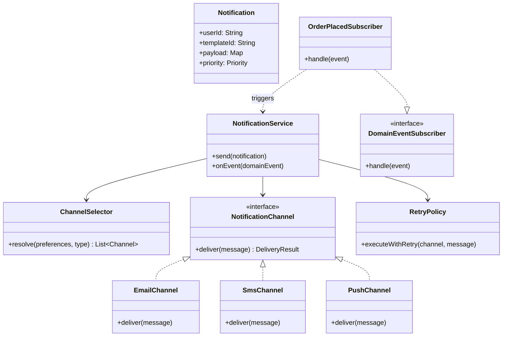
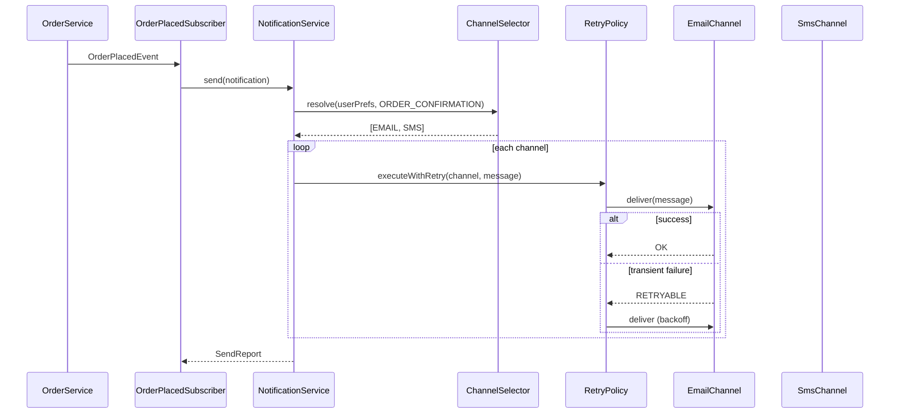

### Problem & Intent

A notification service delivers messages to users across **multiple channels** (email, SMS, push) with different providers, failure modes, and retry policies. The dominant design forces are (1) **channel-specific delivery logic** swappable at runtime ([Strategy](/design-patterns/strategy-pattern/)), and (2) **decoupled dispatch** so order/payment domains publish events without knowing SMTP from FCM ([Observer](/design-patterns/observer-pattern/) or event bus). A thin orchestrator composes template rendering, channel selection, and retry — each with a single reason to change ([SRP](/design-patterns/single-responsibility-principle/)).

---

### When to Use / When NOT to Use

| Situation | Use? | Why |
| :--- | :---: | :--- |
| New channels added regularly (WhatsApp, in-app, webhook) | Yes | Register new `NotificationChannel` without editing callers |
| Multiple domains trigger the same notification pipeline | Yes | Observer/event subscriber isolates producers from delivery |
| Per-channel retry and idempotency differ | Yes | Channel strategy owns provider-specific behavior |
| One channel, one template, synchronous send | No | Direct adapter call from the caller is simpler |
| Guaranteed exactly-once delivery across outages | No | Needs outbox + message broker — LLD is in-process orchestration |
| Heavy workflow (approvals, scheduling, A/B splits) | No | Use a workflow engine or dedicated campaign service |

---

### Structure (Class Diagram)



---

### Interaction Flow



---

### Implementation




**Junior approach — switch on channel in every caller:**

```java
public void notifyUser(User u, String msg, String channel) {
    switch (channel) {
        case "EMAIL" -> smtpClient.send(u.getEmail(), msg);
        case "SMS" -> twilio.send(u.getPhone(), msg);
        case "PUSH" -> fcm.send(u.getDeviceToken(), msg);
    }
}
```

**Strategy + Observer-style subscriber:**

```java
public interface NotificationChannel {
    DeliveryResult deliver(RenderedMessage message);
}

public final class EmailChannel implements NotificationChannel {
  private final SmtpClient smtp;

  @Override
  public DeliveryResult deliver(RenderedMessage msg) {
    try {
      smtp.send(msg.to(), msg.subject(), msg.body());
      return DeliveryResult.success();
    } catch (TransientException e) {
      return DeliveryResult.retryable(e);
    }
  }
}

public final class RetryPolicy {
  public DeliveryResult executeWithRetry(NotificationChannel channel,
                                         RenderedMessage msg) {
    int attempt = 0;
    while (attempt < 3) {
      DeliveryResult result = channel.deliver(msg);
      if (result.isSuccess() || !result.isRetryable()) return result;
      backoff(attempt++);
    }
    return DeliveryResult.failed("max retries");
  }
}

public final class NotificationService {
  private final ChannelSelector selector;
  private final RetryPolicy retryPolicy;
  private final Map<ChannelType, NotificationChannel> channels;

  public SendReport send(Notification n) {
    List<ChannelType> selected = selector.resolve(n.getUserId(), n.getType());
    SendReport report = new SendReport();
    for (ChannelType type : selected) {
      RenderedMessage msg = render(n, type);
      DeliveryResult r = retryPolicy.executeWithRetry(channels.get(type), msg);
      report.record(type, r);
    }
    return report;
  }
}

// Observer boundary — domain does not import SMTP
public final class OrderPlacedSubscriber {
  private final NotificationService notifications;

  public void handle(OrderPlacedEvent event) {
    notifications.send(Notification.orderConfirmation(event));
  }
}
```




**Junior approach:**

```go
func NotifyUser(u User, msg, channel string) error {
    switch channel {
    case "EMAIL":
        return smtp.Send(u.Email, msg)
    case "SMS":
        return twilio.Send(u.Phone, msg)
    default:
        return fmt.Errorf("unknown channel")
    }
}
```

**Strategy + event subscriber:**

```go
type RenderedMessage struct {
    To, Subject, Body string
}

type DeliveryResult struct {
    OK        bool
    Retryable bool
    Err       error
}

type NotificationChannel interface {
    Deliver(msg RenderedMessage) DeliveryResult
}

type EmailChannel struct{ SMTP SmtpClient }

func (e EmailChannel) Deliver(msg RenderedMessage) DeliveryResult {
    if err := e.SMTP.Send(msg.To, msg.Subject, msg.Body); err != nil {
        if isTransient(err) {
            return DeliveryResult{Retryable: true, Err: err}
        }
        return DeliveryResult{Err: err}
    }
    return DeliveryResult{OK: true}
}

type RetryPolicy struct {
    MaxAttempts int
}

func (r RetryPolicy) Execute(ch NotificationChannel, msg RenderedMessage) DeliveryResult {
    for attempt := 0; attempt < r.MaxAttempts; attempt++ {
        res := ch.Deliver(msg)
        if res.OK || !res.Retryable {
            return res
        }
        time.Sleep(time.Duration(attempt+1) * 100 * time.Millisecond)
    }
    return DeliveryResult{Err: errors.New("max retries")}
}

type NotificationService struct {
    Selector ChannelSelector
    Retry    RetryPolicy
    Channels map[ChannelType]NotificationChannel
}

func (s *NotificationService) Send(n Notification) SendReport {
    report := SendReport{}
    for _, chType := range s.Selector.Resolve(n.UserID, n.Type) {
        msg := render(n, chType)
        result := s.Retry.Execute(s.Channels[chType], msg)
        report.Record(chType, result)
    }
    return report
}

type OrderPlacedSubscriber struct {
    Notifications *NotificationService
}

func (s *OrderPlacedSubscriber) Handle(e OrderPlacedEvent) {
    _ = s.Notifications.Send(NewOrderConfirmation(e))
}
```




---

### Trade-offs & Operational Realities

| Concern | Impact |
| :--- | :--- |
| **Testability** | Fake channels capture deliveries; subscriber tests assert event → notification mapping only |
| **Complexity** | Channel registry + retry adds wiring — justified beyond two channels |
| **Framework fit** | Spring: `@EventListener` on subscribers; `@Bean` per channel. Go: explicit subscriber registration |
| **Concurrency** | Async send via executor or goroutine per channel — caller returns fast; track in-flight with context |
| **Scaling** | High volume needs queue (Kafka/SQS) between event and delivery; in-memory LLD becomes the consumer worker |

---

### Junior Mistakes

- Hardcoding channel `switch` in every domain service instead of a shared notification API
- Treating all failures as retryable — burns provider quotas and delays dead-letter routing
- No idempotency key — duplicate `OrderPlacedEvent` sends double emails
- Synchronous SMTP in the HTTP request thread — timeouts cascade to users
- Observer that pulls DB and renders templates — subscriber should stay thin

---

### Senior Questions

1. How do you add **WhatsApp** without changing `OrderPlacedSubscriber`?
2. Observer vs Mediator — where does channel selection belong?
3. How would you guarantee **at-least-once** delivery with an outbox table?
4. Strategy vs Chain of Responsibility for trying SMS then email fallback?
5. How do you test retry backoff without slowing the suite?

---

### Revision Cheat Sheet

- **One line:** Events trigger orchestrated multi-channel delivery via pluggable channel strategies.
- **Trigger smell:** `switch(channel)` duplicated across order, billing, and auth services.
- **Pairs with:** [Strategy Pattern](/design-patterns/strategy-pattern/), [Observer Pattern](/design-patterns/observer-pattern/), [SRP](/design-patterns/single-responsibility-principle/)
- **Avoid when:** Single channel, no event producers, no retry variance.
- **Interview tip:** Mention 429 from providers and idempotency keys unprompted.

---

### See Also

- [Strategy Pattern](/design-patterns/strategy-pattern/)
- [Observer Pattern](/design-patterns/observer-pattern/)
- [Command Pattern](/design-patterns/command-pattern/)
- [In-Memory Rate Limiter LLD](/design-patterns/in-memory-rate-limiter-lld/)
