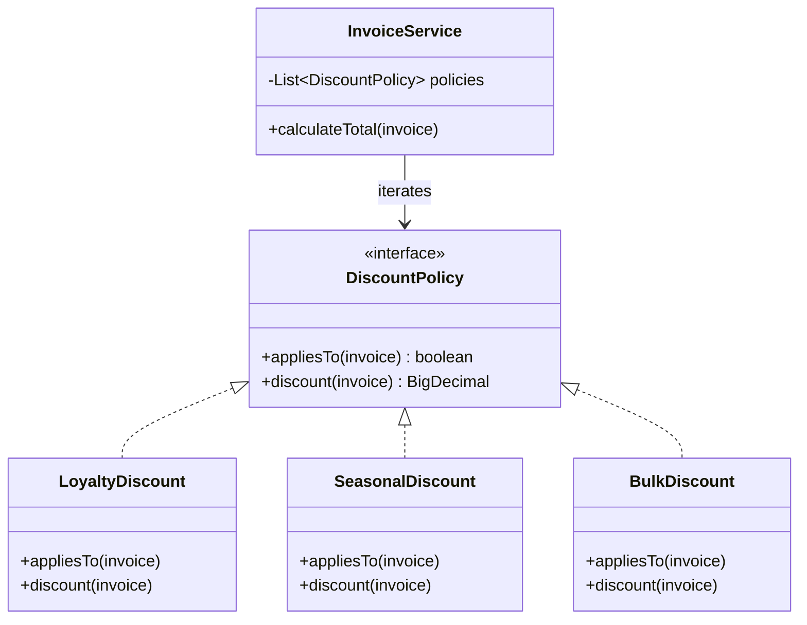
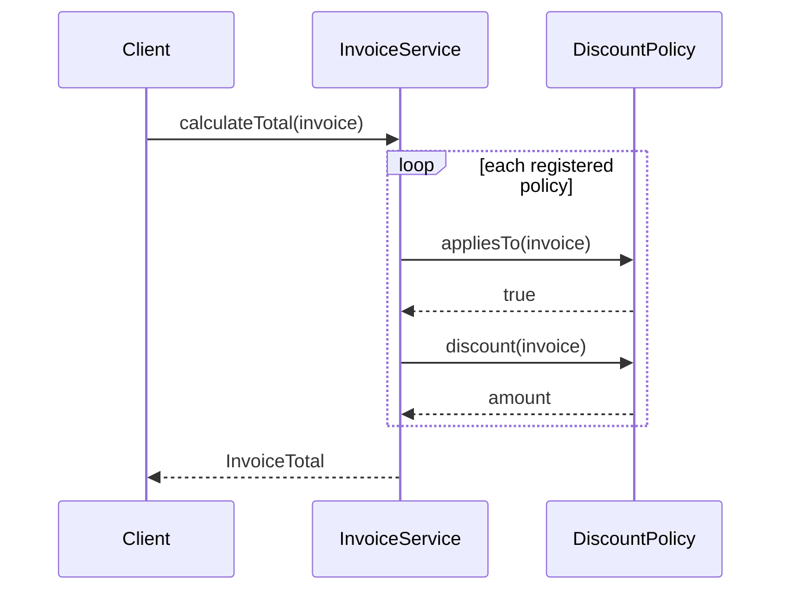

### Problem & Intent

The Open-Closed Principle (OCP) states that software entities should be **open for extension but closed for modification**. When every new discount rule or export format requires editing a central `switch` block, you risk regressions in stable code. OCP pushes new behavior into new types — strategies, plugins, or decorators — so the core orchestrator stays untouched.

---

### When to Use / When NOT to Use

| Situation | Use? | Why |
| :--- | :---: | :--- |
| New variants arrive frequently (pricing tiers, tax rules, file formats) | Yes | Add a new implementation class instead of editing the dispatcher |
| Multiple teams extend the same extension point independently | Yes | Core module stays stable; teams ship plugins in isolation |
| You need regression safety on a mature, heavily tested core | Yes | Changes are additive — existing tests on core logic still pass |
| Only two fixed behaviors that never change | No | A simple branch or parameter is cheaper than a plugin hierarchy |
| Extension points are speculative with zero known variants | No | YAGNI — wait for the second real variant before abstracting |
| Every extension needs to change shared mutable state in the core | No | OCP assumes stable contracts; redesign boundaries first |

---

### Structure (Class Diagram)



---

### Interaction Flow



---

### Implementation




**Violation — edit core logic for every new rule:**

```java
public BigDecimal calculateTotal(Invoice invoice, String promoCode) {
    BigDecimal total = invoice.subtotal();
    if ("LOYALTY".equals(promoCode)) {
        total = total.multiply(new BigDecimal("0.90"));
    } else if ("SUMMER".equals(promoCode)) {
        total = total.subtract(new BigDecimal("15"));
    } else if ("BULK".equals(promoCode) && invoice.lineCount() >= 10) {
        total = total.multiply(new BigDecimal("0.85"));
    }
    // every new promo = modify + retest this method
    return total;
}
```

**OCP-aligned — register new policies without touching the service:**

```java
public interface DiscountPolicy {
    boolean appliesTo(Invoice invoice);
    BigDecimal discount(Invoice invoice);
}

public final class LoyaltyDiscount implements DiscountPolicy {
    @Override
    public boolean appliesTo(Invoice invoice) {
        return invoice.customerTier() == Tier.GOLD;
    }

    @Override
    public BigDecimal discount(Invoice invoice) {
        return invoice.subtotal().multiply(new BigDecimal("0.10"));
    }
}

public final class InvoiceService {
    private final List<DiscountPolicy> policies;

    public InvoiceService(List<DiscountPolicy> policies) {
        this.policies = List.copyOf(policies);
    }

    public BigDecimal calculateTotal(Invoice invoice) {
        BigDecimal total = invoice.subtotal();
        for (DiscountPolicy policy : policies) {
            if (policy.appliesTo(invoice)) {
                total = total.subtract(policy.discount(invoice));
            }
        }
        return total.max(BigDecimal.ZERO);
    }
}
```

**Spring wiring:** register each `DiscountPolicy` as a bean; inject `List<DiscountPolicy>` into `InvoiceService` — new promos are new `@Component` classes.




**Violation:**

```go
func CalculateTotal(inv Invoice, promo string) float64 {
    total := inv.Subtotal
    switch promo {
    case "LOYALTY":
        total *= 0.90
    case "SUMMER":
        total -= 15
    case "BULK":
        if inv.LineCount >= 10 {
            total *= 0.85
        }
    }
    return total
}
```

**OCP-aligned:**

```go
type Invoice struct {
    Subtotal    float64
    LineCount   int
    CustomerTier string
}

type DiscountPolicy interface {
    AppliesTo(inv Invoice) bool
    Discount(inv Invoice) float64
}

type LoyaltyDiscount struct{}

func (LoyaltyDiscount) AppliesTo(inv Invoice) bool { return inv.CustomerTier == "GOLD" }
func (LoyaltyDiscount) Discount(inv Invoice) float64 { return inv.Subtotal * 0.10 }

type InvoiceService struct {
    policies []DiscountPolicy
}

func NewInvoiceService(policies ...DiscountPolicy) *InvoiceService {
    return &InvoiceService{policies: policies}
}

func (s *InvoiceService) CalculateTotal(inv Invoice) float64 {
    total := inv.Subtotal
    for _, p := range s.policies {
        if p.AppliesTo(inv) {
            total -= p.Discount(inv)
        }
    }
    if total < 0 {
        return 0
    }
    return total
}
```

Register policies at startup (`main` or wire) — adding `SeasonalDiscount` never edits `InvoiceService`.




---

### Trade-offs & Operational Realities

| Concern | Impact |
| :--- | :--- |
| **Testability** | Each policy unit-tested in isolation; `InvoiceService` tests use stub policies |
| **Complexity** | More types than a switch — pays off when rule count or change frequency grows |
| **Framework fit** | Spring auto-collects `List<DiscountPolicy>` beans; Go composes via constructor or `fx` modules |
| **Discovery** | Teams must know where to register extensions — document the plugin contract and ordering rules |

---

### Junior Mistakes

- Creating abstract factories and strategy hierarchies before a second variant exists
- Making the core class `abstract` "for OCP" when no extension point is needed
- Forgetting policy **ordering** when discounts stack — silent double-counting bugs
- Confusing OCP with "never change any file" — fixing bugs in core logic is still allowed

---

### Senior Questions

1. Where is the **extension point** — interface, event hook, or configuration schema?
2. How do you prevent two policies from applying conflicting discounts?
3. When does OCP overlap with [Strategy Pattern](/design-patterns/strategy-pattern/) — same mechanism, different intent?
4. How do feature flags interact with OCP — flag inside core vs flag selects implementation?
5. How do you version extension contracts when existing plugins must keep working?

---

### Revision Cheat Sheet

- **One line:** Extend behavior with new types, not edits to stable code.
- **Trigger smell:** "Add another `case` to the switch" for the third time this quarter.
- **Pairs with:** [Strategy Pattern](/design-patterns/strategy-pattern/), [Decorator Pattern](/design-patterns/decorator-pattern/)
- **Avoid when:** Only one behavior exists and the domain is stable.
- **Interview tip:** Name a real extension point (pricing, export, validation) and show the before/after switch.

---

### See Also

- [Single Responsibility Principle](/design-patterns/single-responsibility-principle/)
- [Strategy Pattern](/design-patterns/strategy-pattern/)
- [Decorator Pattern](/design-patterns/decorator-pattern/)
- [SOLID Composition Guide](/design-patterns/solid-principles-composition-guide/)
