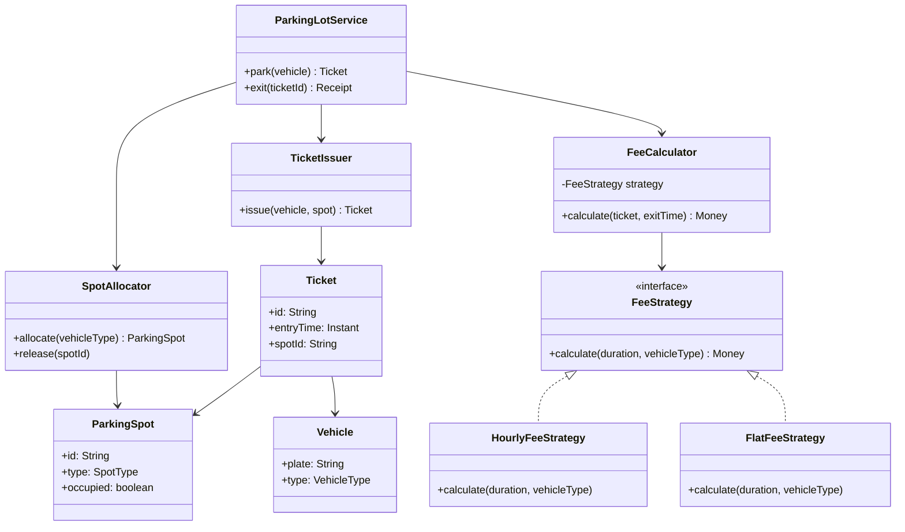
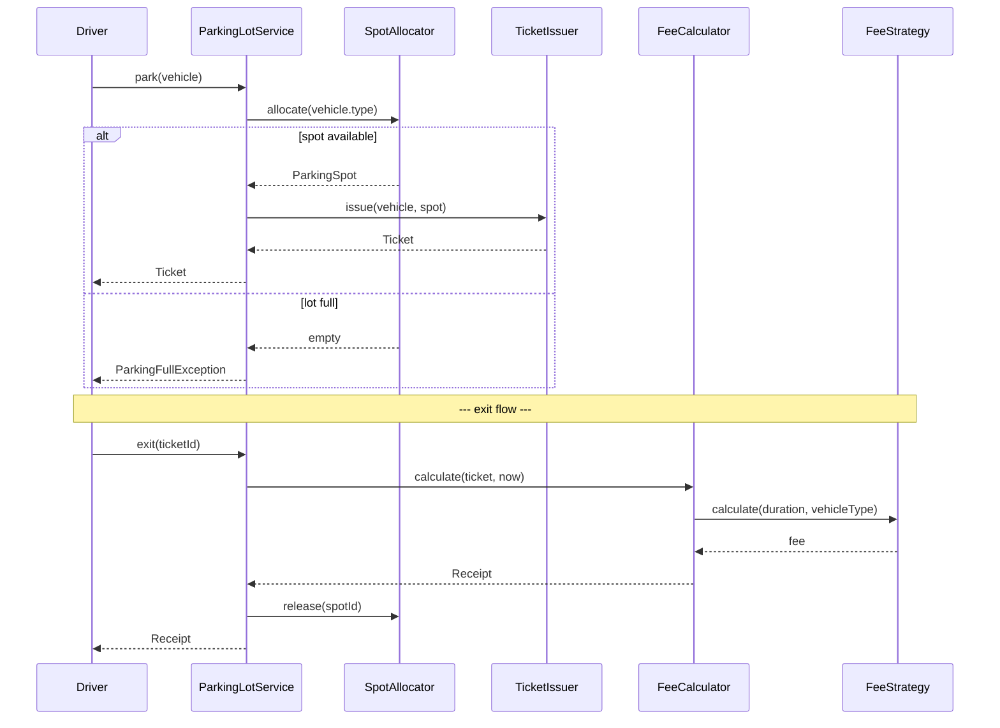

### Problem & Intent

A parking lot system must **allocate finite spots** to heterogeneous vehicles, issue trackable entry tickets, and compute exit fees — all under concurrent entry/exit load. The dominant design force is **separating spot allocation from pricing rules**: vehicle type determines eligible spots, while fee calculation varies by duration, day-of-week, or flat-rate policies. [Strategy](/design-patterns/strategy-pattern/) for pricing and clear entity boundaries ([SRP](/design-patterns/single-responsibility-principle/)) keep the model interview-ready and production-extensible.

---

### When to Use / When NOT to Use

| Situation | Use? | Why |
| :--- | :---: | :--- |
| Multiple vehicle types with different spot constraints (compact, large, handicapped) | Yes | Spot selection and pricing are independent axes |
| Pricing rules change per lot, tenant, or promotion | Yes | Swap `FeeStrategy` without touching allocation logic |
| High concurrency at entry gates (many threads/processes) | Yes | Explicit spot locking and idempotent ticket issuance matter |
| Single fixed-price lot with one vehicle type | No | A `Map<SpotId, Boolean>` plus one fee function is enough |
| Distributed multi-site fleet needing global occupancy | No | Needs external store (Redis/DB) — in-memory LLD is a building block, not the full system |
| Real-time dynamic pricing from ML models | No | Strategy interface still works, but pricing belongs in a dedicated pricing service |

---

### Structure (Class Diagram)



---

### Interaction Flow



---

### Implementation




**Junior approach — god class with inline pricing:**

```java
public class ParkingLot {
    private List<Boolean> spots = new ArrayList<>();

    public String park(String plate, String type) {
        for (int i = 0; i < spots.size(); i++) {
            if (!spots.get(i)) {
                spots.set(i, true);
                // pricing mixed with allocation
                return plate + "-" + i + "-fee=" + (type.equals("TRUCK") ? 20 : 5);
            }
        }
        throw new RuntimeException("full");
    }
}
```

**SRP + Strategy — allocation, ticketing, and fees separated:**

```java
public enum VehicleType { COMPACT, LARGE, MOTORCYCLE }
public enum SpotType { COMPACT, LARGE, HANDICAPPED }

public interface FeeStrategy {
    BigDecimal calculate(Duration parked, VehicleType type);
}

public final class HourlyFeeStrategy implements FeeStrategy {
    private final Map<VehicleType, BigDecimal> ratePerHour;

    public HourlyFeeStrategy(Map<VehicleType, BigDecimal> ratePerHour) {
        this.ratePerHour = ratePerHour;
    }

    @Override
    public BigDecimal calculate(Duration parked, VehicleType type) {
        long hours = Math.max(1, parked.toHours());
        return ratePerHour.get(type).multiply(BigDecimal.valueOf(hours));
    }
}

public final class SpotAllocator {
    private final Map<String, ParkingSpot> spots = new ConcurrentHashMap<>();

    public Optional<ParkingSpot> allocate(VehicleType vehicleType) {
        return spots.values().stream()
            .filter(s -> !s.isOccupied() && s.fits(vehicleType))
            .findFirst()
            .map(spot -> {
                synchronized (spot) {
                    if (spot.isOccupied()) return null;
                    spot.setOccupied(true);
                    return spot;
                }
            });
    }

    public void release(String spotId) {
        ParkingSpot spot = spots.get(spotId);
        if (spot != null) {
            synchronized (spot) { spot.setOccupied(false); }
        }
    }
}

public final class ParkingLotService {
    private final SpotAllocator allocator;
    private final TicketIssuer ticketIssuer;
    private final FeeCalculator feeCalculator;
    private final Map<String, Ticket> activeTickets = new ConcurrentHashMap<>();

    public Ticket park(Vehicle vehicle) {
        ParkingSpot spot = allocator.allocate(vehicle.getType())
            .orElseThrow(() -> new ParkingFullException("no spot"));
        Ticket ticket = ticketIssuer.issue(vehicle, spot);
        activeTickets.put(ticket.getId(), ticket);
        return ticket;
    }

    public Receipt exit(String ticketId) {
        Ticket ticket = activeTickets.remove(ticketId);
        if (ticket == null) throw new TicketNotFoundException(ticketId);
        BigDecimal fee = feeCalculator.calculate(ticket, Instant.now());
        allocator.release(ticket.getSpotId());
        return new Receipt(ticketId, fee);
    }
}
```

**Concurrency note:** synchronize per `ParkingSpot`, not the entire lot — reduces contention while preventing double-booking.




**Junior approach:**

```go
type ParkingLot struct {
    spots []bool
}

func (p *ParkingLot) Park(plate, vType string) (string, error) {
    for i, taken := range p.spots {
        if !taken {
            p.spots[i] = true
            fee := 5
            if vType == "TRUCK" { fee = 20 }
            return fmt.Sprintf("%s-%d-%d", plate, i, fee), nil
        }
    }
    return "", errors.New("full")
}
```

**SRP + Strategy:**

```go
type VehicleType string
type SpotType string

const (
    CompactVehicle VehicleType = "COMPACT"
    LargeVehicle   VehicleType = "LARGE"
)

type FeeStrategy interface {
    Calculate(parked time.Duration, vType VehicleType) float64
}

type HourlyFee struct {
    Rates map[VehicleType]float64
}

func (h HourlyFee) Calculate(parked time.Duration, vType VehicleType) float64 {
    hours := math.Max(1, math.Ceil(parked.Hours()))
    return h.Rates[vType] * hours
}

type ParkingSpot struct {
    mu       sync.Mutex
    ID       string
    Type     SpotType
    Occupied bool
}

func (s *ParkingSpot) TryOccupy() bool {
    s.mu.Lock()
    defer s.mu.Unlock()
    if s.Occupied { return false }
    s.Occupied = true
    return true
}

type SpotAllocator struct {
    spots []*ParkingSpot
}

func (a *SpotAllocator) Allocate(vType VehicleType) (*ParkingSpot, error) {
    for _, spot := range a.spots {
        if spot.fits(vType) && spot.TryOccupy() {
            return spot, nil
        }
    }
    return nil, errors.New("parking full")
}

type ParkingLotService struct {
    allocator     *SpotAllocator
    feeStrategy   FeeStrategy
    activeTickets sync.Map // ticketID -> Ticket
}

func (s *ParkingLotService) Park(v Vehicle) (Ticket, error) {
    spot, err := s.allocator.Allocate(v.Type)
    if err != nil { return Ticket{}, err }
    ticket := NewTicket(v, spot.ID)
    s.activeTickets.Store(ticket.ID, ticket)
    return ticket, nil
}

func (s *ParkingLotService) Exit(ticketID string) (Receipt, error) {
    raw, ok := s.activeTickets.LoadAndDelete(ticketID)
    if !ok { return Receipt{}, fmt.Errorf("ticket not found: %s", ticketID) }
    ticket := raw.(Ticket)
    fee := s.feeStrategy.Calculate(time.Since(ticket.EntryTime), ticket.Vehicle.Type)
    s.allocator.Release(ticket.SpotID)
    return Receipt{TicketID: ticketID, Fee: fee}, nil
}
```




---

### Trade-offs & Operational Realities

| Concern | Impact |
| :--- | :--- |
| **Testability** | `FeeStrategy`, `SpotAllocator`, and `ParkingLotService` test in isolation; stub strategies for fee edge cases |
| **Complexity** | More types than a monolith class — pays off when pricing rules or spot types grow |
| **Framework fit** | Spring: inject `FeeStrategy` bean per lot; Go: constructor wiring or registry keyed by lot ID |
| **Concurrency** | Per-spot locks scale better than global lot mutex; still vulnerable to lost updates without atomic `compare-and-set` on distributed stores |
| **Scaling** | In-memory model is single-node; multi-gate lots need Redis/DB with transactional spot claims and idempotent ticket IDs |

---

### Junior Mistakes

- Storing fee logic inside `park()` instead of a swappable strategy — every promo requires editing core flow
- Using one global `synchronized` on the entire lot — creates unnecessary gate bottlenecks
- Modeling spots as `boolean[]` without vehicle-type compatibility (assigning a truck to a compact spot)
- Forgetting to release spots on failed exit or duplicate `exit()` calls — use idempotent ticket lookup + `remove`
- Returning raw strings as tickets instead of structured `Ticket` with entry time and spot reference

---

### Senior Questions

1. How would you add **weekend surge pricing** without modifying `ParkingLotService`?
2. Two cars arrive simultaneously for the last spot — walk through your locking or CAS approach.
3. How does this design differ from **Factory Method** when creating tickets vs selecting fee strategies?
4. What breaks when you shard the lot across microservices — where does the transaction boundary live?
5. How do you test concurrent `park()` calls deterministically?

---

### Revision Cheat Sheet

- **One line:** Allocate spots, issue tickets, delegate fees to interchangeable strategies.
- **Trigger smell:** `if (isWeekend) fee *= 1.5` inside spot allocation code.
- **Pairs with:** [Strategy](/design-patterns/strategy-pattern/), [SRP](/design-patterns/single-responsibility-principle/), [Factory Method](/design-patterns/factory-method-pattern/)
- **Avoid when:** Single spot type, fixed price, no concurrency requirements.
- **Interview tip:** Draw entry + exit sequence diagrams before writing code.

---

### See Also

- [Strategy Pattern](/design-patterns/strategy-pattern/)
- [Single Responsibility Principle](/design-patterns/single-responsibility-principle/)
- [Factory Method vs Abstract Factory vs Builder](/design-patterns/factory-method-vs-abstract-factory-vs-builder/)
- [Elevator Control System LLD](/design-patterns/elevator-control-system-lld/)
