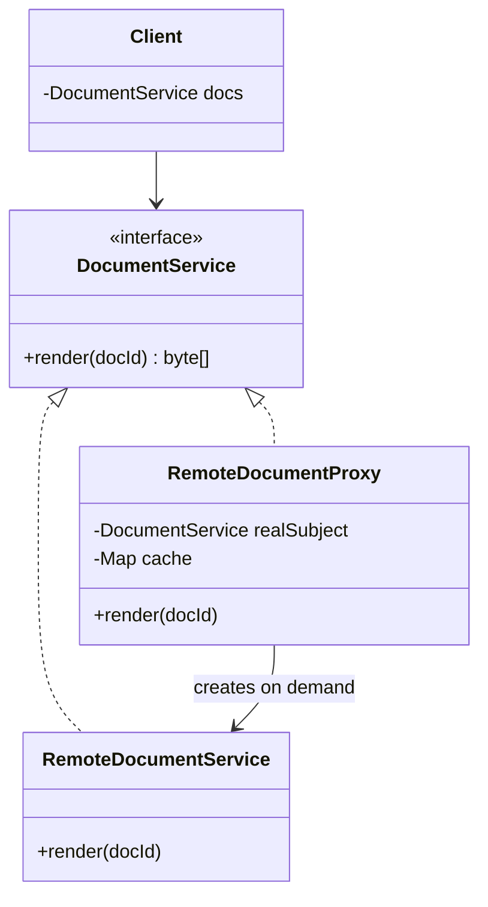
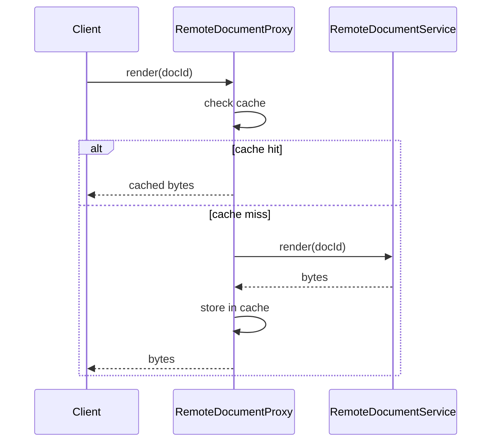

### Problem & Intent

The Proxy Pattern provides a **surrogate or placeholder** that controls access to another object. The proxy implements the same interface as the real subject and intercepts calls to add lazy initialization, caching, access control, logging, or remote delegation. The dominant force is **managing cost or risk of reaching the real object** — expensive construction, network hops, or privileged operations.

---

### When to Use / When NOT to Use

| Situation | Use? | Why |
| :--- | :---: | :--- |
| Lazy-load heavy objects (images, DB connections, large reports) | Yes | Proxy defers creation until first real use |
| Cache results of expensive remote or DB calls | Yes | Transparent memoization behind same interface |
| Enforce security or rate limits before delegating | Yes | Single gatekeeper with uniform interface |
| Stack optional cross-cutting features in any order | No | Prefer [Decorator](/design-patterns/decorator-pattern/) |
| Translate incompatible third-party interfaces | No | Prefer [Adapter](/design-patterns/adapter-pattern/) |
| Simple pass-through with no interception logic | No | Inject the real subject directly |

---

### Structure (Class Diagram)



---

### Interaction Flow



---

### Implementation




**Direct remote calls — no control layer:**

```java
public byte[] viewDocument(String docId) {
    // Every call hits the network; no cache or auth check
    return remoteClient.fetchDocument(docId);
}
```

**Caching proxy:**

```java
public interface DocumentService {
    byte[] render(String docId);
}

public final class RemoteDocumentService implements DocumentService {
    private final RemoteClient client;
    @Override
    public byte[] render(String docId) {
        return client.fetchDocument(docId);
    }
}

public final class CachingDocumentProxy implements DocumentService {
    private final Supplier<DocumentService> realSubjectFactory;
    private final Map<String, byte[]> cache = new ConcurrentHashMap<>();
    private volatile DocumentService realSubject;

    public CachingDocumentProxy(Supplier<DocumentService> factory) {
        this.realSubjectFactory = factory;
    }

    private DocumentService realSubject() {
        if (realSubject == null) {
            synchronized (this) {
                if (realSubject == null) {
                    realSubject = realSubjectFactory.get();
                }
            }
        }
        return realSubject;
    }

    @Override
    public byte[] render(String docId) {
        return cache.computeIfAbsent(docId, id -> realSubject().render(id));
    }
}
```

**Spring note:** `@Cacheable` on the real bean is often enough; explicit proxy types help when cache policy differs per caller or for interview clarity.




**Direct calls:**

```go
func ViewDocument(docID string) ([]byte, error) {
    return remoteClient.FetchDocument(docID) // always remote
}
```

**Caching proxy:**

```go
type DocumentService interface {
    Render(ctx context.Context, docID string) ([]byte, error)
}

type RemoteDocumentService struct {
    Client RemoteClient
}

func (s *RemoteDocumentService) Render(ctx context.Context, docID string) ([]byte, error) {
    return s.Client.FetchDocument(ctx, docID)
}

type CachingDocumentProxy struct {
    Real    DocumentService
    mu      sync.RWMutex
    cache   map[string][]byte
}

func NewCachingProxy(real DocumentService) *CachingDocumentProxy {
    return &CachingDocumentProxy{Real: real, cache: make(map[string][]byte)}
}

func (p *CachingDocumentProxy) Render(ctx context.Context, docID string) ([]byte, error) {
    p.mu.RLock()
    if b, ok := p.cache[docID]; ok {
        p.mu.RUnlock()
        return b, nil
    }
    p.mu.RUnlock()

    b, err := p.Real.Render(ctx, docID)
    if err != nil {
        return nil, err
    }
    p.mu.Lock()
    p.cache[docID] = b
    p.mu.Unlock()
    return b, nil
}
```

For lazy init, hold `sync.Once` around real subject construction — same interface, deferred allocation.




---

### Trade-offs & Operational Realities

| Concern | Impact |
| :--- | :--- |
| **Testability** | Unit-test proxy with a fake real subject; verify cache hits and lazy init |
| **Complexity** | Extra indirection; Spring AOP and Go middleware often replace hand-rolled proxies |
| **Framework fit** | Spring: JDK/cglib proxies for `@Transactional`, `@Cacheable`; Go: wrapper structs or `http.RoundTripper` |
| **Stale cache** | Proxy owns invalidation policy — TTL, event-driven eviction |
| **Remote failure** | Virtual proxy + circuit breaker — see microservices resilience patterns |

---

### Junior Mistakes

- Using Proxy to add **stackable** features (logging + metrics + retry) — that is Decorator territory
- Proxy that exposes different methods than the real subject (breaks Liskov)
- Caching mutable objects without defensive copies
- Confusing Proxy with Adapter — proxy **same** interface and controls access; adapter **changes** interface

---

### Senior Questions

1. How do you add TTL eviction to the caching proxy without changing clients?
2. Proxy vs Decorator vs Facade — classify an API gateway forwarding to a backend service.
3. When does Spring's `@Transactional` JDK proxy differ from the Proxy pattern intent?
4. How do you test lazy initialization without slowing every test?
5. Virtual proxy vs protection proxy vs remote proxy — which fits file upload virus scanning?

---

### Revision Cheat Sheet

- **One line:** Same interface as the real object; controls when and how delegation happens.
- **Trigger smell:** Expensive resource created eagerly; repeated identical remote fetches.
- **Pairs with:** [Decorator](/design-patterns/decorator-pattern/), [Flyweight](/design-patterns/flyweight-pattern/), [Decorator vs Proxy vs Bridge](/design-patterns/decorator-vs-proxy-vs-bridge/)
- **Avoid when:** No interception needed or behavior is composable enhancement, not access control.
- **Interview tip:** Proxy manages **one** subject's lifecycle/access; decorator stacks **features**.

---

### See Also

- [Decorator vs Proxy vs Bridge](/design-patterns/decorator-vs-proxy-vs-bridge/)
- [Decorator Pattern](/design-patterns/decorator-pattern/)
- [Flyweight Pattern](/design-patterns/flyweight-pattern/)
- [In-Memory Rate Limiter LLD](/design-patterns/in-memory-rate-limiter-lld/) — access control proxy
