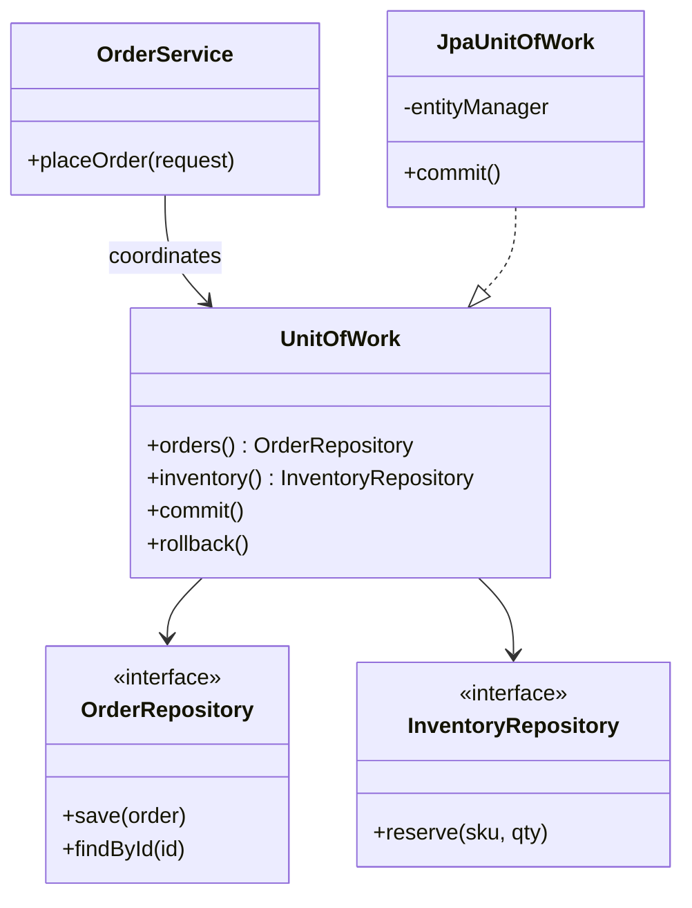
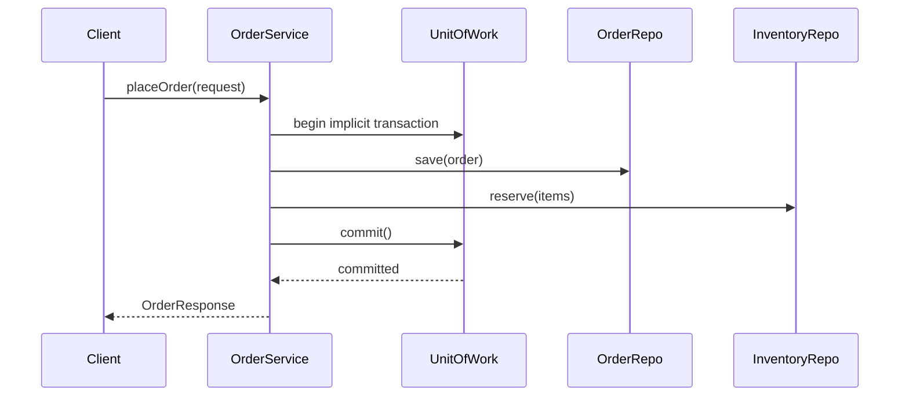

### Problem & Intent

The **Repository** pattern hides persistence mechanics behind a collection-like interface so domain and application code never speak SQL or ORM APIs directly. **Unit of Work** coordinates multiple repository writes inside a single transactional boundary — tracking new, dirty, and deleted entities and committing or rolling back atomically. Together they decouple business logic from storage technology and make multi-aggregate saves testable without a live database.

---

### When to Use / When NOT to Use

| Situation | Use? | Why |
| :--- | :---: | :--- |
| Domain services must persist aggregates without knowing JDBC/JPA details | Yes | Repository abstracts storage; swap in-memory fakes in tests |
| Multiple tables or aggregates must commit or fail together | Yes | Unit of Work owns the transaction boundary |
| You need query methods expressed in domain terms (`findByCustomerId`) | Yes | Keeps persistence vocabulary out of services |
| Simple CRUD on one table with no domain model | No | Spring Data `JpaRepository` on the entity is enough |
| Read-heavy reporting with ad-hoc joins across many tables | No | Repository per aggregate fights analytical queries — use a read model |
| Microservice with one aggregate and framework-managed `@Transactional` | No | Explicit UoW adds ceremony when the ORM already tracks changes |

---

### Structure (Class Diagram)



---

### Interaction Flow



---

### Implementation




**Violation — service owns SQL and transaction details:**

```java
public class OrderManager {
    public void placeOrder(OrderRequest request) {
        EntityManager em = emf.createEntityManager();
        EntityTransaction tx = em.getTransaction();
        tx.begin();
        try {
            em.persist(new OrderEntity(request));
            em.createQuery("UPDATE inventory SET qty = qty - :q WHERE sku = :s")
              .setParameter("q", request.getQty())
              .setParameter("s", request.getSku())
              .executeUpdate();
            tx.commit();
        } catch (Exception e) {
            tx.rollback();
            throw e;
        } finally {
            em.close();
        }
    }
}
```

**Repository + Unit of Work:**

```java
public interface OrderRepository {
    Order save(Order order);
    Optional<Order> findById(OrderId id);
}

public interface InventoryRepository {
    void reserve(Sku sku, int quantity);
}

public interface UnitOfWork extends AutoCloseable {
    OrderRepository orders();
    InventoryRepository inventory();
    void commit();
    void rollback();
}

public final class OrderService {
    private final UnitOfWorkFactory uowFactory;

    public OrderService(UnitOfWorkFactory uowFactory) {
        this.uowFactory = uowFactory;
    }

    public OrderResponse placeOrder(OrderRequest request) {
        try (UnitOfWork uow = uowFactory.open()) {
            Order order = uow.orders().save(Order.from(request));
            request.getItems().forEach(i ->
                uow.inventory().reserve(i.sku(), i.quantity()));
            uow.commit();
            return OrderResponse.from(order);
        }
    }
}
```

Spring note: `@Transactional` on `OrderService.placeOrder` often replaces explicit UoW when a single `EntityManager` spans repositories — explicit UoW shines when coordinating non-JPA stores or custom change tracking.




**Violation:**

```go
func (m *OrderManager) PlaceOrder(ctx context.Context, req OrderRequest) error {
    tx, err := m.db.BeginTx(ctx, nil)
    if err != nil {
        return err
    }
    defer tx.Rollback()
    if _, err := tx.ExecContext(ctx,
        "INSERT INTO orders (customer_id) VALUES ($1)", req.CustomerID); err != nil {
        return err
    }
    if _, err := tx.ExecContext(ctx,
        "UPDATE inventory SET qty = qty - $1 WHERE sku = $2", req.Qty, req.SKU); err != nil {
        return err
    }
    return tx.Commit()
}
```

**Repository + Unit of Work:**

```go
type OrderRepository interface {
    Save(ctx context.Context, order Order) (Order, error)
    FindByID(ctx context.Context, id OrderID) (Order, error)
}

type InventoryRepository interface {
    Reserve(ctx context.Context, sku SKU, qty int) error
}

type UnitOfWork interface {
    Orders() OrderRepository
    Inventory() InventoryRepository
    Commit() error
    Rollback() error
}

type OrderService struct {
    uowFactory func(ctx context.Context) (UnitOfWork, error)
}

func (s *OrderService) PlaceOrder(ctx context.Context, req OrderRequest) (OrderResponse, error) {
    uow, err := s.uowFactory(ctx)
    if err != nil {
        return OrderResponse{}, err
    }
    defer uow.Rollback()

    order, err := uow.Orders().Save(ctx, NewOrder(req))
    if err != nil {
        return OrderResponse{}, err
    }
    for _, item := range req.Items {
        if err := uow.Inventory().Reserve(ctx, item.SKU, item.Qty); err != nil {
            return OrderResponse{}, err
        }
    }
    if err := uow.Commit(); err != nil {
        return OrderResponse{}, err
    }
    return ToResponse(order), nil
}
```

Go typically implements UoW with `sql.Tx` passed into repository constructors for the request scope.




---

### Trade-offs & Operational Realities

| Concern | Impact |
| :--- | :--- |
| **Testability** | In-memory repositories behind UoW let you test `OrderService` without Docker Postgres |
| **Complexity** | Extra interfaces and factory wiring — justified when persistence is non-trivial or multi-store |
| **Framework fit** | Spring Data repos + `@Transactional` cover many cases; explicit UoW for mixed persistence or DDD aggregates |
| **Lazy loading traps** | Repositories returning ORM entities can leak lazy-load calls outside the UoW boundary |

---

### Junior Mistakes

- Putting business rules inside repository implementations instead of domain services
- One giant `GenericRepository<T>` with `saveAnything` — loses aggregate-specific query intent
- Calling `commit()` per repository operation instead of once per use case
- Exposing `EntityManager` or `sql.DB` from the UoW to callers — breaks the abstraction

---

### Senior Questions

1. Where does the transaction start — service, UoW factory, or framework interceptor?
2. Repository per aggregate or per table — how do you model an order with line items?
3. How do you handle eventual consistency when inventory lives in another microservice?
4. When would you skip UoW and rely on Spring `@Transactional` alone?
5. How do you test rollback behavior when inventory reservation fails mid-flow?

---

### Revision Cheat Sheet

- **One line:** Repositories hide storage; Unit of Work commits related changes atomically.
- **Trigger smell:** Service methods with raw SQL, manual `begin`/`commit`, and mixed table updates.
- **Pairs with:** [DIP](/design-patterns/dependency-inversion-principle/), [DDD Building Blocks](/design-patterns/domain-driven-design-building-blocks/), [DTO Mapper](/design-patterns/dto-entity-mapper-separation/)
- **Avoid when:** Single-table CRUD with framework-managed transactions is sufficient.
- **Interview tip:** Draw one use case, two repositories, one commit — name what rolls back on failure.

---

### See Also

- [Dependency Inversion Principle](/design-patterns/dependency-inversion-principle/)
- [Domain-Driven Design Building Blocks](/design-patterns/domain-driven-design-building-blocks/)
- [DTO vs Entity Mapper Separation](/design-patterns/dto-entity-mapper-separation/)
- [Single Responsibility Principle](/design-patterns/single-responsibility-principle/)
