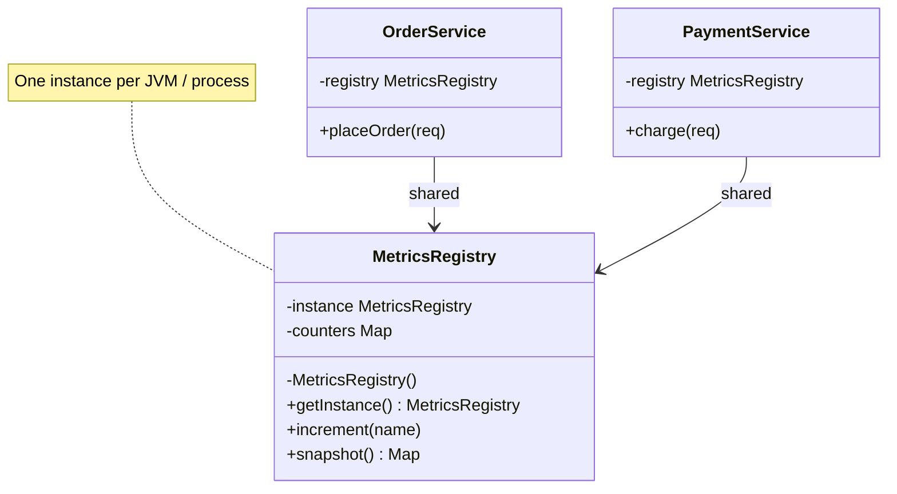
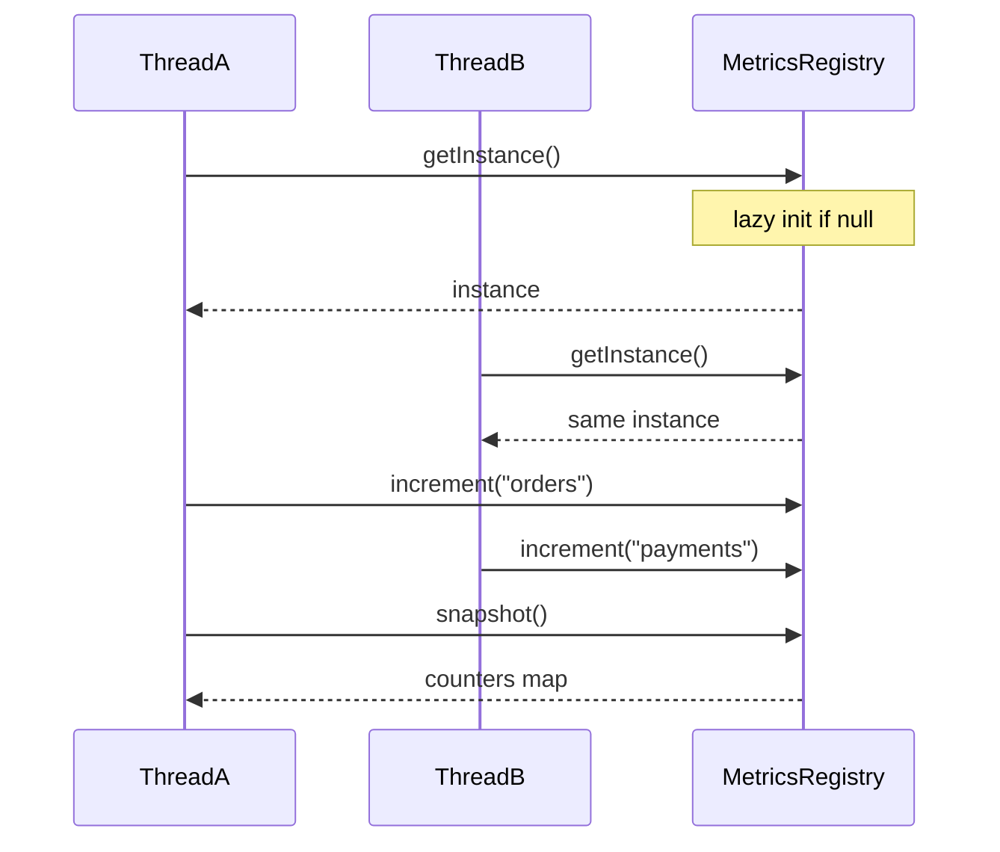

### Problem & Intent

The Singleton Pattern ensures a class has **only one instance** and provides a global access point to it. The design force is coordinating shared resources — connection pool configuration, metrics registry, feature-flag cache — where multiple instances would waste memory or corrupt shared state. In modern Spring and Go applications, **container-managed singleton scopes** often replace hand-rolled `getInstance()`; the pattern's lesson is *controlled single instance*, not *static globals everywhere*.

---

### When to Use / When NOT to Use

| Situation | Use? | Why |
| :--- | :---: | :--- |
| Exactly one shared resource coordinator (pool, registry, id generator) | Yes | Prevents duplicate initialization and inconsistent global state |
| Lazy, thread-safe initialization of an expensive object | Yes | `Holder` idiom or `sync.Once` defers cost until first use |
| Framework already provides singleton scope (`@Component`, package-level var) | Yes | Let the container own lifecycle — do not reinvent |
| You need multiple instances for testing or multi-tenant isolation | No | Singleton hides dependencies and blocks parallel test runs |
| State accumulates unbounded instance fields (user sessions in singleton) | No | Memory leak and concurrency hazard — use request/session scope |
| "Global variable because passing parameters is annoying" | No | Prefer dependency injection over `getInstance()` service locator |

---

### Structure (Class Diagram)



---

### Interaction Flow



---

### Implementation




**Violation — unsafe lazy singleton + service locator:**

```java
public class MetricsRegistry {
    private static MetricsRegistry instance;
    private final Map<String, Long> counters = new HashMap<>();

    public static MetricsRegistry getInstance() {
        if (instance == null) {                    // race: two threads create two instances
            instance = new MetricsRegistry();
        }
        return instance;
    }

    public void increment(String name) {
        counters.merge(name, 1L, Long::sum);     // HashMap not thread-safe
    }
}

// Hidden dependency — untestable without static mocking
public class OrderService {
    public void placeOrder(OrderRequest req) {
        MetricsRegistry.getInstance().increment("orders");
    }
}
```

**Singleton — holder idiom + injected abstraction:**

```java
public final class MetricsRegistry {
    private final ConcurrentHashMap<String, Long> counters = new ConcurrentHashMap<>();

    private MetricsRegistry() {}

    private static final class Holder {
        static final MetricsRegistry INSTANCE = new MetricsRegistry();
    }

    public static MetricsRegistry getInstance() {
        return Holder.INSTANCE;
    }

    public void increment(String name) {
        counters.merge(name, 1L, Long::sum);
    }

    public Map<String, Long> snapshot() {
        return Map.copyOf(counters);
    }
}

// Preferred in Spring — container singleton, constructor injection
@Component
public final class OrderService {
    private final MetricsRegistry registry;

    public OrderService(MetricsRegistry registry) {
        this.registry = registry;
    }

    public void placeOrder(OrderRequest req) {
        registry.increment("orders");
    }
}
```

**Spring default scope is singleton** — one bean per container; use `@Scope("prototype")` when you need a new instance per injection.




**Violation:**

```go
var (
    registry *MetricsRegistry
    mu       sync.Mutex
)

func GetRegistry() *MetricsRegistry {
    if registry == nil { // check-then-act race without proper sync
        registry = &MetricsRegistry{counters: make(map[string]int64)}
    }
    return registry
}

type OrderService struct{}

func (s *OrderService) PlaceOrder(req OrderRequest) {
    GetRegistry().Increment("orders") // hidden global
}
```

**Singleton — `sync.Once` + explicit injection:**

```go
type MetricsRegistry struct {
    counters sync.Map
}

var (
    instance *MetricsRegistry
    once     sync.Once
)

func GetMetricsRegistry() *MetricsRegistry {
    once.Do(func() {
        instance = &MetricsRegistry{}
    })
    return instance
}

func (r *MetricsRegistry) Increment(name string) {
    val, _ := r.counters.LoadOrStore(name, int64(0))
    r.counters.Store(name, val.(int64)+1)
}

// Preferred — construct once in main, pass to services
type OrderService struct {
    registry *MetricsRegistry
}

func NewOrderService(reg *MetricsRegistry) *OrderService {
    return &OrderService{registry: reg}
}

func (s *OrderService) PlaceOrder(req OrderRequest) error {
    s.registry.Increment("orders")
    return nil
}

func main() {
    reg := GetMetricsRegistry()
    orders := NewOrderService(reg)
    _ = orders
}
```

Package-level `var defaultRegistry = GetMetricsRegistry()` is idiomatic only when injection is impractical (small CLIs).




---

### Trade-offs & Operational Realities

| Concern | Impact |
| :--- | :--- |
| **Testability** | Static `getInstance()` forces test pollution — inject interface or reset hooks; Spring `@MockBean` replaces the bean |
| **Complexity** | Double-checked locking is subtle; prefer Holder (Java) or `sync.Once` (Go) |
| **Framework fit** | Spring singleton beans + DI is the enterprise default; manual singleton is for libraries and legacy code |
| **Distributed systems** | JVM singleton ≠ cluster singleton — use Redis/etcd for cluster-wide coordination |

---

### Junior Mistakes

- Implementing broken double-checked locking without `volatile` (Java) or outside `sync.Once` (Go)
- Storing per-user or per-request state in a singleton bean
- Calling `getInstance()` from everywhere instead of constructor injection (service locator anti-pattern)
- Assuming singleton solves distributed uniqueness — two pods still have two instances

---

### Senior Questions

1. Singleton vs Spring default scope — when would you still hand-roll `getInstance()`?
2. How do you unit-test `OrderService` without a static metrics singleton?
3. Enum singleton (`enum Instance { INSTANCE }`) — pros/cons vs holder idiom?
4. How does singleton interact with classloader boundaries in application servers?
5. When does a singleton become a **god object** — what extraction signals do you watch for?

---

### Revision Cheat Sheet

- **One line:** One instance per process; global access — prefer container-managed singleton.
- **Trigger smell:** `getInstance()` calls scattered; singleton holding user-specific state.
- **Pairs with:** [Dependency Injection](/design-patterns/dependency-injection-inversion-of-control/), [Factory Method](/design-patterns/factory-method-pattern/), [Flyweight](/design-patterns/flyweight-pattern/)
- **Avoid when:** Testing needs isolation, state varies per request, or cluster coordination is required.
- **Interview tip:** Mention thread safety (Holder / `sync.Once`) and DI over service locator.

---

### See Also

- [Dependency Injection & IoC](/design-patterns/dependency-injection-inversion-of-control/)
- [Flyweight Pattern](/design-patterns/flyweight-pattern/)
- [In-Memory Rate Limiter LLD](/design-patterns/in-memory-rate-limiter-lld/)
- [Singleton Pattern pitfalls in Parking Lot LLD](/design-patterns/parking-lot-system-lld/)
