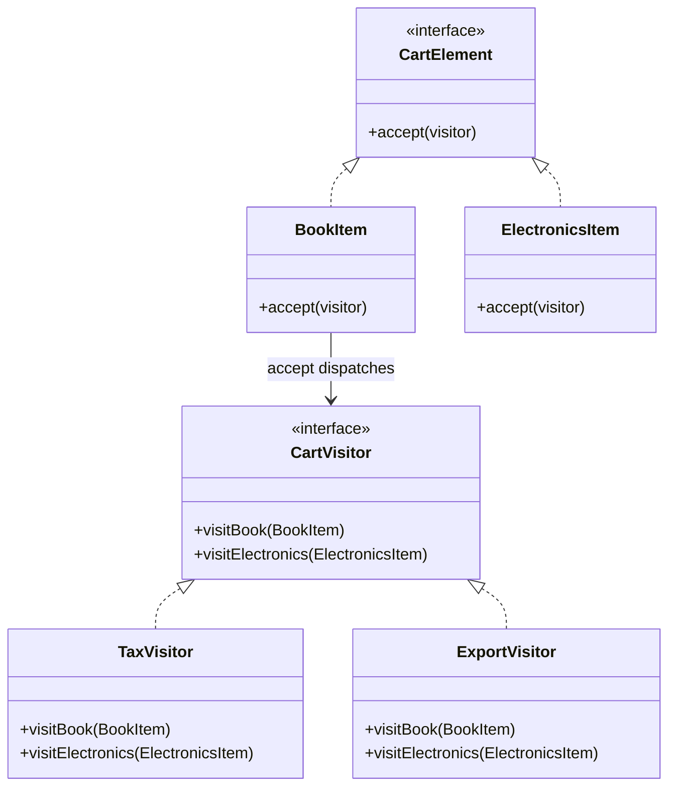
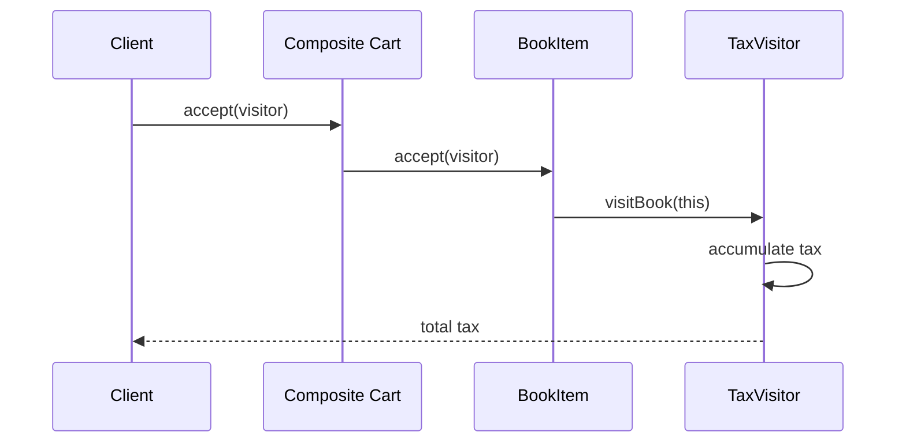

### Problem & Intent

The Visitor Pattern lets you **define new operations on a stable object structure without changing element classes**. Each element accepts a visitor and dispatches to the correct `visit` overload (double dispatch). It fits ASTs, document object models, and [Composite](/design-patterns/composite-pattern/) trees where element types are fixed but **operations proliferate** (render, export, validate, tax).

---

### When to Use / When NOT to Use

| Situation | Use? | Why |
| :--- | :---: | :--- |
| Stable element hierarchy; many new operations over time | Yes | Add visitor class, not new method per element |
| Operations span the whole structure (compile, lint, bill) | Yes | One visitor walks entire tree |
| Element types rarely change but operations often do | Yes | Visitor favors operations axis |
| Element types change frequently | No | Every new element breaks all visitors |
| Simple two-type hierarchy with one operation | No | `switch` or type assertion is enough |
| Cannot modify elements to add `accept(visitor)` | No | Pattern requires element cooperation |
| Operations need to add state to elements | No | Visitor is stateless traversal; use Decorator |

---

### Structure (Class Diagram)



---

### Interaction Flow



---

### Implementation




**Junior approach — instanceof sprawl:**

```java
public double calculateTax(List<Item> items) {
    double tax = 0;
    for (Item item : items) {
        if (item instanceof Book) {
            tax += item.getPrice() * 0.05;
        } else if (item instanceof Electronics) {
            tax += item.getPrice() * 0.18;
        }
    }
    return tax;
}
```

**Visitor approach:**

```java
public interface CartElement {
    void accept(CartVisitor visitor);
}

public final class BookItem implements CartElement {
    private final BigDecimal price;

    @Override
    public void accept(CartVisitor visitor) {
        visitor.visitBook(this);
    }

    public BigDecimal getPrice() { return price; }
}

public interface CartVisitor {
    void visitBook(BookItem item);
    void visitElectronics(ElectronicsItem item);
}

public final class TaxVisitor implements CartVisitor {
    private BigDecimal totalTax = BigDecimal.ZERO;

    @Override
    public void visitBook(BookItem item) {
        totalTax = totalTax.add(item.getPrice().multiply(new BigDecimal("0.05")));
    }

    @Override
    public void visitElectronics(ElectronicsItem item) {
        totalTax = totalTax.add(item.getPrice().multiply(new BigDecimal("0.18")));
    }

    public BigDecimal getTotalTax() { return totalTax; }
}
```

Java sealed classes + pattern matching reduce visitor ceremony in Java 21+, but classic Visitor remains common in compilers and AST libraries.




```go
type CartElement interface {
    Accept(v CartVisitor)
}

type BookItem struct{ Price float64 }

func (b BookItem) Accept(v CartVisitor) { v.VisitBook(b) }

type ElectronicsItem struct{ Price float64 }

func (e ElectronicsItem) Accept(v CartVisitor) { v.VisitElectronics(e) }

type CartVisitor interface {
    VisitBook(BookItem)
    VisitElectronics(ElectronicsItem)
}

type TaxVisitor struct {
    TotalTax float64
}

func (t *TaxVisitor) VisitBook(b BookItem) {
    t.TotalTax += b.Price * 0.05
}

func (t *TaxVisitor) VisitElectronics(e ElectronicsItem) {
    t.TotalTax += e.Price * 0.18
}

func WalkCart(items []CartElement, v CartVisitor) {
    for _, item := range items {
        item.Accept(v)
    }
}
```

Go has no overloads — **one interface method per element type**. Alternative: type switch in a single `Walk` function when visitor count is low (simpler, less extensible).




---

### Trade-offs & Operational Realities

| Concern | Impact |
| :--- | :--- |
| **Testability** | Each visitor tested with fixture trees; elements tested for correct dispatch |
| **Complexity** | New element type requires updating every visitor — fragile |
| **Framework fit** | Compiler ASTs, ANTLR visitors; less common in typical CRUD services |
| **Alternatives** | Java 21 pattern matching; Go type switches; functional folds over ADTs |

---

### Junior Mistakes

- Adding Visitor when element types change every sprint
- Visitor with business logic that mutates element state (side effects everywhere)
- Forgetting to traverse children in composite `accept` — skips subtree
- One god visitor with 20 `visit` methods instead of focused visitors per operation
- Using Visitor in CRUD apps where a service method and DTO suffice

---

### Senior Questions

1. Visitor vs type switch — when is double dispatch worth the boilerplate?
2. How do sealed classes + pattern matching change the Visitor trade-off in Java 21?
3. Adding a new `CartElement` type — how many files must change?
4. Visitor vs [Iterator](/design-patterns/iterator-pattern/) — traverse vs operate?
5. Functional style: `fold` over AST vs classic Visitor — equivalent?

---

### Revision Cheat Sheet

- **One line:** Elements dispatch to visitor; new ops = new visitor class.
- **Trigger smell:** `instanceof` chains or switches grow with every new operation.
- **Pairs with:** [Composite Pattern](/design-patterns/composite-pattern/), [Iterator Pattern](/design-patterns/iterator-pattern/)
- **Avoid when:** Element types evolve often or structure is flat and tiny.
- **Go tip:** Type switch for few ops; Visitor interface when operations outnumber types.

---

### See Also

- [Composite Pattern](/design-patterns/composite-pattern/)
- [Iterator Pattern](/design-patterns/iterator-pattern/)
- [Open-Closed Principle](/design-patterns/open-closed-principle/)
- [Specification Pattern](/design-patterns/specification-pattern/)
