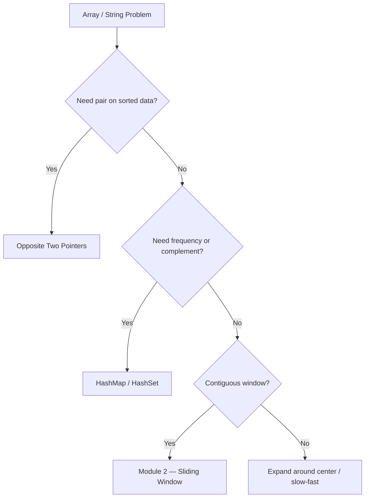

# Arrays, HashMap & Two Pointers

> **Canonical home** for HashMap, HashSet, complement lookup, grouping keys, and two-pointer scans.  
> Prefix sum and sliding window live in [Module 2](/dsa-coding/02-sliding-window-prefix-sum/). Do not duplicate those patterns here.

---

## Overview

O(1) expected lookups and linear scans with two indices. The workhorse module for unsorted array/string problems at O(n) or O(n log n) after sort.

---

## Why This Pattern Exists

Nested loops are O(n²). Hash structures trade O(n) space for O(1) membership or frequency. Two pointers exploit sorted order or symmetric scans without extra space.

---

## Recognition Signals

| Signal | Lean toward |
| :--- | :--- |
| "Have we seen X before?" / duplicates | HashSet |
| Count frequency / group by property | HashMap |
| Pair summing to target (unsorted) | Complement lookup in HashMap |
| Pair/triplet in sorted array | Opposite-direction two pointers |
| In-place filter / partition | Same-direction slow & fast |
| Palindrome / expand from center | Two pointers or expand-around-center |

---

## When To Use

- Unsorted data with membership, frequency, or pair-by-complement needs.
- Sorted (or sortable) arrays needing pair/triplet enumeration.
- In-place compaction without auxiliary arrays.

---

## When NOT To Use

- Contiguous subarray optima with **negative** numbers → [Prefix Sum + HashMap](/dsa-coding/02-sliding-window-prefix-sum/) (Module 2).
- Fixed/variable **window** on streams → [Sliding Window](/dsa-coding/02-sliding-window-prefix-sum/) (Module 2).
- Sorted target with O(1) space and two-pointer friendly → prefer pointers over HashMap.

---

## Problem Solving Framework

1. Can a complement `target - x` be defined? → HashMap (query **before** insert).
2. Is data sorted or sortable for pairs? → Two pointers.
3. Need counts not just presence? → HashMap not HashSet.
4. Grouping by derived key? → Normalize key (sorted string or frequency tuple).

---

## Brute Force Approach

Nested loops for pairs/triplets — O(n²) or O(n³). Baseline to mention in interviews before optimizing.

---

## Optimization Journey

| Stage | Technique | Time |
| :--- | :--- | :--- |
| Brute force | All pairs | O(n²) |
| HashMap complement | Single pass | O(n) |
| Sort + two pointers | 3Sum family | O(n²) |

---

## Core Algorithms

### Complement lookup invariant

Query map for `target - nums[i]` **first**; only then store `nums[i]`. Prevents self-pair bugs.

### Opposite-direction template

`lo = 0`, `hi = n - 1`; move the pointer that improves the metric (sum too small → `lo++`).

### Grouping key

Anagram bucket: sort characters or use 26-count tuple as immutable map key.

---

## Complexity Analysis

| Pattern | Time | Space |
| :--- | :--- | :--- |
| HashMap / HashSet pass | O(n) | O(n) |
| Sort + two pointers | O(n log n) | O(1) |
| Two pointers (pre-sorted) | O(n) | O(1) |

---

## Common Mistakes

- `x in list` inside a loop → accidental O(n²).
- Storing current element **before** complement check (Two Sum).
- 3Sum: not skipping duplicate `i` / `lo` / `hi` after a hit.
- Using HashMap when problem needs **contiguous** subarray with negatives.

---

## Interview Discussion

- State space tradeoff: "I trade O(n) memory for O(1) lookups."
- For 3Sum: "Sort once, fix one index, two-pointer the rest — duplicates handled by skipping equal values."
- Link to [Java HashMap internals](/java-engineering/hashmap-internals/) for production hash behavior.

---

---

## Interviewer Perspective

- Expect you to **name the tradeoff** before coding: O(n) space for HashMap vs O(n log n) sort for two pointers.
- Follow-ups probe **duplicate handling** (3Sum skip logic) and **when HashMap fails** (contiguous subarray with negatives).
- Senior signal: connect to [HashMap internals](/java-engineering/hashmap-internals/) — load factor, worst-case buckets.

---

## Common Failure Modes

| Failure | Symptom | Fix |
| :--- | :--- | :--- |
| Complement self-pair | Two Sum returns same index twice | Query map **before** insert |
| O(n²) hidden lookup | `list.contains` in loop | HashSet/HashMap |
| 3Sum duplicates | Repeated triplets | Skip equal `i`, `lo`, `hi` after hit |
| Wrong pointer move | Infinite loop or missed pairs | Move the side that improves metric |
| HashMap on contiguous sum | Wrong answer with negatives | Route to Module 2 prefix+map |

---

## Architect Notes

- **Distributed caches** mirror complement lookup — idempotent keys, collision handling.
- **Sort + two pointers** is the pattern when you need **deterministic ordering** without extra memory for indices.
- Prefer **normalized keys** (sorted tuple, frequency vector) over raw strings for grouping at scale.

---

## Representative Problems

| # | Problem | Pattern |
| :---: | :--- | :--- |
| 1 | [Two Sum](/dsa-coding/01-arrays-hashmap-two-pointers/two-sum/) | Complement HashMap |
| 3 | [Group Anagrams](/dsa-coding/01-arrays-hashmap-two-pointers/group-anagrams/) | Normalized key |
| 7 | [3Sum](/dsa-coding/01-arrays-hashmap-two-pointers/3sum/) | Sort + two pointers |
| 6 | [Valid Palindrome](/dsa-coding/01-arrays-hashmap-two-pointers/valid-palindrome/) | Opposite pointers |

[Full module problem list](/dsa-coding/01-arrays-hashmap-two-pointers/) — 12 problems.

---

## Related Patterns

- [Prefix Sum](/dsa-coding/02-sliding-window-prefix-sum/) — range sums, pivot (Module 2)
- [Sliding Window](/dsa-coding/02-sliding-window-prefix-sum/) — contiguous windows (Module 2)
- [Two Pointers Quick Revision](/dsa-coding/11-interview-pattern-cheatsheets/01-two-pointers-cheatsheet/) (Module 11)

---

## Quick Revision Notes

- **HashSet:** existence / dedupe.
- **HashMap:** frequency, complement, grouping.
- **Two pointers:** sorted pairs; slow/fast for in-place.
- **Never** re-teach prefix sum or sliding window here — link Module 2.

## Problems in This Module

| # | Problem | Pattern |
| :---: | :--- | :--- |
| 1 | [Two Sum](/dsa-coding/01-arrays-hashmap-two-pointers/two-sum/) | HashMap |
| 2 | [Valid Anagram](/dsa-coding/01-arrays-hashmap-two-pointers/valid-anagram/) | HashMap |
| 3 | [Group Anagrams](/dsa-coding/01-arrays-hashmap-two-pointers/group-anagrams/) | HashMap |
| 4 | [Count Pairs With Absolute Difference K](/dsa-coding/01-arrays-hashmap-two-pointers/count-pairs-absolute-difference-k/) | HashMap |
| 5 | [Count Nice Pairs in an Array](/dsa-coding/01-arrays-hashmap-two-pointers/count-nice-pairs-in-an-array/) | HashMap |
| 6 | [Valid Palindrome](/dsa-coding/01-arrays-hashmap-two-pointers/valid-palindrome/) | Two Pointers |
| 7 | [3Sum](/dsa-coding/01-arrays-hashmap-two-pointers/3sum/) | Two Pointers |
| 8 | [3Sum Closest](/dsa-coding/01-arrays-hashmap-two-pointers/3sum-closest/) | Two Pointers |
| 9 | [4Sum](/dsa-coding/01-arrays-hashmap-two-pointers/4sum/) | Two Pointers |
| 10 | [Merge Sorted Array](/dsa-coding/01-arrays-hashmap-two-pointers/merge-sorted-array/) | Two Pointers |
| 11 | [Meeting Schedule](/dsa-coding/01-arrays-hashmap-two-pointers/meeting-schedule/) | Two Arrays + Sorting |
| 12 | [Longest Palindromic Substring](/dsa-coding/01-arrays-hashmap-two-pointers/longest-palindromic-substring/) | Expand Around Center |

---

## See Also

- [Next: Two Sum](/dsa-coding/01-arrays-hashmap-two-pointers/two-sum/)
- [DSA & Coding Index](/dsa-coding/)
- [Java Engineering](/java-engineering/)
- [Design Patterns](/design-patterns/)
