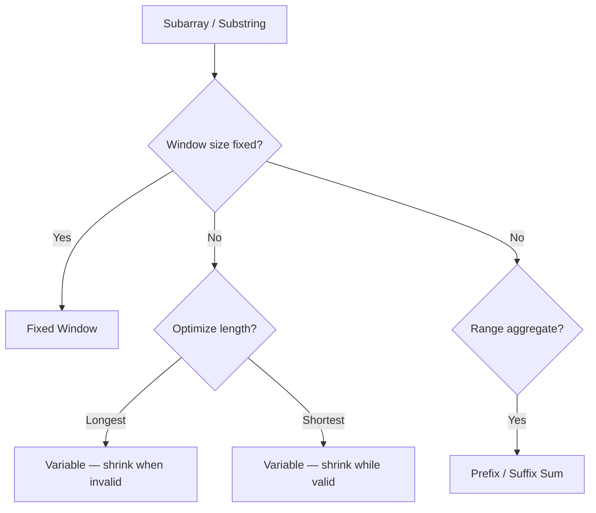

# Sliding Window & Prefix Sum

> **Canonical home** for prefix sums, prefix+map subarrays, fixed/variable sliding windows, and prefix/suffix aggregates.  
> HashMap complement pairs without contiguity → [Module 1](/dsa-coding/01-arrays-hashmap-two-pointers/).

---

## Overview

Turn repeated range calculations into O(1) queries, or maintain a contiguous window incrementally instead of rescanning.

---

## Why This Pattern Exists

Recomputing every window of size k is O(n·k). Prefix arrays reduce range queries to subtraction. Sliding windows update state with one add and one remove per step.

---

## Recognition Signals

| Signal | Pattern |
| :--- | :--- |
| Range sum / pivot / balance | Prefix sum |
| Subarray sum equals k (with negatives) | Prefix sum + HashMap `{0:1}` seed |
| Window size **fixed** k | Fixed sliding window |
| "Longest" substring/subarray | Variable window — expand, shrink when invalid |
| "Shortest" meeting threshold | Variable window — shrink while valid |
| Trapping water / product except self | Prefix & suffix passes |

---

## When To Use

- Many range-sum queries or single-pass pivot detection.
- Contiguous substring/subarray with monotone shrink/expand logic.
- **Positive-only** subarray sum targets can use sliding window; with negatives use prefix+map.

---

## When NOT To Use

- Non-contiguous pairs → Module 1 HashMap.
- Global sorted search → [Binary Search](/dsa-coding/03-binary-search/) (Module 3).
- Arbitrary graph reachability → [Graphs](/dsa-coding/06-graphs/) (Module 6).

---

## Problem Solving Framework

1. Fixed k? → Initialize first window, slide with add/remove.
2. Longest valid? → Expand right; while invalid, shrink left; record max **after** valid.
3. Shortest valid? → Expand until valid; shrink while valid; record min **inside** shrink.
4. Range sum? → `prefix[j+1] - prefix[i]` with length `n+1` array starting at 0.

---

## Brute Force Approach

Recompute each window or range from scratch — O(n·k) or O(n²).

---

## Optimization Journey

Prefix O(n) build + O(1) query; sliding window amortized O(n) with two pointers.

---

## Core Algorithms

**Prefix range formula:** `sum(i..j) = prefix[j+1] - prefix[i]`

**Longest window invariant:** contract when invalid; answer after contraction loop.

**Shortest window invariant:** contract while valid; update min inside contraction.

---

## Complexity Analysis

| Pattern | Time | Space |
| :--- | :--- | :--- |
| Prefix build + query | O(n) / O(1) | O(n) |
| Fixed / variable window | O(n) amortized | O(k) map if charset |
| Prefix + HashMap | O(n) | O(n) |

---

## Common Mistakes

- Sliding window on arrays with **negative** numbers.
- Forgetting `{0:1}` when counting subarrays summing to k.
- Updating max length while window is **invalid**.
- Not removing map entries when window frequency hits zero.

---

## Interview Discussion

- Articulate longest vs shortest window invariants — interviewers probe this often.
- Trapping rain: prefix max from left and right, or two-pointer after explaining tradeoffs.

---

---

## Interviewer Perspective

- Tests whether you distinguish **longest vs shortest** window invariants — state both before coding.
- Expect justification for **prefix+map** when array has negatives (sliding window invalid).
- Follow-ups: streaming data, fixed vs variable window, subarray count vs existence.

---

## Common Failure Modes

| Failure | Symptom | Fix |
| :--- | :--- | :--- |
| Window on negatives | Wrong min/max subarray sum | Prefix sum + HashMap |
| Max length while invalid | Overcounted window | Update best **after** shrink loop |
| Missing `{0:1}` seed | Miss subarrays starting at index 0 | Initialize prefix map |
| Stale map entries | Wrong distinct count | Remove key when freq hits 0 |
| Recompute each window | O(n·k) timeout | Incremental add/remove |

---

## Architect Notes

- Sliding window = **fixed-size event buffer** in stream processing — amortized O(1) per element.
- Prefix sums enable **range queries** on immutable snapshots (metrics, billing windows).
- Trapping rain water maps to **capacity planning** — left/right max as boundary constraints.

---

## Representative Problems

| Problem | Pattern |
| :--- | :--- |
| [Max Sum Subarray Size K](/dsa-coding/02-sliding-window-prefix-sum/max-sum-subarray-size-k/) | Fixed window |
| [Longest Substring Without Repeating](/dsa-coding/02-sliding-window-prefix-sum/longest-substring-without-repeating-characters/) | Variable longest |
| [Pivot Index](/dsa-coding/02-sliding-window-prefix-sum/equal-left-right-subarray-sum/) | Prefix sum |
| [Trapping Rain Water](/dsa-coding/02-sliding-window-prefix-sum/trapping-rain-water/) | Prefix/suffix |

---

## Related Patterns

- [HashMap](/dsa-coding/01-arrays-hashmap-two-pointers/) (Module 1) — non-contiguous counts
- [Sliding Window Quick Revision](/dsa-coding/11-interview-pattern-cheatsheets/02-sliding-window-cheatsheet/)
- [Prefix Sum Quick Revision](/dsa-coding/11-interview-pattern-cheatsheets/03-prefix-sum-cheatsheet/)

---

## Quick Revision Notes

- **Fixed k:** add right, drop left.
- **Longest:** shrink when broken; max after shrink.
- **Shortest:** shrink while OK; min inside shrink.
- **Prefix:** use `n+1` array; seed map with `0 → 1` for subarray-k.

## Problems in This Module

| # | Problem | Pattern |
| :---: | :--- | :--- |
| 13 | [Max Sum Subarray of Size K](/dsa-coding/02-sliding-window-prefix-sum/max-sum-subarray-size-k/) | Fixed Window |
| 14 | [Longest Substring Without Repeating Characters](/dsa-coding/02-sliding-window-prefix-sum/longest-substring-without-repeating-characters/) | Variable Window |
| 15 | [Longest Substring with At Most K Distinct Characters](/dsa-coding/02-sliding-window-prefix-sum/longest-substring-k-distinct-characters/) | Variable Window |
| 16 | [Max Consecutive Ones III](/dsa-coding/02-sliding-window-prefix-sum/max-consecutive-ones-iii/) | Variable Window |
| 17 | [Maximum Points You Can Obtain from Cards](/dsa-coding/02-sliding-window-prefix-sum/maximum-points-from-cards/) | Sliding Window |
| 18 | [Equal Left and Right Subarray Sum](/dsa-coding/02-sliding-window-prefix-sum/equal-left-right-subarray-sum/) | Prefix Sum |
| 19 | [Trapping Rain Water](/dsa-coding/02-sliding-window-prefix-sum/trapping-rain-water/) | Prefix/Suffix |
| 20 | [Subdomain Visit Count](/dsa-coding/02-sliding-window-prefix-sum/subdomain-visit-count/) | HashMap |

---

## See Also

- [Previous: Longest Palindromic Substring](/dsa-coding/01-arrays-hashmap-two-pointers/longest-palindromic-substring/)
- [Next: Max Sum Subarray of Size K](/dsa-coding/02-sliding-window-prefix-sum/max-sum-subarray-size-k/)
- [DSA & Coding Index](/dsa-coding/)
- [Java Engineering](/java-engineering/)
- [Design Patterns](/design-patterns/)
