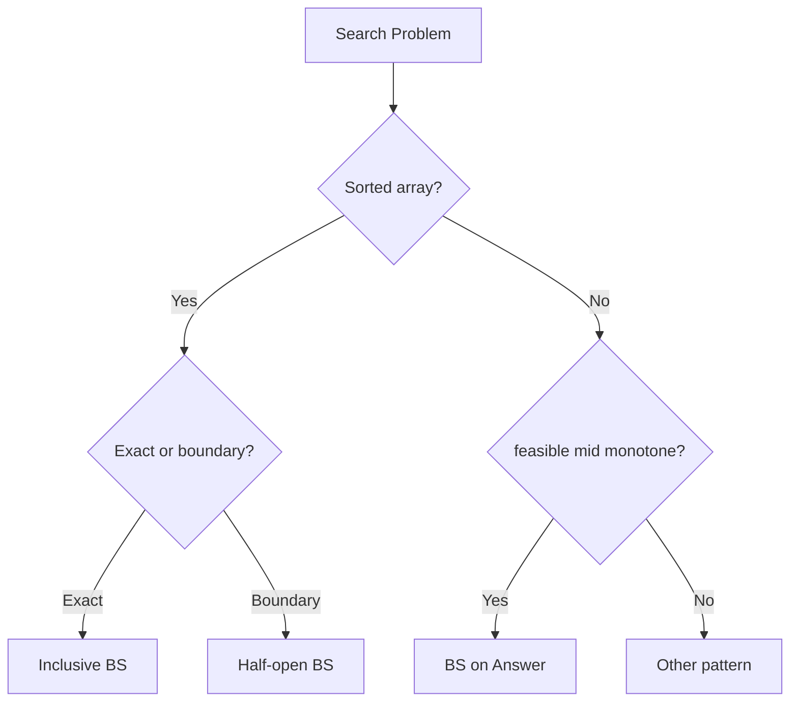

# Binary Search

> **Canonical home** for inclusive BS, lower/upper bound, rotated search, matrix search, and binary search on answer space.

---

## Overview

Halve the search space on sorted data or on a monotone feasibility predicate.

---

## Why This Pattern Exists

Linear scan is O(n). Binary search achieves O(log n) when monotonic structure exists.

---

## Recognition Signals

- Sorted array / answer space with "first feasible" transition
- "Minimize maximum" / "maximize minimum" with monotone `feasible(x)`
- Rotated sorted array
- 2D matrix with sorted rows

---

## When To Use

- Ordered data or provable monotonic feasibility.
- Need O(log n) locate or boundary.

---

## When NOT To Use

- Unsorted with no sort allowed and no answer-space monotonicity.
- Shortest path on graphs → BFS (Module 6).

---

## Problem Solving Framework

1. Exact target on sorted array → inclusive `while (lo <= hi)`.
2. Insertion / boundary → half-open `while (lo < hi)`, `hi = mid`.
3. Rotated → identify sorted half, discard other.
4. Answer space → `feasible(mid)`, shrink toward first true.

---

## Brute Force Approach

Linear scan or enumerate all candidate answers.

---

## Optimization Journey

Sort O(n log n) + scan → BS O(log n); answer-space BS O(n log R) with O(n) check.

---

## Core Algorithms

```java
// Inclusive — exact target
while (lo <= hi) {
    int mid = lo + (hi - lo) / 2;
    if (nums[mid] == target) return mid;
    if (nums[mid] < target) lo = mid + 1;
    else hi = mid - 1;
}
```

```java
// Half-open — lower bound
while (lo < hi) {
    int mid = lo + (hi - lo) / 2;
    if (nums[mid] < target) lo = mid + 1;
    else hi = mid;
}
```

See [copy-paste templates](/dsa-coding/09-interview-guide/binary-search-template/) for Go variants.



---

## Complexity Analysis

| Variant | Time | Space |
| :--- | :--- | :--- |
| Classic BS | O(log n) | O(1) |
| BS on answer | O(n log R) | O(1) |

---

## Common Mistakes

- `mid = (lo + hi) / 2` overflow — use `lo + (hi-lo)/2`.
- `lo = mid` with `<=` loop → infinite loop.
- Wrong sorted-half test on rotated array (`left <= mid` for 2 elements).

---

## Interview Discussion

- Always prove monotonicity before answer-space BS.
- State template choice: inclusive vs half-open.

---


---

## Interviewer Perspective

- Must prove **monotonicity** before binary search on answer — interviewers reject BS without feasibility proof.
- Expect correct template: inclusive (`<=`) vs half-open (`<`) — mixing causes infinite loops.
- Rotated array: identify **sorted half**; don't guess both sides.

---

## Common Failure Modes

| Failure | Symptom | Fix |
| :--- | :--- | :--- |
| Mid overflow | Wrong results on large bounds | `lo + (hi - lo) / 2` |
| `lo = mid` with `<=` | Infinite loop | Match template to variant |
| BS on unsorted | Wrong answer | Sort first or use answer-space predicate |
| Wrong rotated half | Miss target | `left <= mid` for 2-element half |
| Maximize vs minimize | Wrong boundary | Shrink `hi` or `lo` per predicate |

---

## Architect Notes

- BS on answer = **capacity planning**: find minimum machines/rate meeting SLA — predicate is feasibility check.
- Lower bound BS = **first index satisfying** condition — useful for version rollout thresholds.
- O(log n) locate beats linear scan when validation is cheap and search space is huge.

---

## Representative Problems

| Problem | Variant |
| :--- | :--- |
| [Binary Search](/dsa-coding/03-binary-search/binary-search/) | Inclusive |
| [Rotated Search](/dsa-coding/03-binary-search/search-in-rotated-sorted-array/) | Modified |
| [Koko Eating Bananas](/dsa-coding/03-binary-search/koko-eating-bananas/) | Answer space |

---

## Related Patterns

- [BS Quick Revision](/dsa-coding/11-interview-pattern-cheatsheets/04-binary-search-cheatsheet/)
- [Shortest window](/dsa-coding/02-sliding-window-prefix-sum/) — alternative when positive-only

---

## Quick Revision Notes

- **Inclusive:** `<=`, `lo=mid+1`, `hi=mid-1`.
- **Half-open:** `<`, `hi=mid`, `hi=n`.
- **Answer space:** prove `feasible`, first `true`.

## Problems in This Module

| # | Problem | Pattern |
| :---: | :--- | :--- |
| 21 | [Binary Search](/dsa-coding/03-binary-search/binary-search/) | Classic |
| 22 | [Search in Rotated Sorted Array](/dsa-coding/03-binary-search/search-in-rotated-sorted-array/) | Modified Binary Search |
| 23 | [Search a 2D Matrix](/dsa-coding/03-binary-search/search-a-2d-matrix/) | Matrix Binary Search |
| 24 | [Missing Number in Sorted Array](/dsa-coding/03-binary-search/missing-number-in-sorted-array/) | Binary Search |
| 25 | [Koko Eating Bananas](/dsa-coding/03-binary-search/koko-eating-bananas/) | Binary Search on Answer |
| 26 | [Aggressive Cows](/dsa-coding/03-binary-search/aggressive-cows/) | Binary Search on Answer |

---

## See Also

- [Previous: Subdomain Visit Count](/dsa-coding/02-sliding-window-prefix-sum/subdomain-visit-count/)
- [Next: Binary Search](/dsa-coding/03-binary-search/binary-search/)
- [DSA & Coding Index](/dsa-coding/)
- [Java Engineering](/java-engineering/)
- [Design Patterns](/design-patterns/)
