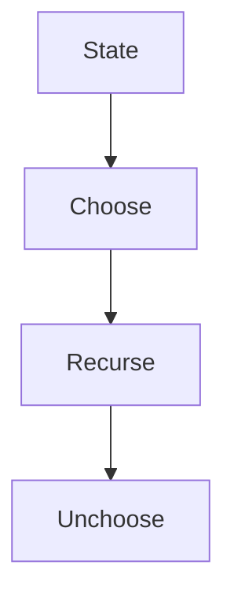

# Recursion & Backtracking

> **Canonical home** for backtracking, subset generation, stack-based validation, and **related** monotonic-stack patterns (not in problem set — see § Related Patterns).

---

## Overview

Explore decision trees depth-first; undo choices to restore state. Stack simulates recursion for matching problems.

---

## Why This Pattern Exists

Brute enumeration is exponential; pruning and early exit make search tractable. Stacks give O(1) nesting checks.

---

## Recognition Signals

- Generate all combinations / permutations / placements
- Constraint satisfaction (N-Queens, parentheses)
- Grid path with visited marking
- "Next greater element" → monotonic stack (related)

---

## When To Use / When NOT To Use

**Use:** discrete choices, clear validity, exponential output acceptable with pruning.  
**Not:** shortest path unweighted → BFS; overlapping subproblems → DP (Module 8).

---

## Problem Solving Framework

Choose → recurse → unchoose. Copy state before recurse if immutable.

---

## Brute Force / Optimization Journey

Enumerate all → prune invalid branches → O(output) with constraints.

---

## Core Algorithms

```text
backtrack(state):
  if goal: record; return
  for choice in choices:
    if valid: apply; backtrack; undo
```



---

## Complexity Analysis

Often O(k^n) worst case; pruning improves average. Stack validation O(n).

---

## Common Mistakes

- Forgetting undo after recursion
- Not marking/unmarking grid cells in word search
- Duplicate subsets when input has duplicates (sort + skip)

---

## Interview Discussion

State recursion tree depth and branching factor. Contrast with DP when subproblems overlap.

---


---

## Interviewer Perspective

- Expect explicit **choose → recurse → unchoose** narration; forgetting undo is an instant red flag.
- Subset Sum recursion vs DP follow-up tests **overlapping subproblems** recognition.
- N-Queens: interviewer checks **pruning** (column/diag sets) not brute placement.

---

## Common Failure Modes

| Failure | Symptom | Fix |
| :--- | :--- | :--- |
| No undo | Corrupted state in siblings | Reverse choice after recurse |
| Grid not unmarked | False paths in word search | Mark/unmark in same DFS frame |
| Duplicate subsets | Repeated picks | Sort + skip equal at same depth |
| Stack only on open | Wrong parentheses | Push opens; pop on close |
| DFS for shortest path | Wrong distance | BFS for unweighted shortest |

---

## Architect Notes

- Backtracking = **constraint satisfaction** in config generators, feature flags, test case enumeration.
- Stack simulates recursion for **nested structure validation** (JSON, XML, call stacks).
- Pruning early mirrors **circuit breakers** — don't explore branches known to violate invariants.

---

## Representative Problems

| Problem | Pattern |
| :--- | :--- |
| [Generate Parentheses](/dsa-coding/04-recursion-backtracking/generate-parentheses/) | Backtracking |
| [Word Search](/dsa-coding/04-recursion-backtracking/word-search/) | Grid DFS |
| [N-Queens](/dsa-coding/04-recursion-backtracking/n-queens/) | Constraint placement |

---

## Related Patterns

- [DP](/dsa-coding/08-dynamic-programming/) when overlapping subproblems (Subset Sum recursion vs DP)
- Monotonic stack (Phase 1 patterns 14–15) — next greater/smaller; not duplicated here

---

## Quick Revision Notes

- **Invariant:** choose → recurse → unchoose.
- **Stack:** valid parentheses without explicit recursion tree.

## Problems in This Module

| # | Problem | Pattern |
| :---: | :--- | :--- |
| 27 | [Valid Parentheses](/dsa-coding/04-recursion-backtracking/valid-parentheses/) | Stack / Recursion Thinking |
| 28 | [Subset Sum](/dsa-coding/04-recursion-backtracking/subset-sum-recursion/) | Recursion |
| 29 | [Letter Combinations of a Phone Number](/dsa-coding/04-recursion-backtracking/letter-combinations-of-phone-number/) | Backtracking |
| 30 | [Generate Parentheses](/dsa-coding/04-recursion-backtracking/generate-parentheses/) | Backtracking |
| 31 | [Word Search](/dsa-coding/04-recursion-backtracking/word-search/) | Backtracking |
| 32 | [N-Queens](/dsa-coding/04-recursion-backtracking/n-queens/) | Backtracking |

---

## See Also

- [Previous: Aggressive Cows](/dsa-coding/03-binary-search/aggressive-cows/)
- [Next: Valid Parentheses](/dsa-coding/04-recursion-backtracking/valid-parentheses/)
- [DSA & Coding Index](/dsa-coding/)
- [Java Engineering](/java-engineering/)
- [Design Patterns](/design-patterns/)
