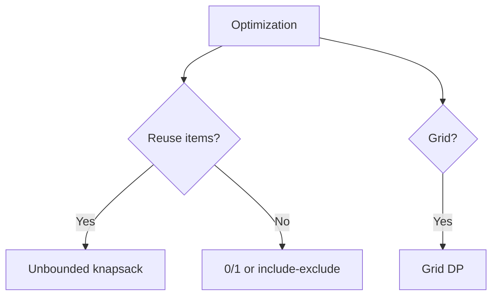

# Dynamic Programming

> **Canonical home** for optimal substructure: Fibonacci, include/exclude, subset sum, grid paths, unbounded knapsack.

---

## Overview

Cache subproblems — bottom-up table or top-down memo.

---

## Recognition Signals

- Count ways / min cost
- Take-or-skip adjacent (House Robber)
- Grid paths
- Unlimited coin/rod reuse

---

## When To Use / When NOT To Use

**Use:** overlapping subproblems, optimal substructure. **Not:** pure enumeration → backtracking.

---

## Problem Solving Framework

Define state `dp[i]` or `dp[i][j]`; recurrence; base cases; iteration order.

---

## DP Pattern Handbook

| Pattern | Example |
| :--- | :--- |
| Fibonacci | [Climbing Stairs](/dsa-coding/08-dynamic-programming/climbing-stairs/) |
| Include/Exclude | [House Robber](/dsa-coding/08-dynamic-programming/house-robber/) |
| Subset Sum | [Subset Sum DP](/dsa-coding/08-dynamic-programming/subset-sum-dp/) |
| Grid | [Unique Paths](/dsa-coding/08-dynamic-programming/unique-paths/) |
| Unbounded | [Coin Change](/dsa-coding/08-dynamic-programming/coin-change/) |

---

## Common Mistakes

- Wrong loop direction for unbounded vs 0/1 knapsack
- Missing base cases

---

## Related Patterns

- [Subset Sum recursion](/dsa-coding/04-recursion-backtracking/subset-sum-recursion/) — same problem, recursion first
- [DP quick revision](/dsa-coding/11-interview-pattern-cheatsheets/08-dp-cheatsheet/)

---

---

## Interviewer Perspective

- Must define **state, recurrence, base case** verbally before coding table.
- Unbounded vs 0/1 knapsack: loop direction is the classic trap — interviewers probe this.
- Subset Sum recursion → DP transition tests **same problem, different paradigm**.

---

## Common Failure Modes

| Failure | Symptom | Fix |
| :--- | :--- | :--- |
| Wrong loop order | Reuse item illegally in 0/1 | Outer items, inner capacity |
| Missing base case | Garbage in dp[0] | Initialize dp[0] explicitly |
| Top-down without memo | Still exponential | Memoize visited states |
| Greedy when DP needed | Wrong min coins | DP for arbitrary denominations |
| Space O(n²) when O(n) suffices | TLE/MLE on large n | Rolling array / two rows |

---

## Architect Notes

- DP = **memoized decision policy** — pricing, routing, resource allocation with overlapping subproblems.
- Include/exclude pattern maps to **feature toggles** with adjacency constraints.
- Grid DP mirrors **path planning** with obstacle maps — unique paths = combinatorial capacity.

---

## Quick Revision Notes

- **Fibonacci:** `dp[i] = dp[i-1] + dp[i-2]`.
- **Unbounded:** loop amount outer, coins inner.

## Problems in This Module

| # | Problem | Pattern |
| :---: | :--- | :--- |
| 50 | [Climbing Stairs](/dsa-coding/08-dynamic-programming/climbing-stairs/) | Fibonacci DP |
| 51 | [House Robber](/dsa-coding/08-dynamic-programming/house-robber/) | Include/Exclude |
| 52 | [Subset Sum](/dsa-coding/08-dynamic-programming/subset-sum-dp/) | DP |
| 53 | [Unique Paths](/dsa-coding/08-dynamic-programming/unique-paths/) | Grid DP |
| 54 | [Coin Change](/dsa-coding/08-dynamic-programming/coin-change/) | DP |
| 55 | [Rod Cutting](/dsa-coding/08-dynamic-programming/rod-cutting/) | Unbounded Knapsack |

---

## See Also

- [Previous: All Nodes Distance K in Binary Tree](/dsa-coding/07-advanced-graphs/all-nodes-distance-k-in-binary-tree/)
- [Next: Climbing Stairs](/dsa-coding/08-dynamic-programming/climbing-stairs/)
- [DSA & Coding Index](/dsa-coding/)
- [Java Engineering](/java-engineering/)
- [Design Patterns](/design-patterns/)
