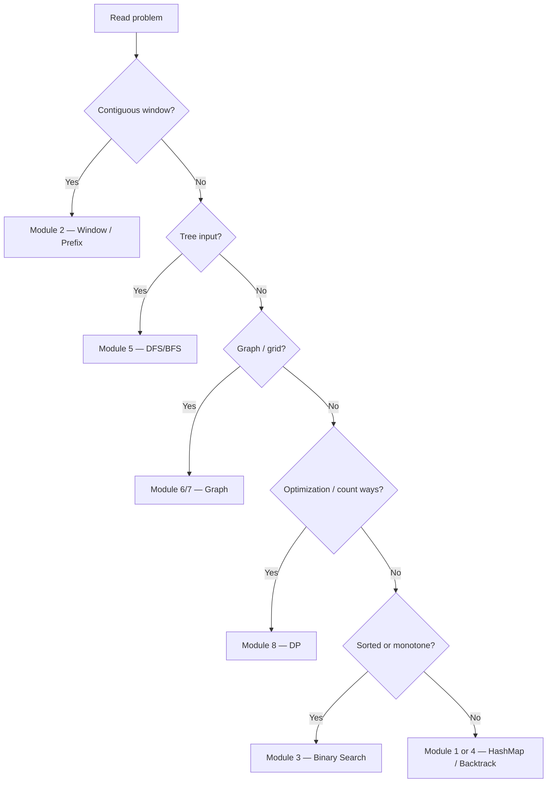

# Pattern Selection Matrix

Decision grid for senior engineers — route to **one primary module** before coding.  
Full signals: [Pattern Recognition Table](/dsa-coding/09-interview-guide/pattern-recognition-table/).

| If the problem… | Primary pattern | Module | Avoid |
| :--- | :--- | :--- | :--- |
| Needs "have we seen X?" on unsorted data | HashMap / HashSet | [1](/dsa-coding/01-arrays-hashmap-two-pointers/) | Nested loops |
| Pair/triplet on sortable array | Sort + two pointers | [1](/dsa-coding/01-arrays-hashmap-two-pointers/) | HashMap duplicate pain |
| Contiguous subarray / substring optimum | Sliding window | [2](/dsa-coding/02-sliding-window-prefix-sum/) | HashMap without contiguity |
| Range sum, pivot, subarray sum with negatives | Prefix sum (+ map) | [2](/dsa-coding/02-sliding-window-prefix-sum/) | Sliding window on negatives |
| Sorted locate or monotone feasibility | Binary search | [3](/dsa-coding/03-binary-search/) | Linear scan |
| Minimize max / maximize min with check | BS on answer | [3](/dsa-coding/03-binary-search/) | Greedy without proof |
| Generate all / constraint placement | Backtracking | [4](/dsa-coding/04-recursion-backtracking/) | DP without overlap |
| Matching nesting / LIFO validity | Stack | [4](/dsa-coding/04-recursion-backtracking/) | Counter-only |
| Tree path / BST / level metric | DFS or BFS | [5](/dsa-coding/05-trees/) | Graph algorithms on tree |
| Grid connectivity / components | DFS flood-fill | [6](/dsa-coding/06-graphs/) | BFS when only count needed |
| Shortest steps unweighted | BFS | [6](/dsa-coding/06-graphs/) | DFS |
| Parallel spread from multiple seeds | Multi-source BFS | [6](/dsa-coding/06-graphs/) | Single-source only |
| Dependency ordering | Topological sort | [7](/dsa-coding/07-advanced-graphs/) | Sorting all strings |
| Optimal substructure / count ways | DP | [8](/dsa-coding/08-dynamic-programming/) | Greedy / brute force |

---

## Selection Flow

---

## Cross-links

- [Complexity Decision Framework](/dsa-coding/09-interview-guide/complexity-decision-framework/)
- [60-Second Pattern Recognition](/dsa-coding/09-interview-guide/60-second-pattern-recognition/)
- [Interview Framework](/dsa-coding/09-interview-guide/interview-problem-solving-framework/)
