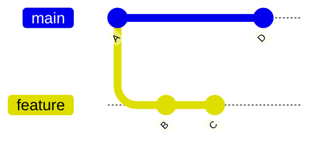

## Executive Summary

A **branch** is a movable pointer to a commit. Creating and switching branches is cheap and local until you push. Modern Git uses `git switch` and `git branch` instead of overloading `git checkout`.

---

## Core Concepts



| Concept | Meaning |
| :--- | :--- |
| **Branch** | Named ref → tip commit (`refs/heads/main`) |
| **HEAD** | Where you are now (usually a branch name) |
| **Detached HEAD** | HEAD points directly to a commit, not a branch |
| **Tracking branch** | Local branch linked to `origin/feature` |

| Command era | Create/switch | Delete |
| :--- | :--- | :--- |
| Modern (2.23+) | `git switch` / `git switch -c` | `git branch -d` |
| Legacy | `git checkout -b` | `git branch -D` (force) |

---

## Quick Reference

| Task | Command |
| :--- | :--- |
| List branches | `git branch` / `git branch -a` |
| Create + switch | `git switch -c feature/x` |
| Switch existing | `git switch main` |
| Delete merged | `git branch -d feature/x` |
| Force delete | `git branch -D feature/x` |
| Rename | `git branch -m old new` |
| Set upstream | `git push -u origin feature/x` |
| Track remote | `git switch -c feat origin/feat` |
| Prune stale remotes | `git fetch --prune` |

```bash
git branch -vv                    # show tracking info
git switch -c hotfix/INC-42 main  # branch from main
git push -u origin hotfix/INC-42
```

---

## Examples

### Start feature from latest main

```bash
git switch main
git pull --ff-only
git switch -c feature/oauth2
```

### Work on existing remote branch

```bash
git fetch origin
git switch feature/oauth2        # auto-creates tracking branch if unique
# or explicitly:
git switch -c feature/oauth2 --track origin/feature/oauth2
```

### Detached HEAD (inspect old release)

```bash
git switch v2.1.0                # tag → detached
git switch -                     # return to previous branch
```

### Naming conventions

| Pattern | Example |
| :--- | :--- |
| Feature | `feature/JIRA-123-short-desc` |
| Bugfix | `fix/null-pointer-checkout` |
| Release | `release/2.4.0` |
| Hotfix | `hotfix/INC-99` |

---

## Best Practices

- Branch from **up-to-date main** (`git pull --ff-only`) before new work.
- Keep branches **short-lived** — days, not months; merge or delete after PR.
- Use `git switch` not `git checkout` for branch changes (clearer semantics).
- Delete remote branches after merge: `git push origin --delete feature/x`.
- Run `git fetch --prune` regularly to clean stale `origin/*` refs.

---

## Common Interview Questions


**Q:** How is a Git branch implemented?

**A:** A branch is a **file in `.git/refs/heads/`** containing a 40-char commit SHA. Moving a branch means updating that pointer. No file copying occurs.



**Q:** What is detached HEAD?

**A:** **HEAD** references a commit directly, not a branch name. New commits aren't on any branch — they can become unreachable when you switch away. Create a branch (`git switch -c tmp`) to keep work.


---

## Related Topics

- [Merge](/git-cheatsheet/merge/) — integrate branch into another
- [Rebase](/git-cheatsheet/rebase/) — replay commits on new base
- [Pull Request Workflow](/git-cheatsheet/pull-request-workflow/) — team branching model
- [Remote](/git-cheatsheet/remote/) — push branches to origin
