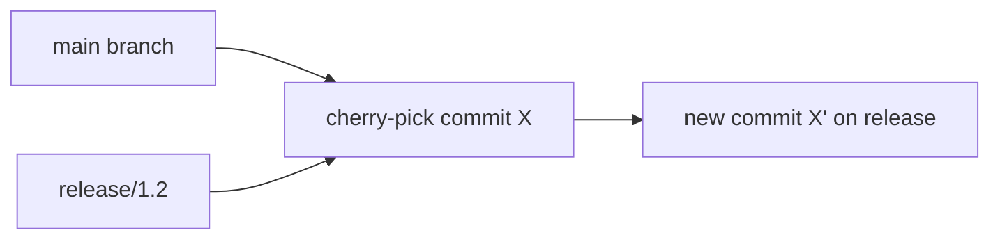

## Executive Summary

`git cherry-pick` applies the **changes from one or more commits** onto your current branch as **new commits** (new SHAs). Use for backporting fixes to release branches or pulling isolated commits without merging entire branches.

---

## Core Concepts



| Scenario | Approach |
| :--- | :--- |
| Hotfix on `main` → backport to `release/1.2` | Cherry-pick the fix commit |
| Wrong branch commit | Cherry-pick to correct branch, reset wrong branch |
| Range of commits | `git cherry-pick A..B` (exclusive start) |

| Flag | Effect |
| :--- | :--- |
| `-n` / `--no-commit` | Apply changes without committing (stage only) |
| `-x` | Append "(cherry picked from …)" to message |
| `--mainline 1` | For merge commits — pick relative to parent 1 |

---

## Quick Reference

| Task | Command |
| :--- | :--- |
| Single commit | `git cherry-pick <sha>` |
| Multiple | `git cherry-pick sha1 sha2 sha3` |
| Range | `git cherry-pick release..hotfix-tip` |
| No commit | `git cherry-pick -n <sha>` |
| Abort | `git cherry-pick --abort` |
| Continue | `git cherry-pick --continue` |
| List unpicked | `git cherry -v main release/1.2` |

```bash
git switch release/2.0
git cherry-pick -x abc1234        # fix from main
git push origin release/2.0
```

---

## Examples

### Backport security fix

```bash
# fix landed on main as commit f1a2b3c
git switch release/1.9
git cherry-pick -x f1a2b3c
# resolve conflicts if any
git push origin release/1.9
```

### Move commit to correct branch

```bash
# committed on feature by mistake — should be on hotfix
git log -1 --oneline              # note SHA
git switch hotfix/INC-7
git cherry-pick <sha>
git switch feature
git reset --hard HEAD~1           # remove from feature (if not pushed)
```

### Cherry-pick without committing (combine edits)

```bash
git cherry-pick -n sha1
git cherry-pick -n sha2
git commit -m "feat: combined backport"
```

---

## Best Practices

- Use `-x` on release branches for **audit trail** of source commit.
- Prefer **merge or rebase** for integrating full features; cherry-pick for **isolated commits**.
- Expect conflicts — same files may have diverged on target branch.
- Verify with `git cherry -v` which commits exist on one branch but not another.
- Run CI on target branch after cherry-pick before tagging release.

---

## Common Interview Questions


**Q:** Cherry-pick vs merge?

**A:** **Cherry-pick** takes **specific commits** and replays them elsewhere as new commits. **Merge** brings **all** commits from a branch and records branch ancestry. Cherry-pick doesn't merge branch history.



**Q:** Why new SHA after cherry-pick?

**A:** A commit is identified by **content + parent + metadata**. Parent changes on the target branch → new SHA even if patch is identical.


---

## Related Topics

- [Branch](/git-cheatsheet/branch/) — target branch for pick
- [Merge](/git-cheatsheet/merge/) — full branch integration
- [Tag](/git-cheatsheet/tag/) — tag release after backport
- [Conflict Resolution](/git-cheatsheet/conflict-resolution/)
